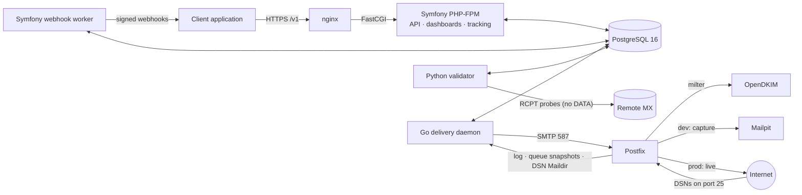

# Smarthost

A self-hosted platform for **email validation**, **tracked outbound SMTP delivery**,
**bounce and event tracking**, and **reputation control**. The data model is multi-tenant from the
start, so it can later serve third-party clients as a SaaS.

**Version:** 0.1.1 · **Status:** Phases 0 and 1 complete

---

## What it does

| Function | How |
|---|---|
| Email validation | A Python worker checks syntax, typos, DNS/MX/Null-MX, disposable and role addresses, and SMTP RCPT probing (never `DATA`), and records evidence-based results that keep uncertainty visible. |
| Tracked delivery | Client applications submit fully rendered, recipient-specific messages in batches. A Go daemon creates one message per recipient, applies VERP and optional tracking, and submits to Postfix. OpenDKIM signs. |
| Bounces and events | Postfix logs, queue snapshots and inbound DSNs become append-only message events. Reconciliation catches lost events. |
| Reputation safety | Transport suppressions (hard bounce, complaint, repeated soft bounce), sending-domain verification and operator controls. |
| Integration | A versioned HTTPS API (`/v1`) and signed webhooks. Clients never touch Smarthost's database. |

Smarthost is **not** a mailing-list or template engine. Subscribers, consent, templates, mail
merge and unsubscribe state all belong to client applications.

## Architecture at a glance



Everything runs under **rootless Podman** with **Quadlet/systemd user units**, in a single pod
named `smarthost` on an internal network with no Internet route. There is no Docker, no
Kubernetes and no message broker: PostgreSQL is the only coordination medium.

## Repository layout

```
app/              Symfony PHP-FPM image (Phase 1 probes; Symfony arrives in Phase 2)
validator/        Python validator image (Phase 1 probe)
delivery/         Go delivery image (Phase 1 probe)
postfix/          Postfix image: capture/live safety switch, DSN spool, snapshots
opendkim/         OpenDKIM milter image and disposable dev-key tool
infra/            Quadlet templates (smarthost pod), systemd timers, nginx, DB bootstrap, smarthostctl, verification suite
tests/fake-smtp/  Deterministic fake SMTP server
docs/             Specifications, contracts, architecture, schema, API
scripts/          Contract consistency checker
```

The full file-by-file description and workflow diagrams are in
**[docs/PROJECT.md](docs/PROJECT.md)**.

## Documentation

| Start here | Purpose |
|---|---|
| [docs/20260908-1644-smarthost-llm-spec.yaml](docs/20260908-1644-smarthost-llm-spec.yaml) | **Authoritative** specification (2.1) |
| [docs/20260908-1644-smarthost-human-specification.md](docs/20260908-1644-smarthost-human-specification.md) | Human-readable companion |
| [docs/PROJECT.md](docs/PROJECT.md) | Directory structure, every file's purpose, workflow diagrams |
| [docs/development-environment.md](docs/development-environment.md) | Running the Phase 1 Podman environment |
| [docs/README.md](docs/README.md) | Index of all contracts and architecture documents |

## Quick start (development, Phase 1)

Requirements: rootless Podman 5.1 or later with Quadlet, either on a Linux host or in a Podman
machine (WSL is supported), plus Python 3.10 or later.

```sh
infra/bin/smarthostctl init-env     # infra/.env with random dev secrets (gitignored)
infra/bin/smarthostctl build        # build all images
infra/bin/smarthostctl secrets      # disposable dev TLS certs as Podman secrets
infra/bin/smarthostctl install      # render + install Quadlet/systemd units
infra/bin/smarthostctl dkim-dev-key # disposable dev DKIM key (OpenDKIM volume only)
infra/bin/smarthostctl start        # start the whole topology
infra/bin/smarthostctl status
infra/bin/smarthostctl verify       # Phase 1 verification suite
```

Development mail never leaves the machine. Postfix runs in capture mode, relaying everything to
Mailpit, and every Smarthost container sits on an `Internal=true` Podman network with no route
to the Internet.

Check the contracts with:

```sh
python3 scripts/check-contracts.py
```

## Project status

| Phase | Status |
|---|---|
| 0: Architecture and contracts | **Complete** (specification 2.1) |
| 1: Rootless Podman development environment | **Complete.** `smarthostctl verify --clean` passes 162/162 checks. |
| 2–10 | Not started |

See [CHANGELOG.md](CHANGELOG.md).

## Licence

MIT. See [LICENSE](LICENSE).
