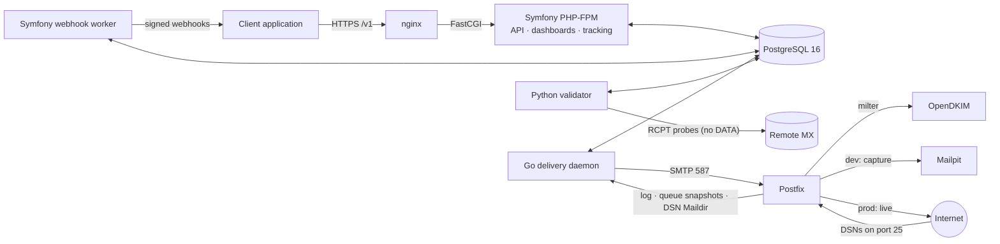

# Smarthost

A self-hosted platform for **email validation**, **tracked outbound SMTP delivery**,
**bounce and event tracking**, and **reputation control**. The data model is multi-tenant from the
start, so it can later serve third-party clients as a SaaS.

**Version:** 0.1.8 · **Status:** Phases 0–7 complete (Phase 7 Smarthost side); Phase 8 repository-side production readiness and Phase 9 repository-side public SaaS hardening implemented (v0.1.8, specification 2.10; public onboarding disabled); live production steps and real first-client integration outstanding

---

## What it does

| Function | How |
|---|---|
| Email validation | A Python worker checks syntax, typos, DNS/MX/Null-MX, disposable and role addresses, and SMTP RCPT probing (never `DATA`), and records evidence-based results that keep uncertainty visible. |
| Tracked delivery | Client applications submit fully rendered, recipient-specific messages in batches. A Go daemon creates one message per recipient, applies VERP and optional tracking, and submits to Postfix. OpenDKIM signs. |
| Bounces and events | Postfix logs, queue snapshots, inbound DSNs and ARF complaints become append-only message events, correlated to the exact message (or kept as unmatched DSNs for the operator). Reconciliation catches lost events. |
| Engagement tracking | Opt-in per job: an open pixel and click redirects with opaque per-message tokens record *recorded* opens and clicks (never claimed as proof of reading); redirects go only to targets stored when the message was built. |
| Sign-in and access control | Passwordless: the dashboard emails a single-use sign-in link (captured by Mailpit in development). `APP_ADMIN_EMAIL` is always the administrator (ADMIN: every permission); other users, roles, permissions and client memberships are managed in the browser. |
| Dashboards | Server-rendered Twig + Stimulus pages: a client dashboard (validation results and CSV export, send jobs, message timelines, suppressions, sending domains, usage) and an operator dashboard (system health from durable signals, clients, unmatched DSNs, suppressions, audit log, webhook deliveries and workers) and client webhook-endpoint management. |
| Reputation safety | Global transport suppressions (recipient-specific hard bounce, complaint, repeated recipient soft bounce) that apply to every client, explicit recipient global opt-outs from operator-authorised clients, sending-domain verification and operator controls. |
| Integration | A versioned HTTPS API (`/v1`) and signed webhooks. Clients never touch Smarthost's database. |

Smarthost is **not** a mailing-list or template engine. Subscribers, consent, templates, mail
merge and unsubscribe state all belong to client applications. The one exception is a recipient's
explicit request not to receive email from any source using the installation, which an authorised
client may report as a global opt-out.

## Architecture at a glance



Everything runs under **rootless Podman** in a single, persistent pod named `smarthost` on an
internal network with no Internet route. The pod and its containers are ordinary Podman objects:
they are created once and then started and stopped (also from Podman Desktop) without being
removed; a systemd user service starts the pod when the Podman machine boots. There is no Docker, no
Kubernetes and no message broker: PostgreSQL is the only coordination medium.

## Repository layout

```
app/              Symfony 8.1 application (PHP-FPM): /v1 API, tracking endpoints, dashboards, entities, migrations, auth
validator/        Python validation worker: leased claiming, DNS/SMTP evidence, classification (never DATA)
delivery/         Go delivery daemon: send jobs -> Postfix, VERP, tracking, MIME, log ingestion, reconciliation
postfix/          Postfix image: capture/live safety switch, DSN spool, snapshots
opendkim/         OpenDKIM milter image and disposable dev-key tool
infra/            Persistent pod definition, systemd boot service and timers, nginx, DB bootstrap, smarthostctl, test suites
tests/fake-smtp/  Deterministic fake SMTP server
docs/             Specifications, contracts, architecture, schema, API
scripts/          Contract consistency checker
```

The full file-by-file description and workflow diagrams are in
**[docs/PROJECT.md](docs/PROJECT.md)**.

## Documentation

| Start here | Purpose |
|---|---|
| [docs/20260908-1644-smarthost-llm-spec.yaml](docs/20260908-1644-smarthost-llm-spec.yaml) | **Authoritative** specification (2.10) |
| [docs/20260908-1644-smarthost-human-specification.md](docs/20260908-1644-smarthost-human-specification.md) | Human-readable companion |
| [docs/PROJECT.md](docs/PROJECT.md) | Directory structure, every file's purpose, workflow diagrams |
| [docs/development-environment.md](docs/development-environment.md) | Running the Podman environment, the application and the test suites |
| [docs/production/README.md](docs/production/README.md) | Production topology: network matrix, the socket-activated ingress (client addresses), launch decisions, delivery states, where state lives |
| [docs/production/runbook.md](docs/production/runbook.md) | Production runbook: VPS, installation, TLS, DNS/PTR/SPF/DKIM/DMARC, activation, seed tests, warm-up, emergencies, backups, upgrades |
| [docs/production/onboarding.md](docs/production/onboarding.md) | Client onboarding checklist, lifecycle, limits, keys, reputation alerts, usage and billing statements; the public-onboarding decision |
| [docs/api/integration-guide.md](docs/api/integration-guide.md) | For client developers (served at `/docs/api`): authentication, jobs, limits, webhooks, and what the statuses mean |
| [docs/README.md](docs/README.md) | Index of all contracts and architecture documents |

## Quick start (development)

Requirements: rootless Podman 5.1 or later, either on a Linux host or in a Podman
machine (WSL is supported), plus Python 3.10 or later.

```sh
infra/bin/smarthostctl init-env     # infra/.env with random dev secrets (gitignored)
infra/bin/smarthostctl build        # build all images
infra/bin/smarthostctl secrets      # disposable dev TLS certs as Podman secrets
infra/bin/smarthostctl dkim-dev-key # disposable dev DKIM key (OpenDKIM volume only)
infra/bin/smarthostctl install      # systemd boot service + create the persistent pod and containers
infra/bin/smarthostctl start        # start the existing pod (ordered: PostgreSQL, DB tasks, services)
infra/bin/smarthostctl status       # pod and containers (they stay listed when stopped)
infra/bin/smarthostctl verify       # Phase 1 verification suite
infra/bin/smarthostctl test         # Phase 2 and 3 test suites (throwaway, network-less pods)
infra/bin/smarthostctl console smarthost:dev:bootstrap   # dev client + API key (shown once)
```

Lifecycle: `stop`, `start` and `restart` keep the same pod and containers (exactly like Podman
Desktop's Stop/Start buttons). After `build` or a container-definition change, `recreate` replaces
the pod and containers while keeping every volume. Only `destroy-volumes --yes` deletes data. See
[docs/development-environment.md](docs/development-environment.md) §2.

Production is a separate command family, `infra/bin/smarthostctl prod help`. It deploys a
different topology on a dedicated Ubuntu 24.04 host; follow
[docs/production/runbook.md](docs/production/runbook.md).

The API is then at `https://127.0.0.1:8443/v1` (disposable self-signed certificate). Submitted send
jobs are delivered by the Go daemon through Postfix and OpenDKIM to Mailpit
(`http://127.0.0.1:8026`); their messages' events come from the Postfix log.

Development mail never leaves the machine. Postfix runs in capture mode, relaying everything to
Mailpit, and every Smarthost container sits on an `Internal=true` Podman network with no route
to the Internet.

Check the contracts with:

```sh
python3 scripts/check-contracts.py
```

## Project status

| Phase | Status |
|---|---|
| 0: Architecture and contracts | **Complete** (current specification 2.10) |
| 1: Rootless Podman development environment | **Complete.** `smarthostctl verify` passes all 176 checks (including the persistent pod lifecycle and the DSN spool with the Phase 5 daemon); `verify --clean` additionally proves a start from destroyed volumes. |
| 2: Database and Symfony foundation | **Complete.** Migrations reproduce the reference schema; API-key auth, tenant isolation, idempotency, validation-job and send-job primitives. `smarthostctl test phase2`: 248/248 tests pass (including the Phase 5 opt-out API and operator commands, the Phase 6 tracking and dashboard tests, passwordless sign-in and ACL, and the Phase 7 webhook worker, dashboard, query-plan and web-isolation tests, and the Phase 8 operations and production-guard tests). |
| 3: Python validation engine | **Complete.** Leased claiming, D-32 normalisation, syntax, typo suggestions, DNS/MX/Null MX, disposable/role flags, SMTP probing without DATA, per-domain/MX limits, retries, conservative classification, D-33 metering, outbox events. `smarthostctl test phase3`: 295 pytest tests and the 10,000-address end-to-end run pass. |
| 4: Go/Postfix delivery pipeline | **Complete.** Leased send-job claiming, exactly-once message creation, suppression lookup, VERP, tracking, MIME and RFC 8058 headers, authenticated submission through OpenDKIM, queue-id capture with content purge and `message_submitted` metering, Postfix log ingestion with persistent cursors, D-27 reconciliation, pacing. `smarthostctl test phase4` (Go unit + PostgreSQL integration) and `test phase4-e2e` (real Postfix/OpenDKIM/Mailpit, crash/restart, 10,000 recipients) pass. |
| 5: Inbound DSN, complaint and global suppression processing | **Complete** (v0.1.5; the spec 2.5 corrections D-36–D-38 in v0.1.6). D-30: global suppressions with provenance, the trusted-client opt-out API with durable request idempotency and operator capability, RFC 3464/6533 DSN and ARF parsing, correlation only by Smarthost identifiers (VERP, ENVID, Message-ID, queue id; never by recipient), conservative classification, the unmatched-DSN operator workflow, spool claim/reclaim/retention. `smarthostctl test phase5` and `test phase5-e2e` (real Postfix :25 and spool) pass. |
| 6: Tracking and dashboards | **Complete** (v0.1.6; tracking and dashboard behaviour from specification 2.6, sign-in and ACL from 2.7). Public `/t/o/{token}.gif` and `/t/c/{token}/{n}` with eligibility checks, identical answers for unknown tokens, a bounded recording rule and token-free logs; redirects only to stored targets (open-redirect attempts tested). Client and operator dashboards with passwordless emailed single-use sign-in links (specification 2.7), tenant isolation (foreign ids are 404), keyset pagination, whitelisted sorting/filtering, CSRF-protected POST actions through the existing audited services, CSP. `smarthostctl test phase2` (tracking, dashboards, two-client isolation, operator authorisation, 10,000-row load test with query plans) and `test phase6-e2e` (through nginx against the running pod, sign-in links taken from Mailpit) passes 75/75. |
| 6.1: Passwordless sign-in, roles and ACL | **Complete** (v0.1.6; specification 2.7). Emailed single-use links through Postfix, `APP_ADMIN_EMAIL` administrator, permission-keyed operator pages, built-in ADMIN/OPERATOR and custom roles, Users and Roles pages; no passwords. |
| 7: First client API integration | **Smarthost side complete** (v0.1.7; specification 2.8). The real Symfony webhook worker: transactional outbox fan-out; HMAC-SHA256 signatures with rotation overlap; retries with backoff; at-least-once delivery with leases and fencing; SSRF protection with address pinning and no redirects; health and heartbeats. Also `POST /v1/webhooks/test`, dashboard webhook management and delivery visibility. `smarthostctl test phase7-e2e` proves the client workflow without database access using a deterministic external client (an API-only driver and an independent signature-verifying receiver): validation, a 501-recipient batched send, tracking, bounce and complaint webhooks, receiver outage, worker crash with de-duplication, permanent failure with polling fallback, and SSRF refusals. **Outstanding:** integrating the real first client application in its own repository. |
| 8: Controlled production launch | **Repository side implemented** (v0.1.8; specification 2.9). A production topology of standalone containers on internal, ingress and egress networks (no published ports: a systemd socket-activated ingress hands 443/25 to nginx, so nginx/Symfony and Postfix see real client addresses), `smarthostctl prod` (install, build, TLS, DKIM keys, preflight, live activation, pause, backup/restore, upgrade/rollback, seed test), the production configuration profile and safety rules, held mode until an audited, preflight-gated activation, the production preflight (host, runtime, exposure, ingress, TLS, DNS/PTR/SPF/DKIM/DMARC, bounce domain, Postfix, delivery), an installation-wide warm-up ceiling and per-client throttling, Postfix queue depth on the dashboard, and the runbook. Proven by `smarthostctl test phase8` and a local production rehearsal without Internet egress (`test phase8-rehearsal`). **Outstanding (operator):** VPS, DNS/PTR, certificates, live seed and bounce tests, traffic rollout. |
| 9: Public SaaS hardening | **Repository side implemented** (v0.1.8; specification 2.10). Client lifecycle with approval, throttling, suspension and closure (reasons, permissions, audit); public onboarding gated off (no public route); service-policy acceptance; per-client limits with concurrency-safe quotas (`429 quota-exceeded`); API-key names and expiry; usage summaries, reconciliation, provider-neutral billing statements and export; reputation metrics and alerts (no automatic action; production timer); webhook endpoint health; public API docs at `/docs/api`; a two-client isolation review and query plans at scale. Plans, prices, policy text, threshold calibration and opening public onboarding are owner decisions ([onboarding.md](docs/production/onboarding.md)). |

See [CHANGELOG.md](CHANGELOG.md).

## Licence

MIT. See [LICENSE](LICENSE).
