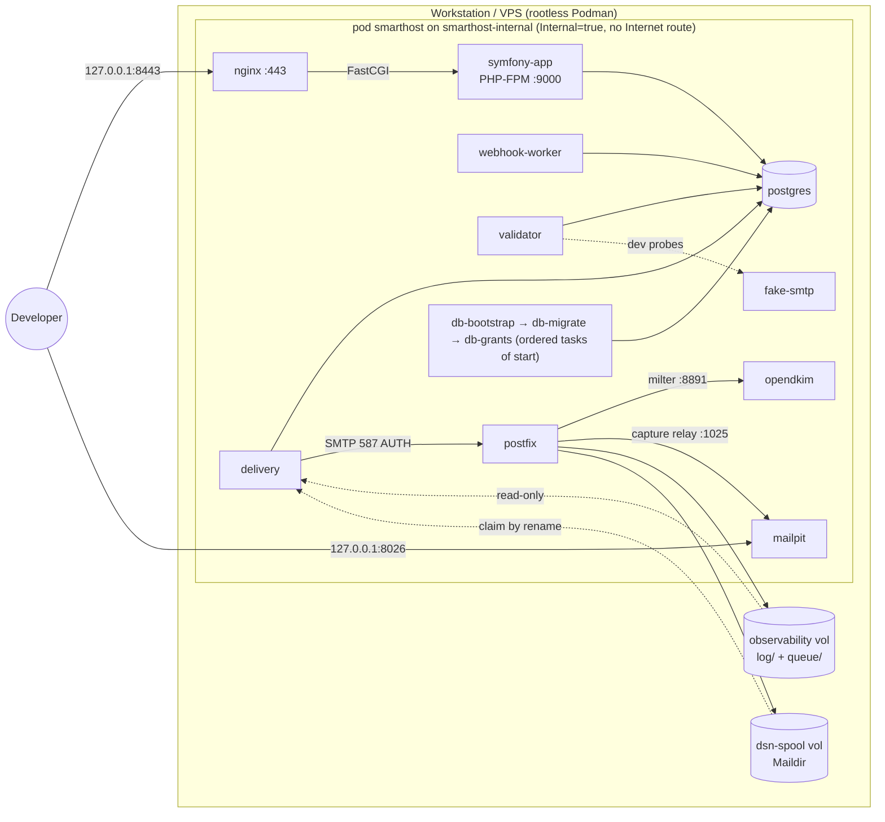
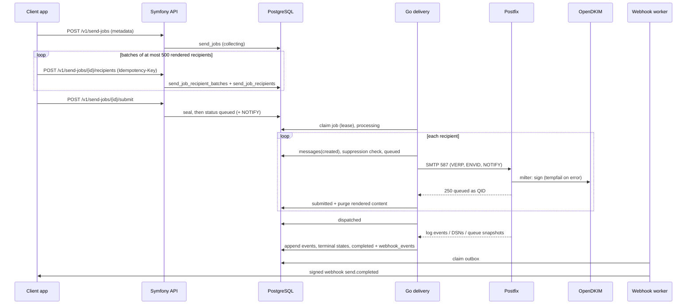
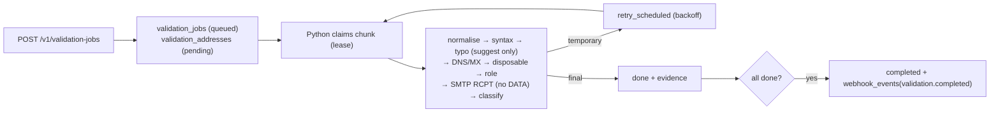
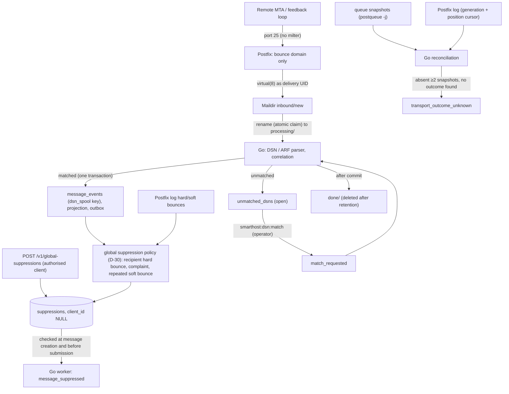
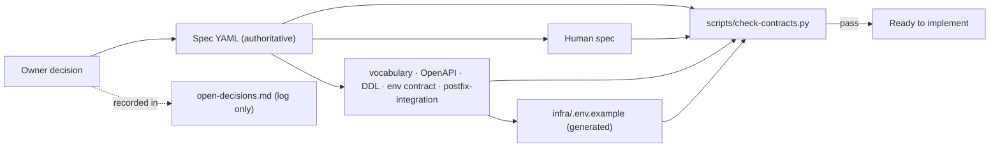
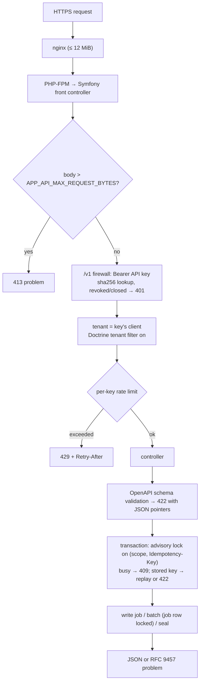
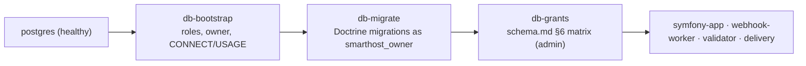

# Project Guide: Structure, Files and Workflows

This guide explains how the repository is organised, what every file does, and how the main
workflows run. Architecture authority is the specification
(`docs/20260908-1644-smarthost-llm-spec.yaml`); this document only describes it.

Generated and secret material is **not** in the repository:
- `infra/.env` holds development secrets.
- `infra/.generated/` holds the rendered env files, rendered units and development TLS keys.

Both are gitignored.

---

## 1. Directory structure

```
.
├── install-catto-mail             The production installer (root, Ubuntu Server 26.04 LTS; specification 2.11)
├── AGENTS.md                      Rules for coding agents (read first)
├── CLAUDE.md                      Claude Code specifics on top of AGENTS.md
├── README.md                      Project overview and quick start
├── CHANGELOG.md                   Version history
├── LICENSE                        MIT licence
├── .gitignore                     Excludes secrets and generated files
├── .containerignore               Build context filter for the app and validator images (repository root)
├── app/                           Symfony 8.1 application (PHP-FPM)
│   ├── Containerfile              Multi-stage: base, tools, test, vendor, runtime
│   ├── README.md
│   ├── composer.json, composer.lock, symfony.lock
│   ├── phpunit.dist.xml
│   ├── bin/console, bin/phpunit
│   ├── public/index.php           The only front controller (nginx → FastCGI)
│   ├── config/                    Framework, Doctrine, security, monolog, Twig, AssetMapper, routes, services
│   ├── migrations/                14 Doctrine migrations (the schema authority)
│   ├── assets/                    Dashboard CSS, Stimulus bootstrap and controller, vendored Stimulus (AssetMapper, no build step)
│   ├── importmap.php              Import map (local files only; no CDN)
│   ├── templates/                 Twig: dashboard layout, client and operator pages, production error page
│   ├── src/
│   │   ├── Access/                Permission catalogue, roles, ACL service and permission voter
│   │   ├── Api/                   Problems, OpenAPI validation, idempotency key, cursors, representations, work permission (D-31)
│   │   ├── Audit/                 Audit log writer
│   │   ├── Client/                Client lifecycle, limits and quotas; user and membership administration
│   │   ├── Command/               Console commands (administration and dev bootstrap)
│   │   ├── Config/                Fail-closed configuration, `_FILE` secrets, limits
│   │   ├── Controller/            /v1 API, /healthz, tracking endpoints (/t/o, /t/c), client and operator dashboards
│   │   ├── Dashboard/             Dashboard read models, keyset pagination, client access, labels, security headers
│   │   ├── Crypto/                Encryption keyring (webhook signing secrets)
│   │   ├── Doctrine/Type/         timestamptz and jsonb_map types
│   │   ├── Domain/                Sending domains and DNS TXT verification
│   │   ├── Dsn/                   Unmatched-DSN operator workflow (match request, dismissal)
│   │   ├── Entity/                48 entities, one per table
│   │   ├── Enum/                  54 vocabulary enums
│   │   ├── Idempotency/           In-flight lock
│   │   ├── Logging/               Contract log format
│   │   ├── Security/              API-key and dashboard authentication, voter
│   │   ├── Tracking/              Recorded opens and clicks (eligibility, bounded recording, safe targets)
│   │   ├── Sending/               Send-job lifecycle, D-18 normalisation, content fingerprint
│   │   ├── AddressBatch/          Administrator address batches: parsing, import, validation, state dimensions, staged sends, re-permission (2.11)
│   │   ├── Help/                  The help and tutorial catalogue (2.11)
│   │   ├── System/                Setup wizard, diagnostics and history, host-agent requests, emergency stop, seed tests (2.11)
│   │   ├── Reputation/            Per-client reputation metrics, threshold alerts, acknowledgement (Phase 9)
│   │   ├── Suppression/           Recipient global opt-out API service, operator suppression administration (D-30)
│   │   ├── Tenant/                Tenant scope and Doctrine tenant filter
│   │   ├── Usage/                 Usage periods, summaries, reconciliation, billing statements, export (Phase 9)
│   │   ├── Validation/            Validation-job creation
│   │   ├── Webhook/               Endpoints and secrets, outbox, webhook worker (dispatcher, signer, SSRF guard, payloads)
│   │   ├── Util/Clock.php
│   │   └── Kernel.php
│   ├── tests/                     PHPUnit: Unit, Contract, Schema, Integration, Support, bin
│   ├── docker/
│   │   ├── webhook-worker-healthcheck.sh
│   │   ├── fpm-healthcheck.sh
│   │   ├── php.ini
│   │   └── zz-smarthost-fpm.conf
│   └── phase1-probe/
│       └── db-check.php
├── validator/                     Python validation worker (Phase 3)
│   ├── Containerfile              Stages: base, test, runtime
│   ├── README.md
│   ├── requirements.txt, requirements-test.txt, pytest.ini
│   ├── smarthost_validator/       The worker package (pipeline stages, leases, limits, SQL)
│   └── tests/                     pytest: unit, database, worker; fakes/ (fake DNS); e2e/zone.json
├── delivery/                      Go delivery daemon (Phases 4 and 5)
│   ├── Containerfile              Stages: deps, test, build, runtime
│   ├── README.md
│   ├── go.mod, go.sum
│   ├── cmd/smarthost-delivery/    main.go (run, health, normalize), probe.go (Phase 1 probes)
│   └── internal/                  address, config, dsn (+ testdata fixtures), dsnspool, ids, ingest,
│                                  integration (tests), logx, mimemsg, pacing, postfixlog, reconcile,
│                                  smtpclass, smtpsub, snapshot, status, store, testsmtp, tracking, worker
├── postfix/                       Postfix image
│   ├── Containerfile
│   ├── README.md
│   ├── entrypoint.sh
│   ├── healthcheck.sh
│   ├── queue-snapshot.sh
│   └── logrotate.sh
├── opendkim/                      OpenDKIM milter image
│   ├── Containerfile
│   ├── README.md
│   ├── entrypoint.sh
│   └── dev-key.sh
├── infra/                         Environment, units and tooling
│   ├── .env.example
│   ├── production.env.example     Production template (the contract's Production profile; no secrets)
│   ├── README.md
│   ├── bin/
│   │   ├── smarthostctl
│   │   ├── smarthostctl-prod      `smarthostctl prod`: production operations (Phase 8)
│   │   └── smarthost-machine-helper.sh
│   ├── lib/
│   │   ├── smarthost_render.py    Templates, init-env, validation (incl. production rules), rendering
│   │   ├── smarthost_preflight.py Production preflight, DNS checklist, firewall ruleset (stdlib)
│   │   └── smarthost_seedtest.py  Operator-triggered seed test through the public API
│   ├── nginx/
│   │   ├── Containerfile
│   │   ├── templates/smarthost.conf.template
│   │   └── production/smtp-ingress.conf.stream-template   production SMTP ingress (PROXY protocol)
│   ├── postgres/
│   │   ├── bootstrap.sh           Role bootstrap
│   │   ├── grants.sh              Applies grants.sql after migrations
│   │   └── grants.sql             The schema.md §6 privilege matrix
│   ├── podman/smarthost-pod.sh.in Persistent development pod: network, volumes, pod, 10 containers, DB tasks
│   ├── podman/smarthost-production.sh.in  Production topology: internal, ingress, egress networks, 8 containers (Phase 8)
│   ├── systemd/*.in               boot service + timers
│   ├── systemd/production/*.in    production: the ingress socket and nginx service; the reputation, backup and certificate timers; the host agent
│   └── tests/
│       ├── Containerfile          Verification tool image
│       ├── requirements.txt
│       ├── phase1_client.py
│       ├── phase1-verify.sh       Phase 1 verification suite
│       ├── testpod.sh             Shared throwaway network-less test pod (sourced)
│       ├── phase2-test.sh         Phase 2 test harness (PHPUnit)
│       ├── phase3-test.sh         Phase 3 test harness (pytest + end to end)
│       ├── phase4-test.sh         Phase 4/5 harness: Go unit + PostgreSQL integration (throwaway pod)
│       ├── phase4-e2e.sh          Phase 4 end to end against the running pod
│       ├── phase4_e2e.py          Phase 4 end-to-end driver (API, Mailpit, DKIM, DB, Postfix log)
│       ├── phase5-e2e.sh          Phase 5 end to end against the running pod (DSNs via port 25)
│       ├── phase5_e2e.py          Phase 5 end-to-end driver (API, DSN/ARF injection, DB)
│       ├── phase6-e2e.sh          Phase 6 end to end against the running pod (tracking, dashboards, logs)
│       ├── phase6_e2e.py          Phase 6 end-to-end driver (Mailpit HTML, nginx, dashboard browser sessions)
│       ├── phase7-e2e.sh          Phase 7 end to end: external client via API and signed webhooks only
│       ├── phase7_e2e.py          Phase 7 external-client driver (no database access)
│       ├── phase8-test.sh         Phase 8 production tooling tests (no network)
│       ├── phase8-rehearsal.sh    Phase 8 production rehearsal (production topology, no Internet egress)
│       ├── installer-test.sh      The installer on an Ubuntu 26.04 VPS stand-in (2.11)
│       ├── installer/Containerfile  The VPS stand-in: Ubuntu 26.04 with systemd
│       └── phase8/                Phase 8 unit tests (configuration, rendering, preflight) and fixtures
├── tests/fake-smtp/               Deterministic SMTP test server
│   ├── Containerfile
│   ├── README.md
│   └── fake_smtp.py
├── tests/webhook-receiver/        Deterministic external-client webhook receiver (test fixture)
│   ├── Containerfile
│   ├── README.md
│   ├── receiver.py
│   └── test_receiver.py
├── scripts/
│   ├── README.md
│   └── check-contracts.py
└── docs/                          Specifications, contracts, architecture
    ├── README.md
    ├── PROJECT.md                 (this file)
    ├── development-environment.md
    ├── 20260908-1644-smarthost-llm-spec.yaml
    ├── 20260908-1644-smarthost-human-specification.md
    ├── api/
    │   ├── openapi.v1.yaml
    │   └── integration-guide.md   Client integration guide (served at /docs/api)
    ├── architecture/
    │   ├── overview.md
    │   ├── conventions.md
    │   ├── postfix-integration.md
    │   └── open-decisions.md
    ├── contracts/
    │   ├── environment.md
    │   ├── status-vocabulary.yaml
    │   └── address-normalization-vectors.json
    ├── production/
    │   ├── README.md              Production topology and network matrix (Phase 8)
    │   ├── VPS-INSTALL.md         Installing on an Ubuntu VPS (start here; 2.11)
    │   ├── components.md          Every component: container, unit, purpose, inputs, outputs, network, data
    │   ├── architecture.md        What happens to an address and a message, step by step
    │   ├── runbook.md             Production runbook
    │   └── onboarding.md          Client onboarding and SaaS operations (Phase 9)
    ├── integration/
    │   └── ctnlist.md             The ctnlist integration and its outstanding re-permission work
    └── schema/
        ├── reference-schema.sql
        └── schema.md
```

---

## 2. Files and what they do

### Root

| File | Purpose |
|---|---|
| `install-catto-mail` | The production installer (specification 2.11), run as root on Ubuntu Server 26.04 LTS: 21 PASS/WARN/FAIL steps (OS and resources, Ubuntu packages, the `cattomail` user, lingering, the low-port setting, the Podman socket, the release tag, `infra/.env` with generated secrets, image build, certificates, units and containers, start in HELD mode, health, host checks, first backup, firewall rules, automatic start, a bootstrap sign-in link). Idempotent; `--help`; `--no-egress` only for local tests (`smarthostctl test installer`). |
| `AGENTS.md` | Mandatory instructions for any coding agent: read the specs first; Podman only; no commits without instruction; what to report. |
| `CLAUDE.md` | Claude Code notes: authority order, commands (setup, tests, narrowing a suite), the cross-component architecture, current phase, local and WSL Podman engine handling, protection of other projects' containers, required checks. |
| `README.md` | What Smarthost is, an architecture diagram, layout, quick start, status. |
| `CHANGELOG.md` | Version history: 0.1 (Phase 0 complete), 0.1.1 (Phase 1 complete, `smarthost` pod), 0.1.2 (Phase 2 complete: Symfony foundation, schema, API primitives) 0.1.3 (Phase 3 complete: Python validation engine), 0.1.4 (Phase 4 complete: Go/Postfix delivery pipeline; persistent pod lifecycle) 0.1.5 (Phase 5 complete: inbound DSN, complaint and global suppression processing, D-30) 0.1.6 (Phase 5 corrections; Phase 6 complete: tracking and dashboards; passwordless sign-in, roles and ACL) 0.1.7 (Phase 7 Smarthost side: webhook worker and delivery contract), 0.1.8 (Phases 8 and 9 repository side: production readiness and public SaaS hardening), 0.1.9 (Phase 10: operator self-service; the first GitHub Release) 0.2.0 (development on a local Linux engine with Podman 4.9; documentation aligned) and 0.2.1 (the installer works when run from root's home). |
| `LICENSE` | MIT licence. |
| `.gitignore` | Keeps `infra/.env`, `infra/.generated/`, keys and certificates out of git. |
| `.containerignore` | The app and validator images build from the repository root so that they can copy the normative contracts; this admits only `app/` (without `vendor/`, `var/`), `validator/` (without caches), those contract files, the D-32 vectors and the fake SMTP server (validator test stage). |

### `docs/`: specifications and contracts

| File | Purpose |
|---|---|
| `20260908-1644-smarthost-llm-spec.yaml` | **Canonical specification 2.10.** It covers architecture, ownership, services, API, sending, tracking, schema, security, compliance and phases. |
| `20260908-1644-smarthost-human-specification.md` | Human-readable companion that mirrors the YAML. |
| `README.md` | Index of the documentation. |
| `PROJECT.md` | This guide. |
| `development-environment.md` | How to run the Podman environment: requirements (local Linux or WSL engine, Podman 4.9 notes), lifecycle, topology, ports, volumes, mail safety, facts established in Phase 1, the verification suite, the application and test suites, and the Phase 8 production tests. |
| `api/openapi.v1.yaml` | OpenAPI 3.1 contract for `/v1`: validation jobs, batched send jobs (create → recipients → submit), messages, events and webhooks; limits, quotas (`429 quota-exceeded`) and key expiry. Served publicly at `/docs/api/openapi.v1.yaml`. |
| `api/integration-guide.md` | The client developers' guide (Phase 9), served at `/docs/api/integration-guide.md`: authentication and keys, limits and quotas, validation and send workflows, webhooks, and what remote acceptance, recorded opens, validation and unsubscribes do and do not mean. Copied into the app image. |
| `contracts/status-vocabulary.yaml` | Every allowed status, event, event source, failure scope and classification value, with transitions and ranks. |
| `contracts/environment.md` | The only list of permitted environment variables, with consumers, secrecy and phase. |
| `contracts/address-normalization-vectors.json` | Shared D-32 address-normalisation test vectors (87). PHP and Python test against this file; Go must from Phase 4. |
| `schema/reference-schema.sql` | Reference PostgreSQL 16 DDL (39 tables). This is not a migration. |
| `schema/schema.md` | ERD, tenant ownership, required indexes, CHECK rules and the database grant matrix. |
| `architecture/overview.md` | One-page map from the specification to the contracts and flows. |
| `architecture/conventions.md` | Cross-language rules: IDs, time, leases, API, webhooks, logging, wording. |
| `production/README.md` | Production topology (Phase 8): development versus production, the network matrix, routes, host firewall, rootless notes, the capture/held/live/paused states, where state lives. |
| `production/VPS-INSTALL.md` | The primary installation guide (2.11): VPS requirements and sizing, the installer and its steps, first sign-in, DNS with examples, Let's Encrypt DNS-01, DKIM, the setup wizard, firewall, backups, reboot test, going live, versions/upgrade/rollback, what catto-mail cannot do, the real-VPS acceptance checklist, what was tested where. |
| `production/components.md` | The canonical component names and, for each, container, process, purpose, inputs, outputs, network, data and dependencies; host units; networks, volumes, secrets; BIND is not required. |
| `production/architecture.md` | The architecture diagram and the twelve steps from upload to webhook. |
| `integration/ctnlist.md` | Responsibilities between ctnlist and catto-mail, the API calls and webhooks ctnlist already uses, `repermission.responded`, and the outstanding ctnlist work. |
| `production/onboarding.md` | Client onboarding and SaaS operations (Phase 9): the new-client checklist, lifecycle and its effects, limits and quotas, API keys, reputation alerts, usage, reconciliation and billing statements, notes, permissions, and the criteria for opening public onboarding. |
| `production/runbook.md` | Production runbook: VPS, installation, secrets, TLS, DNS identity, DKIM keys, preflight, activation, seed tests, warm-up stages, health checks, webhook/DSN/`outcome_unknown` handling, emergency controls, retention, backups, upgrades, recovery, pending external actions. |
| `architecture/postfix-integration.md` | Postfix/OpenDKIM/Go channels, cursors, reconciliation and the verified V-1…V-7 results. |
| `architecture/open-decisions.md` | Decision log (D-01…D-38 and the per-phase implementation choices, including Phase 9 and the business decisions left to the owner). Not a source of authority. |

### `infra/`: environment, units and tooling

| File | Purpose |
|---|---|
| `.env.example` | Safe template of every contract variable, with secrets empty. Generated from `docs/contracts/environment.md`. |
| `production.env.example` | The production template: the contract's *Production profile* values (held mode, ingress binds 443/25, empty `TRUSTED_PROXIES`, warm-up stage 0, webhook defaults) with placeholders and empty secrets. `smarthostctl prod init-env` copies it and generates the secrets on the host. |
| `bin/smarthostctl-prod` | `smarthostctl prod`: production operations. Configuration (init-env, check, render), lifecycle (build with `SMARTHOST_IMAGE_TAG`, TLS secrets, install with units including the ingress socket, start/stop/restart/status, recreate/replace, migrate, logs, console; the host prerequisites are checked before containers are created or started), preflight, `ingress-check` (client addresses preserved), DNS checklist, firewall, DKIM keys, audited live-enable/live-disable/pause/resume, client status, ops status, queue, backup/restore, upgrade/rollback, seed test. Refuses non-production configurations. |
| `lib/smarthost_agent.py` | The host agent (2.11; stdlib Python): host facts and checks (OS, Podman, lingering, units, disk, memory, clock, firewall, containers, secret file modes, backups, certificate renewal, boot recovery) and the hourly preflight, reported through `smarthost:system:agent report`; claims and carries out dashboard requests (`claim`/`finish`) with `smarthostctl prod`. `run` (the service loop), `once`, `facts`. |
| `lib/smarthost_preflight.py` | Production preflight (PASS/WARN/FAIL; `--activation`, `--json`): config, host (OS, Podman, lingering, the low-port sysctl against the configured binds, running and persisted), runtime (images, health, migrations, grants vs `schema.md` §6), exposure (no published ports, network matrix, key placement), ingress (socket units, nginx's inherited sockets, Postfix's PROXY listener, empty `TRUSTED_PROXIES`, and the two-loopback-source proof at nginx and Postfix: `prod ingress-check`), TLS (served certificates via HTTPS and STARTTLS), DNS (own UDP/TCP client: A, PTR, FCrDNS, MX, SPF evaluator, DMARC), DKIM (database, OpenDKIM tables and DNS key agree), Postfix (settings, live relay-refusal test), delivery (heartbeat). Also the DNS checklist and the nftables ruleset. Host, DNS and TLS are injectable for tests. |
| `lib/smarthost_seedtest.py` | Operator-triggered seed test through the public API (`--i-own-these-addresses`, at most 10 recipients): sends a tiny job and reports message states and events, expecting `remote_accepted` or `hard_bounced`. |
| `README.md` | What lives in `infra/`. |
| `bin/smarthostctl` | Developer CLI: init-env, render, build, secrets, install (units + pod if missing), create, dkim-dev-key, start/stop/restart (same objects), recreate (new pod and containers, volumes kept), remove, status, logs, systemctl pass-through, uninstall, destroy-volumes, verify, test (Phase 2/3/4 suites and the Phase 4 end-to-end run), console (Symfony console in the app container), migrate (migration and grant tasks). `prod <command>` dispatches to `smarthostctl-prod`; the development commands refuse a production `.env`; `test phase8` and `test phase8-rehearsal`. |
| `bin/smarthost-machine-helper.sh` | Runs inside the Podman engine's systemd namespace. It installs and uninstalls the systemd units (including the `default.target.wants` boot link; it removes the pre-D-35 Quadlet units once), installs or removes only one production instance's own units (`instance-install`/`instance-uninstall`, for the rehearsal) and passes commands through to `systemctl --user` and `journalctl --user`. It never creates or removes Podman objects. |
| `lib/smarthost_render.py` | `env-example` regenerates `.env.example` and `production.env.example`; `init-env [--production]` creates `infra/.env` with locally generated secrets; `check` validates a `.env` (contract completeness, and the production safety rules of `production_errors()` for `SMARTHOST_ENV=production`); `render` writes per-consumer env files, the pod and production scripts (values shell-quoted) and the systemd templates (`@TOPOLOGY@` selects the script), and refuses non-contract variables and unsafe configurations. `SMARTHOST_DOTENV`/`SMARTHOST_GENERATED` select another configuration (the rehearsal). |
| `nginx/Containerfile` | nginx 1.28 image without the default site. It also derives the production HTTPS template (`/etc/nginx/templates-production/`) from the development one, changing only the `listen` line to `${PROXY_HTTPS_BIND}`; the build fails if anything else would differ. |
| `nginx/production/smtp-ingress.conf.stream-template` | Production only: the SMTP stream server on `POSTFIX_SMTP_BIND` (the inherited ingress socket), passing each connection to `postfix-ingress:25` with the PROXY protocol. |
| `nginx/templates/smarthost.conf.template` | HTTPS server. Every request goes to the Symfony front controller over FastCGI, with request-time DNS resolution. Bodies above 12 MiB get a JSON 413 from nginx; the application enforces the 10 MiB API limit itself. The access log writes tracking URLs with the token redacted. Also a loopback-only health server. |
| `postgres/bootstrap.sh` | Idempotent role bootstrap: five least-privilege roles; owner of the database and schema; runtime roles get CONNECT and USAGE only. |
| `postgres/grants.sql` | The table and column privileges of `docs/schema/schema.md` §6, exactly: revoke everything from the runtime roles, then grant the matrix, in one transaction. |
| `postgres/grants.sh` | Runs `grants.sql` with the administrative connection. Idempotent; re-run after every migration run. |
| `podman/smarthost-production.sh.in` | The production topology (Phase 8), rendered to `.generated/podman/smarthost-production.sh`: `<instance>-internal` (internal), `<instance>-ingress` (internal; nginx and Postfix) and `<instance>-egress` networks; eight persistent containers with fixed addresses and `/etc/hosts` entries; egress only for postfix, symfony-app, webhook-worker and validator; no published ports: nginx is started and stopped only through `<instance>-ingress.service` (socket activation; `SMARTHOST_HOSTCTL` reaches a WSL engine's systemd); Podman secrets for TLS; actions create, start (postgres, DB tasks, services, health), stop, remove, replace, tasks, wait-healthy, exists, names, postfix-exec. (Phase 9: also `app-exec`, used by the reputation timer) |
| `podman/smarthost-pod.sh.in` | The single definition of the persistent topology (D-35), rendered to `.generated/podman/smarthost-pod.sh`: the `Internal=true` network `smarthost-internal` (`10.89.20.0/24`, no Internet route), the six named volumes, the `smarthost` pod (network attachment, service aliases, the two loopback host ports) and its ten service containers with their images, env files, mounts, secrets, identities, health checks and `--restart on-failure`; plus the ordered one-off DB tasks `db-bootstrap`, `db-migrate` (as `smarthost_owner`) and `db-grants`. Actions: `create`, `start` (PostgreSQL → tasks → pod → health), `stop` (pod stop; objects kept), `remove` (pod and containers; volumes kept; both judge the result, not Podman 4.9's cgroup error), `tasks`, `wait-healthy`, `postfix-exec` (timers). |
| `systemd/smarthost.service.in` | Starts the existing pod at boot (ordered start) and stops it at shutdown (`podman pod stop`); wanted by `default.target`. No `ExecStopPost`: it never removes objects. Uses the user's Podman API socket like Podman Desktop. |
| `systemd/smarthost-postfix-queue-snapshot.{service,timer}.in` | Periodic `smarthost-queue-snapshot` in the Postfix container (skipped while it is not running). |
| `systemd/smarthost-postfix-logrotate.{service,timer}.in` | Daily `smarthost-postfix-logrotate` in the Postfix container (skipped while it is not running). |
| `systemd/production/ingress.{socket,service}.in` | Production only, rendered as `<instance>-ingress.socket/.service`. The socket binds `PROXY_HTTPS_BIND` and `POSTFIX_SMTP_BIND` on the host. The service starts the persistent nginx container with them (`podman start --attach`, local Podman; restarted by systemd on failure), so nginx sees each client's real address. The topology script starts and stops both. |
| `systemd/production/host-agent.service.in` | Production only (2.11), `<instance>-host-agent.service`: `smarthostctl prod agent run`, restarted on failure; started and stopped with the topology. |
| `systemd/production/backup.{service,timer}.in` | Production only (2.11), `<instance>-backup.timer` at `BACKUP_SCHEDULE` (persistent): `prod backup --scheduled`. |
| `systemd/production/tls-renew.{service,timer}.in` | Production only (2.11), `<instance>-tls-renew.timer` daily: `prod tls acme renew`. |
| `systemd/production/reputation-evaluate.{service,timer}.in` | Production only (Phase 9), rendered as `<instance>-reputation-evaluate.service/.timer`: every 15 minutes, `smarthost-production.sh app-exec php bin/console smarthost:reputation evaluate` (skipped while the application container is not running). The topology script starts the timer with the containers and stops it before them. |
| `tests/phase1-verify.sh` | Phase 1 verification suite behind `smarthostctl verify [--clean]`. It runs 25 test groups and writes an evidence log to `infra/.generated/verify/`. The groups cover images, units, clean create and start, readiness, ports, network isolation, the live-mode guard, nginx→FPM, PostgreSQL roles, mail capture, DKIM, the milter-failure policy, V-1…V-7, the DSN spool, fake SMTP, the persistent lifecycle (restart, stop/start, Podman-level stop/start, boot path and recreate with pod/container ID and data checks) and untouched neighbours. |
| `tests/testpod.sh` | Sourced by the Phase 2 and 3 harnesses. It builds the app `test` image and starts a throwaway pod **without any network** (`--network none`, label `project=smarthost`) with PostgreSQL 16.15, then runs the real role bootstrap, the Doctrine migrations on the empty database and the grants. Random credentials; the pod is removed afterwards. `APP_EXTRA` adds arguments (e.g. a volume) to the application container. |
| `tests/phase2-test.sh` | Phase 2 harness behind `smarthostctl test phase2`: the test pod, plus the reference schema loaded into a separate database for comparison, then PHPUnit as the application role. Mounts `infra/.generated/test-output/` for test reports (the Phase 6 dashboard observations). |
| `tests/phase3-test.sh` | Phase 3 harness behind `smarthostctl test phase3`: in the test pod, pytest (unit, database and worker tests as the validator role), then an end-to-end run with the fake DNS and fake SMTP servers: Symfony creates jobs through `/v1` (including 10,000 addresses), the real worker is SIGKILLed mid-job and restarted, and Symfony verifies results, usage and the outbox. Fails if the fake SMTP server ever received `DATA`. `smarthostctl test` runs both harnesses. |
| `tests/phase4-test.sh` | Phase 4 harness behind `smarthostctl test phase4`: builds the delivery `test` image (gofmt and go vet run during the build), runs the Go unit tests without network, then the integration tests against PostgreSQL in the throwaway test pod as `smarthost_delivery` (claiming, fencing, exactly-once expansion, suppressions, submission outcomes, purge and metering, ambiguity and crash recovery, log ingestion with rotation and the hold rule, reconciliation, pacing, headers and tracking). |
| `tests/phase7-e2e.sh`, `tests/phase7_e2e.py` | Phase 7 end to end behind `smarthostctl test phase7-e2e`, against the running pod: a fresh client whose driver uses only the public API and the webhooks its external receiver (`tests/webhook-receiver`) verified. It covers validation with results mapped by reference; a 501-recipient batched send through Go/Postfix/OpenDKIM/Mailpit with a replayed batch; tracking; DSN and ARF to `message.*` webhooks; global opt-out without a webhook; `webhook.test` without an endpoint id rejected and not delivered; receiver offline then delivery; worker SIGKILL mid-request then a re-send de-duplicated by the receiver; HTTP 400 permanent failure with polling reconciliation; SSRF refusals; worker command and heartbeat. The harness alone uses the console and the Phase 5 tool. |
| `tests/phase8-test.sh`, `tests/phase8/` | Phase 8 behind `smarthostctl test phase8`, every container `--network none`. It runs the unit tests (`test_render.py`: production rules and template, init-env, the rendered production topology; `test_preflight.py`: DNS wire client, SPF, DKIM/DMARC parsing, certificates, grant matrix, preflight checks with DNS/host fixtures, the low-port host check, the ingress section with a preserving and a collapsing fake ingress; `test_seedtest.py`: the seed-test guards; `test_agent.py`: the host agent's checks, request handling and boot report (2.11); `fixtures.py`), shellcheck, the Postfix production modes (held, live, capture, relayhost refusal, pause at start and at runtime, sender ownership, port-25 hardening, the PROXY-protocol listener: the header's address is the logged peer, no session without it, development unchanged), the nginx production and development templates (`nginx -T`) and the DKIM key tool. |
| `tests/phase8-rehearsal.sh` | Phase 8 rehearsal behind `smarthostctl test phase8-rehearsal`. It deploys the production topology on this engine as `smarthost-rehearsal` (no Internet egress, loopback ports) only through `smarthostctl prod`. It covers configuration rules, build, TLS, install (including the instance's ingress units in the engine host), start, topology (no published ports, the ingress socket), client addresses (a rootlessport control collapses two clients; through the ingress the same two loopback sources stay distinct in nginx, Symfony's sign-in limiter with a forged `X-Forwarded-For` ignored, and Postfix; crash recovery of nginx), held mode (API job not claimed, 450 at submission, sign-in mail queued), sender ownership, queue depth signal, preflight, refused activation, audited pause/resume (with the database emergency stop) and refusal for a non-ADMIN, the operator self-service section (2.11: the bootstrap sign-in link redeemed through nginx and never logged, the host agent and timers running with the instance, a dashboard request carried out by the agent, the agent's host checks and the application diagnostics, a scheduled encrypted backup with an off-host copy, backup status, the restore rehearsal, log shortcuts, ACME status, the re-permission page through nginx without cookies or token logging), backup/restore, D-35 stop/start, and an upgrade to a new image tag. It checks that the development pod is untouched, then removes everything it created. |
| `tests/installer-test.sh`, `tests/installer/Containerfile` | Behind `smarthostctl test installer [--keep] [--with-upgrade]` (2.11). It runs `install-catto-mail` as root in a systemd container of Ubuntu Server 26.04 LTS with rootless Podman inside, installing the working tree committed as a test tag, from a clone of that tag in `/root` as the guide does. It checks the 21 steps, HELD mode, the sign-in link (printed, never logged, redeemed through the ingress socket on 443), the private `infra/.env`, the firewall generated but not applied, an idempotent second run, the units and the host agent's checks, the web emergency stop (daemon paused, Postfix held by the agent, typed resume), a container restart standing in for a reboot, and optionally `prod upgrade` and `prod rollback`. The development pod stays untouched. |
| `tests/phase6-e2e.sh`, `tests/phase6_e2e.py` | Phase 6 end to end behind `smarthostctl test phase6-e2e`, against the running pod through nginx: a tracked subscription message delivered to Mailpit, its pixel and rewritten link requested (events, exact stored redirect, open-redirect attempts, unsubscribe not tracked), the dashboards as two client users and an operator (login, pages, CSV export, tenant isolation, operator-only area, DSN dismissal, operator block and lift, audit, POST sign-out) and token-free nginx/application logs. |
| `tests/phase5-e2e.sh`, `tests/phase5_e2e.py` | Phase 5 end to end behind `smarthostctl test phase5-e2e`, against the running pod: messages through `/v1` to Mailpit, then the fixtures of `delivery/internal/dsn/testdata` sent to Postfix port 25 (VERP, postmaster or the feedback-loop address). Scenarios A (cross-client hard bounce), B (opt-out API and lift), C (correlation), D (ARF complaint), E (excluded scopes, repeated soft bounces), F (operator workflow), G (crash, reclaim, retention). |
| `tests/phase4-e2e.sh`, `tests/phase4_e2e.py` | Phase 4 end to end behind `smarthostctl test phase4-e2e`, against the running pod: jobs through `/v1`, the dev daemon or throwaway worker containers, real Postfix/OpenDKIM/Mailpit. Scenarios A (headers, VERP, tracking, DKIM, events, purge, usage, completion), B (OpenDKIM down), C (deferral), D (SIGKILL and reclaim), E (10,000 recipients with a log rotation); duplicates are checked against the Postfix log. |
| `tests/phase1_client.py` | Test client run inside the tool image on the internal network: submission (with queue ID), port-25 DSN injection, Mailpit lookup, cryptographic DKIM verification, fake-SMTP scenarios, PostgreSQL role/privilege probes and inotify watching. |
| `tests/Containerfile`, `tests/requirements.txt` | Verification tool image (`localhost/smarthost-testtools:dev`): Python with dkimpy, psycopg and inotify_simple, plus the Phase 4, 5 and 6 end-to-end drivers. Test-only; never a service. |

### Service images

| File | Purpose |
|---|---|
| `postfix/Containerfile` | Debian trixie with Postfix 3.10, Cyrus SASL, OpenSSL and netcat. |
| `postfix/entrypoint.sh` | Enforces the capture/live **safety switch** and builds `main.cf`: relayhost, VERP bounce domain to the Maildir as the delivery UID, logging to the observability volume at 0640. Configures submission on 587 (TLS, SASL, OpenDKIM milter, tempfail) and the sasldb, then starts Postfix in the foreground. |
| `postfix/healthcheck.sh` | Readiness: Postfix master running, and a 220 greeting on 25 and 587. |
| `postfix/queue-snapshot.sh` | Atomic `postqueue -j` JSON-Lines snapshot (tmp file, then rename) with retention. |
| `postfix/logrotate.sh` | `postfix logrotate` plus deletion of rotated files older than the retention period. |
| `opendkim/Containerfile` | Debian trixie with OpenDKIM, opendkim-tools, openssl and busybox. |
| `opendkim/entrypoint.sh` | Writes `opendkim.conf`: sign-only, signs for `MTA ORIGINATING` (Postfix submission) using KeyTable/SigningTable. Logs through busybox syslogd to stdout. |
| `opendkim/dev-key.sh` | Generates a **disposable** development key inside the keys volume, registers it, and prints the public TXT record. Refuses outside development/test. |
| `app/Containerfile` | PHP 8.5-FPM with `pdo_pgsql`, `intl`, `pcntl` and `cgi-fcgi`. Stages: `tools` (Composer), `test` (dev dependencies and test-only contract copies), `runtime` (default; no dev dependencies, no tests). Built from the repository root so that the normative OpenAPI and vocabulary files are copied into `config/contracts/`. No PHP HTTP server. |
| `app/docker/php.ini` | UTC, no `expose_php`, `post_max_size` 12M (the application decides the 10 MiB limit), memory and OPcache settings. |
| `app/docker/zz-smarthost-fpm.conf` | Pool overrides: listen 9000, ping path, `clear_env = no`. |
| `app/docker/fpm-healthcheck.sh` | FastCGI ping readiness check. |
| `app/phase1-probe/db-check.php` | CLI check: connect as the app, webhook or owner role and verify the CREATE privilege boundary (used by the Phase 1 suite). |
| `app/docker/webhook-worker-healthcheck.sh` | Webhook-worker liveness: the worker loop's file must be newer than 120 s. |
| `validator/Containerfile` | Python 3.14 slim. Stages: `test` (pytest, tests, fake DNS/SMTP, shared vectors) and `runtime` (default; the worker as unprivileged uid 10001). Built from the repository root. |
| `validator/requirements.txt` | Pinned runtime dependencies: psycopg 3, psycopg-pool, dnspython, idna. `requirements-test.txt`: pytest, pytest-asyncio. |
| `validator/smarthost_validator/` | The worker (see `validator/README.md`): `__main__` (`run`, `health`, `check-db`, `normalize`), `config`, `worker` (claiming, renewal, chunks, LISTEN/poll), `pipeline`, `normalize` (D-32), `syntax`, `typo` + `typo_data`, `dns_check`, `roles`, `smtp_probe` (never DATA), `limits` (global/domain/MX slots, back-off, accept-all policy), `classify` (rule table), `db` (every SQL statement, fenced), `models`, `logs`. |
| `validator/tests/` | pytest suites: normalisation vectors, syntax, typos, roles, config, DNS (with a fake DNS server), SMTP (with the fake SMTP server), limits, classification, pipeline, database leases/fencing/metering, worker end to end. `fakes/fake_dns.py` is a deterministic UDP/TCP DNS server driven by a zone file. |
| `delivery/Containerfile` | Go 1.26, built from the repository root. Stages: `deps` (modules), `test` (sources, shared D-32 vectors; `gofmt` and `go vet` run during the build; `go test` runs offline), `build` (static binary), `runtime` (default; Debian slim, `USER 5001:5000`). |
| `delivery/cmd/smarthost-delivery/` | The daemon (`run`: job worker, log ingestion, reconciliation, heartbeat, stats), `health`, `normalize`, and the Phase 1 probes `identity`, `check-db`, `check-observability`, `check-spool [--claim]`. |
| `delivery/internal/` | See `delivery/README.md`: `config` (environment contract), `logx` (contract logs), `address` (D-32), `ids` (UUIDv7, VERP, tracking tokens, Message-ID), `mimemsg` (MIME and header contract), `tracking` (pixel, click rewriting), `smtpsub` (submission client), `pacing`, `store` (all SQL: leases, expansion, acceptance with purge and metering, projection, counts, outbox, log batches, reconciliation), `worker` (job processing), `postfixlog` (parser, generations, searches), `ingest` (cursor-following ingestion), `snapshot` and `reconcile` (D-27), `status` (vocabulary ranks), `testsmtp` (scripted submission server for tests), `integration` (PostgreSQL integration tests, build tag `integration`; `phase5_test.go` covers DSNs and the suppression policy). Phase 5: `smtpclass` (the one failure-scope classifier), `dsn` (bounded DSN/ARF parser, interpretation, correlation evidence; `testdata/` holds the realistic fixtures), `dsnspool` (spool claim/reclaim/retention and the match-request resolver), `store/dsn.go` (ingestion, correlation, unmatched rows, resolution) and `store/policy.go` (global suppression policy, pre-submission suppression). |
| `delivery/go.mod`, `go.sum` | Module definition: pgx v5 and `golang.org/x/net` (IDNA, HTML tokenizer). |
| `tests/fake-smtp/fake_smtp.py` | Stdlib asyncio SMTP server whose reply is chosen by the recipient prefix (`reject-550`, `tempfail-450/451`, `unavailable-421`, `timeout`, otherwise accept) plus the validator scenarios: `accept-all`/`block-all` domain labels and `throttle-421`, `block-554` and accept-all-probe local parts. It logs every command as JSON so tests can prove `DATA` never arrives; DATA is discarded. |
| `tests/fake-smtp/Containerfile` | Python 3.14 slim, uid 10003. |
| `tests/webhook-receiver/receiver.py` | Stdlib HTTP server standing in for a client's webhook endpoint (see its README): independent signature verification with rotation, timestamp tolerance, event-id de-duplication, order-tolerant state, scripted responses (200/400/429/500/timeout/drop/delay) and a control API; state persisted across restarts. `test_receiver.py` unit-tests it. |
| `tests/webhook-receiver/Containerfile` | Python 3.14 slim, uid 10004 (`localhost/smarthost-test-webhook-receiver:dev`, built by the Phase 7 harness). |

### `app/`: the Symfony application (Phases 2–9)

| Path | Purpose |
|---|---|
| `composer.json`, `composer.lock`, `symfony.lock` | Symfony 8.1, Doctrine ORM 3 / DBAL 4 / Migrations, Security, Validator, Serializer, Rate Limiter, Lock, Monolog, Uid, Twig bundle, Asset, AssetMapper, Symfony UX StimulusBundle, Mailer, opis/json-schema; PHPUnit 13 and Symfony test tools as dev dependencies. No Dotenv: configuration comes only from the contract variables. |
| `config/packages/framework.yaml` | Secret, trusted proxies, session (dashboard only), rate limiters (per API key, per IP for failed API authentication, per IP for the tracking endpoints' database writes). |
| `config/packages/twig.yaml`, `config/packages/asset_mapper.yaml` | Twig (strict variables in debug and test); AssetMapper serving `assets/` through the front controller in every environment (nginx serves no files), es-module-shims CDN polyfill disabled. |
| `importmap.php`, `assets/` | The import map (`app`, `@hotwired/stimulus` 3.2.2 vendored in `assets/vendor/`, the StimulusBundle loader); `app.js`, `stimulus_bootstrap.js`, `controllers/confirm_controller.js` (confirmation before consequential POSTs; progressive enhancement), `styles/app.css`. |
| `templates/dashboard/` | `layout.html.twig` (navigation, flash messages, POST sign-out), `_macros.html.twig` (keyset pager, sort links, status text, filters, CSRF field), `_engagement_caveat.html.twig`, `login`, `home`, `client/*` (overview, validation jobs/job, send jobs/job, message timeline, suppressions, domains, usage, webhooks and the one-time secret page) and `operator/*` (overview, clients, client, unmatched DSNs, DSN, suppressions, audit, webhook deliveries/outbox/workers); `_webhook_deliveries.html.twig` is shared. Phase 9: `client/api_keys`, `api_key_secret` (shown once, `no-store`), `operator/alerts`, `operator/usage`, `operator/reconciliation`; the operator client page and the client overview, usage and webhooks pages show lifecycle, policy, limits, quotas, statements and endpoint health. |
| `templates/bundles/TwigBundle/Exception/error.html.twig` | Generic production error page for HTML requests (never names the resource). |
| `config/packages/doctrine.yaml` | Two lazy connections: `default` as `smarthost_app` (runtime) and `owner` as `smarthost_owner` (migrations only); custom types; the tenant filter. |
| `config/packages/doctrine_migrations.yaml` | Migrations run on the `owner` connection, transactional. |
| `config/packages/security.yaml` | Stateless `/v1` firewall (API keys only); a separate `/dashboard` firewall (users only) whose authenticator redeems emailed sign-in links (`LoginLinkAuthenticator`, also the entry point), POST + CSRF logout; operator pages state their permission keys with `#[IsGranted]`; everything else (tracking, assets) without security or session. |
| `config/packages/monolog.yaml` | JSON lines to stderr in the contract format; Doctrine and the `request` channel only at warning (no route parameters, so no tracking tokens), in tests too. |
| `config/services.yaml` | Parameters from the environment contract (including `APP_RETENTION_TRACKING_DAYS`); the test DNS stub and the test-only query recorder. |
| `migrations/Version20261003000100…000500.php` | Tenancy; validation; sending; suppression/reputation; metering, webhooks and audit. |
| `migrations/Version20261004000100.php` | Phase 5 / D-30: client capability, suppression provenance, `recipient_global_opt_out`, partial unique indexes, `messages_recipient_address_idx`, dismissal reason. |
| `migrations/Version20261005000100.php` | Spec 2.5 / D-38: `global_suppression_requests` (durable opt-out request idempotency), backfilled from existing opt-outs; removes the per-row key columns from `suppressions`. |
| `migrations/Version20261006000100.php` | Spec 2.6 / Phase 6: partial `message_events_engagement_idx` (recorded opens/clicks), added after the load test showed whole-table scans. |
| `migrations/Version20261006000200.php` | Spec 2.7: `roles`, `role_permissions`, `user_roles`, `auth_login_tokens`; ADMIN and OPERATOR seeded; operators migrated to OPERATOR; `users.password_hash` and `users.global_role` dropped. With the eight above it reproduces `docs/schema/reference-schema.sql`; each has a `down()`. |
| `migrations/Version20261007000100.php` | Spec 2.8 / Phase 7: `webhook_deliveries.updated_at`, `last_attempt_at`, `last_response_excerpt` and claim-consistency checks; `webhook.test` tied to the single-endpoint `webhook_endpoint` subject; `webhook_worker_heartbeats`. |
| `migrations/Version20261007000200.php` | Phase 7 query-plan review: `webhook_deliveries_endpoint_status_idx`, `webhook_deliveries_created_idx`, `webhook_events_created_idx` (per-endpoint counts, cross-client delivery and outbox lists). |
| `migrations/Version20261008000100.php` | Spec 2.9 / Phase 8: `delivery_heartbeats` (one row per Go daemon: delivery state, warm-up ceiling, Postfix queue depth of the newest snapshot). |
| `migrations/Version20261010000100.php` | Spec 2.11: `system_requests`, `system_checks`, `system_check_runs`, `system_state`, `setup_steps`, `delivery_controls`, `address_batches`, `address_batch_entries`, `address_batch_sends`; the `repermission.responded` webhook event and `address_batch_entry` subject; PLATFORM.SYSTEM.VIEW and PLATFORM.HELP.VIEW for OPERATOR. |
| `migrations/Version20261009000100.php` | Spec 2.10 / Phase 9: client lifecycle and contact columns, `client_limits`, `client_quota_usage`, `client_notes`, `client_policy_acceptances`, `api_keys.expires_at`, `billing_statements` and lines, `client_reputation_metrics`, `client_alerts`, one usage unit per message, the covering usage index, `message_events_reputation_idx`, and the Phase 9 permission keys for OPERATOR. Existing clients are exempt from policy acceptance. |
| `src/Kernel.php` | Runs the fail-closed safety guard on every boot. |
| `src/Config/` | `SafetyGuard` (SMARTHOST_ENV values; unverified domains forbidden in production), `SecretEnvVarProcessor` (`X` or `X_FILE`, never both), `Limits` (configuration may lower, never raise, the contract ceilings). |
| `src/Doctrine/Type/` | `timestamptz` (microseconds, UTC) and `jsonb_map` (`{}` stays an object). |
| `src/Entity/` | One entity per table (48; 2.11: read-only mappings of the self-service and batch tables, which their services write with DBAL; Phase 9: `ClientLimits`, `ClientQuotaUsage`, `ClientNote`, `ClientPolicyAcceptance`, `BillingStatement`, `BillingStatementLine`, `ClientReputationMetric`, `ClientAlert`; `GlobalSuppressionRequest` since D-38; `Role`, `RolePermission`, `UserRole`, `LoginToken` since 2.7). Tables written only by Python or Go are mapped read-only. |
| `src/Enum/` | The vocabularies of `status-vocabulary.yaml` as PHP enums. |
| `src/Security/` | `ApiKeyManager` (raw key `shk_…`, 256 bits, shown once; SHA-256 stored), `ApiKeyAuthenticator` (Bearer; revoked keys and closed clients rejected; last-used tracking; failure rate limit), `ApiClientUser`, dashboard user provider and checker, login listener, `ClientVoter`. |
| `src/Tenant/` | `TenantScope` (the only way API code loads tenant resources; foreign = missing), `TenantFilter` (Doctrine SQL filter, deny-by-default per table; a client sees only its own suppressions and the global opt-outs it reported), and the listener that enables it for the authenticated client. |
| `src/Suppression/` | `GlobalSuppressionService` (D-30 opt-out API: capability check, creation allowed in any authenticated status and lifting only when active/throttled (D-37), normalisation, durable request idempotency in `global_suppression_requests` (D-38), per-address lock, audited create, reaffirm and lift) and `SuppressionAdministration` (operator capability changes, operator blocks, audited lifting, search). |
| `src/Dsn/UnmatchedDsnAdministration.php` | Operator match requests (status `match_requested`, NOTIFY `smarthost_unmatched_dsn_work`; Go applies them) and dismissals with a reason; audited. |
| `src/Api/` | `WorkPermission` (D-31: 403 for work-creating operations of `pending_approval`/`suspended` clients), RFC 9457 problems and their renderer, exception mapping for `/v1`, body-size and per-key rate limits, `OpenApiContract` (validates requests against the normative OpenAPI), `JsonRequest`, `RequestHasher` (canonical idempotency hash), `IdempotencyKey`, `Cursor`, `Presenter`. |
| `src/Idempotency/IdempotencyLock.php` | Transaction-scoped advisory lock that turns a concurrent retry into 409. |
| `src/Validation/ValidationJobService.php` | Creates the job and its pending address rows and wakes the validator with `pg_notify`; validates nothing. |
| `src/Sending/` | `SendJobService` (create, batch, submit with row locking), `AddressNormalizer` (D-18), `RecipientContent` (size and SHA-256 fingerprint kept after purge). |
| `src/Domain/` | `SendingDomainService` (registration, TXT verification, re-checks, enable/disable, DKIM status) and the DNS TXT resolver boundary. |
| `src/Crypto/Keyring.php` | `APP_ENCRYPTION_KEYS` keyring (libsodium secretbox, purpose-bound). |
| `src/Webhook/` | `WebhookEndpointService` (encrypted secrets, rotation with overlap), `WebhookSecrets` (secrets active at a time), `WebhookOutbox` (transactional outbox writer), `WebhookTestService` (`webhook.test` events), and the worker: `WebhookDispatcher` (fan-out, leased claiming with fencing, concurrent sending, retry policy, outcomes), `WebhookSigner`, `WebhookPayloadFactory` (WebhookEvent bodies via the API presenter), `WebhookTargetGuard` with `HostResolver`/`SystemHostResolver` (SSRF policy and address pinning). |
| `src/Command/WebhookWorkCommand.php` | `smarthost:webhook:work [--once] [--batch=N]`: the long-running webhook worker (LISTEN plus polling, SIGTERM, liveness file, heartbeats). |
| `src/Controller/Dashboard/ClientWebhookController.php` | Client › Webhooks: endpoint list, deliveries, create/edit/enable/disable/rotate/test for client admins; the secret page is rendered once with `no-store`. |
| `src/Audit/` | `AuditLogger` and `AuditActor`. |
| `src/Client/AccountAdministration.php` | Clients (created through `ClientLifecycle`), users (case-insensitive login, display name, enable/disable), client memberships (add, change, remove). No passwords. |
| `src/Client/ClientLifecycle.php`, `ClientStatusTransitions.php` | Phase 9: client creation (operator, or the gated public `apply`), status transitions with a permission per transition and a mandatory reason (checked again under a row lock, audited), account details, private notes, policy acceptance and its requirement. |
| `src/Client/ClientLimitPolicy.php`, `ClientLimitAdministration.php`, `QuotaEnforcer.php` | Phase 9: effective limits (client limit under the installation ceiling; the throttled API rate), audited limit changes, and quota admission by atomic counter upsert in the creating transaction (`429 quota-exceeded`). |
| `src/Usage/` | Phase 9: `UsagePeriod` (named, month, custom ≤ 366 days, UTC), `UsageReporting` (totals, all clients, daily), `UsageReconciliation` (metered units against jobs and accepted messages), `BillingStatementService` (prepare, finalize, mark exported, void; audited), `UsageExporter` (deterministic JSON/CSV; audited). |
| `src/Reputation/` | Phase 9: `ReputationThresholds` (from `APP_REPUTATION_*`), `ReputationEvaluator` (advisory-locked metrics per client and window; open, update, resolve and escalate alerts; never acts on a client), `AlertAdministration` (acknowledgement, audited). |
| `src/Controller/ApiDocumentationController.php` | Phase 9: public `/docs/api` (index), `/docs/api/openapi.v1.yaml` and `/docs/api/integration-guide.md`; no session, cacheable. |
| `src/Controller/Dashboard/OperatorClientController.php` | Phase 9: Operator › Clients: create, the client page, lifecycle, account, notes, policy, limits, API keys (create shown once, revoke). |
| `src/Controller/Dashboard/OperatorSaasController.php` | Phase 9: Operator › Alerts (list, evaluate, acknowledge) and Usage (all clients, reconciliation, export, billing statements). |
| `src/System/` | 2.11: `SystemRequests` (host-agent work: validated, audited, claimed, finished), `SystemChecks` (latest results and history rules), `SystemState` (agent reports), `CheckCatalog` (plain-language explanation, fix and help topic per check), `ApplicationDiagnostics` (the application's own checks, including a deterministic validator job), `DeliveryControl` (emergency stop, delivery modes), `SetupWizard` (steps, progress, readiness rows), `SeedTestService` (seed and bounce tests judged from recorded evidence), `Redactor` (no secrets stored). |
| `src/AddressBatch/` | 2.11: `BatchFileParser` (TXT/CSV, cleanup, duplicates, malformed rows, limits), `UploadStore` (upload between preview and import), `AddressBatchService` (import, validation, review and typo decisions, compliance approval), `EntryStates` (the separate state dimensions in SQL), `BatchReadModel` (counts, progress, filters, CSV, timelines, send reports), `BatchSender` (staged sends with personal answer links), `RepermissionService` (tokens, answers, global opt-out, webhook). |
| `src/Help/HelpCatalog.php`, `templates/dashboard/help/` | 2.11: the help topics and their pages. |
| `src/Controller/Dashboard/OperatorSystemController.php` | 2.11: Operator › System (health, diagnostics, history, host requests, stop/resume, live request, host actions) and System setup (wizard steps, seed/bounce tests, test webhook). |
| `src/Controller/Dashboard/AddressBatchController.php` | 2.11: Operator › Address batches (upload, preview, import, batch page, progress JSON, filtered addresses, CSV export, timelines, validate, review, typo, approval, List-Id, send, send report). |
| `src/Controller/Dashboard/HelpController.php`, `src/Controller/RepermissionController.php` | 2.11: Operator › Help; the public re-permission page `/p/{token}` (no session, GET shows, POST answers, RFC 8058 one-click). |
| `src/Command/SystemAgentCommand.php`, `AdminLoginLinkCommand.php`, `DeliveryEmergencyStopCommand.php` | 2.11: `smarthost:system:agent` (the host-agent protocol), `smarthost:admin:login-link` (the bootstrap link), `smarthost:delivery:emergency-stop` (used by `prod pause/resume`). |
| `assets/controllers/progress_controller.js` | 2.11: follows a validating batch's progress. |
| `src/Controller/Dashboard/ClientApiKeyController.php` | Phase 9: Client › API keys (list for members; create shown once and revoke for client admins) and policy acceptance. |
| `src/Dashboard/ClientAccountReadModel.php` | Phase 9: per-client account data for both dashboards: limits and quota usage, keys, webhook endpoint health, usage periods, policy, statements; for operators also notes, reputation and the sanitized audit history (index-driven per target). |
| `src/Access/` | `PermissionCatalog` (the permission keys), `RoleCatalog` (ADMIN, OPERATOR), `AccessControl` (role/permission resolution per request, the APP_ADMIN_EMAIL bootstrap, audited role grants and role administration with the ADMIN/SYSTEM rules), `PermissionVoter`. |
| `src/Security/LoginLinkService.php`, `LoginLinkAuthenticator.php` | Passwordless sign-in: issues single-use links (hash stored, rate limits, link built from the public URL) and emails them through Postfix; redeems them atomically and starts the session; entry point to the sign-in page. |
| `config/packages/mailer.yaml`, `templates/email/` | Symfony Mailer to Postfix submission (`null://` in tests) and the sign-in email. |
| `src/Command/` | `smarthost:client:*` (including `client:global-suppressions`), `smarthost:api-key:*`, `smarthost:user:*`, `smarthost:membership:set`, `smarthost:domain:*`, `smarthost:webhook:*`, `smarthost:suppression:{list,create,lift}`, `smarthost:dsn:{list,show,match,dismiss}`, `smarthost:dev:bootstrap`, and (Phase 8) `smarthost:ops:status [--json]` (production health summary) and `smarthost:ops:record` (audit of installation-wide delivery controls; `SYSTEM.DELIVERY.CONTROL`). Phase 9: `smarthost:client:set-status` (with `--operator` and `--note`), `smarthost:client:limits`, `smarthost:client:account` (note, policy-accept, policy-require, policy-exempt), `smarthost:api-key:create --name --expires`, `smarthost:api-key:list`, `smarthost:usage:{summary,reconcile,export}`, `smarthost:billing:statement` and `smarthost:reputation {evaluate,acknowledge}`; `AdminCommand` resolves operators against the same permission keys and parses period options. Operator actions require `--operator=<login email>`. |
| `src/Controller/Dashboard/AccessDashboardController.php` | Operator › Users (create, enable/disable, sign-in link, roles, memberships) and Roles & permissions (ADMIN). |
| `src/Controller/` | `/v1` controllers (validation jobs, send jobs, messages, global suppressions, `webhooks/test` records a test event), `/healthz`, `TrackingController` (public `/t/o/{token}.gif`, `/t/c/{token}/{index}` and a `/t/...` 404 fallback) and `Dashboard/` (`DashboardController`: login, home, logout; `ClientDashboardController`: `/dashboard/c/{client}` pages, CSV export, domain check, opt-out lift; `OperatorDashboardController`: `/dashboard/operator` pages and actions through the existing audited services). |
| `src/Tracking/TrackingRecorder.php` | Token eligibility (format, handed to Postfix, job tracking flag, `APP_RETENTION_TRACKING_DAYS`), the bounded recording rule (60 s per message for opens, 10 s per message and link for clicks, 1000 events per type and message, advisory lock), stored-target safety re-check. |
| `src/Dashboard/` | `ClientReadModel` and `OperatorReadModel` (DBAL; every client query carries the client id; aggregates in PostgreSQL), `KeysetQuery` and `Listing` (keyset pagination, whitelisted sorts, cursor validation), `ClientAccess` (voter check; foreign = 404), `Labels` (terminology), `AuditDetailSanitizer`, `SecurityHeadersSubscriber` (CSP nonce and headers for `/dashboard` only), `DashboardTwigExtension`. |
| `src/Logging/ContractFormatter.php` | `ts`, `level`, `service`, `msg` plus context. |
| `tests/Unit/` | D-18 normalisation (including the shared D-32 vectors), request hashing, keyring, configuration rules, log format. |
| `tests/Contract/` | `/v1` routes equal the OpenAPI operations; OpenAPI enums equal the PHP enums. |
| `tests/Schema/` | Reference-schema equivalence, migration up/down/up, ORM mapping vs database, vocabulary CHECKs, the grant matrix parsed from `schema.md`, least privilege, critical constraints. |
| `tests/Integration/` | Authentication, client status (D-31), tenant isolation, idempotency (including multi-process concurrency), validation jobs, send jobs, sending domains, dashboard users, webhooks, console commands, health and audit, the global opt-out API (`GlobalSuppressionApiTest`) and the Phase 5 operator commands (`Phase5OperatorCommandTest`). Every API response is validated against the OpenAPI contract. Phase 6: `TrackingTest` (opens, clicks, open-redirect attacks, expiry, privacy, logs), `TrackingStatisticsTest` (aggregates against known event sets), `ClientDashboardTest` (pages, filters, keyset pagination, CSV export, actions, terminology, headers, tenant isolation), `OperatorDashboardTest` (operator-only access, client administration, DSN workflow, suppressions, audit), `DashboardLargeDatasetTest` (10,000-address and 10,000-message jobs: query counts, memory, EXPLAIN ANALYZE of every page query; report in `infra/.generated/test-output/`). Phase 7: `WebhookWorkerTest` (the worker against a local signature-verifying receiver and the stub resolver: contract, fan-out, retry policy, leases and fencing, SSRF, limits, rotation) and `WebhookDashboardTest` (client management, secret shown once, viewer/foreign denial, operator visibility) Phase 8: `OpsCommandTest` (audited delivery controls and their permission, `smarthost:ops:status`, the delivery-state card from `delivery_heartbeats`). `WebProcessIsolationTest` (the web kernel in a subprocess without the worker's database credentials, as in the `symfony-app` container: no 5xx, the worker connection never built) and `WebhookQueryPlanTest` (180,000 deliveries: EXPLAIN ANALYZE of every worker and webhook-page statement, no whole-table scans; report `phase7-webhook-query-plans.txt` in `infra/.generated/test-output/`). Phase 9: `ClientLifecycleTest` (transitions, permissions, reasons, policy gate, onboarding gate), `QuotaTest` (every limit, ceilings, an 8-process quota race, throttled API rate, key expiry), `UsageBillingTest` (periods, reconciliation findings, statements, export), `ReputationTest` (metrics, alerts, resolution, escalation, no automatic action), `Phase9DashboardTest` (flows and per-action permissions), `Phase9TenantIsolationTest` (two clients through API and dashboard), `Phase9QueryPlanTest` (EXPLAIN ANALYZE at 1,000,000 usage records; `phase9-query-plans.txt`). |
| `tests/Phase3/e2e.php` | Phase 3 end-to-end driver (`prepare`, `verify`): creates jobs through `/v1` and checks results, counters, usage and the outbox after the worker run. |
| `tests/Integration/AddressBatchTest.php`, `RepermissionTest.php`, `SystemTest.php` | 2.11: parsing and limits, import, validation linking, state dimensions, suppression filtering, typo and review decisions, CSV reports, staged sends that wait while held, the dashboard flow; the re-permission page (GET never answers, idempotent answers, global opt-out, expiry, one-click, webhook payload); diagnostics and history, the agent protocol, redaction, the emergency stop, the wizard and first-login redirect, help pages, permissions, the bootstrap link. |
| `tests/Support/Phase9Fixtures.php` | Metered validation and send jobs and transport events for the Phase 9 tests. |
| `tests/Support/`, `tests/bin/request.php`, `tests/bin/web-without-worker-role.php` | Test base classes (`ApiTestCase`, `DashboardTestCase`), direct database connections, catalog comparison, DNS stub, bulk Phase 6 fixtures (`DashboardFixtures`), the test-only SQL recorder (`QueryRecorder`, a DBAL middleware), and the concurrent-request worker. |

### `scripts/`

| File | Purpose |
|---|---|
| `check-contracts.py` | Read-only consistency check across the specification, human specification, vocabulary, OpenAPI, DDL, schema docs and environment contract/template, plus a stale-term scan. |
| `README.md` | How to run it. |

The per-directory `README.md` files describe each component's role and limits.

---

## 3. Workflow diagrams

### 3.1 Service topology



### 3.2 Send workflow (Phase 4; tracking endpoints Phase 6, webhook delivery Phase 7)



### 3.2.1 Tracking and dashboards (Phase 6)

```mermaid
sequenceDiagram
    participant R as Recipient mail client
    participant U as Dashboard user
    participant N as nginx
    participant A as Symfony (PHP-FPM)
    participant DB as PostgreSQL
    R->>N: GET /t/o/{token}.gif (access log: token redacted)
    N->>A: FastCGI
    A->>DB: token -> eligible message? recent open? (advisory lock)
    A->>DB: INSERT open_recorded (unless within 60 s / capped / rate-limited)
    A-->>R: same 1x1 GIF for every token (no-store)
    R->>N: GET /t/c/{token}/{n}
    A->>DB: message_links target of (message, n); INSERT click_recorded
    A-->>R: 302 to exactly the stored target, or the same 404
    U->>N: /dashboard/login (form, CSRF)
    U->>A: /dashboard/c/{client}/... (voter: member or operator, else 404)
    A->>DB: keyset page, client id in every query
    U->>A: POST action + CSRF (operator: /dashboard/operator/...)
    A->>DB: existing audited service (status, suppression lift, DSN match request)
```

### 3.2.2 Webhook delivery (Phase 7)

```mermaid
sequenceDiagram
    participant P as Producer (Go, Python, Symfony)
    participant DB as PostgreSQL
    participant W as Webhook worker
    participant C as Client receiver
    P->>DB: state change + webhook_events (one transaction)
    P-->>W: NOTIFY smarthost_webhook_work (API/dashboard tests) or polling
    W->>DB: fan-out: one webhook_deliveries row per enabled, subscribed endpoint
    W->>DB: claim due rows (FOR UPDATE SKIP LOCKED, lease, attempt_count + 1)
    W->>W: SSRF check, resolve and pin the address, sign t.body
    W->>C: POST WebhookEvent (no transaction open)
    C-->>W: 2xx / 408 425 429 5xx / other
    W->>DB: delivered / retry at backoff / failed (only while holding the claim)
    Note over W,DB: a crashed worker's rows are reclaimed after the lease; the receiver de-duplicates on the event id
```

### 3.3 Validation workflow (Phase 3)



### 3.4 Inbound DSN, global suppression and reconciliation (Phases 4–5)



### 3.5 Contract governance workflow



### 3.6 API request pipeline (Phase 2)



### 3.7 Schema and grants at start-up



### 3.8 Development environment lifecycle

See `docs/development-environment.md` §2.
