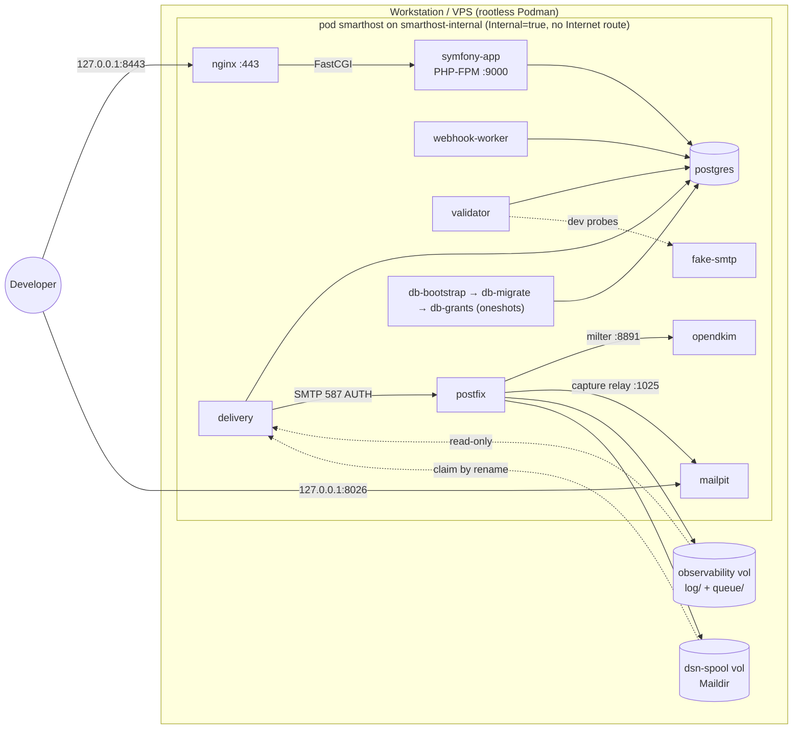
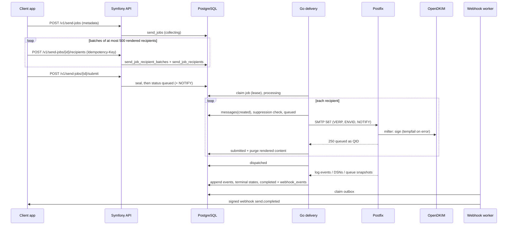
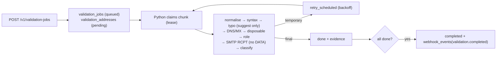
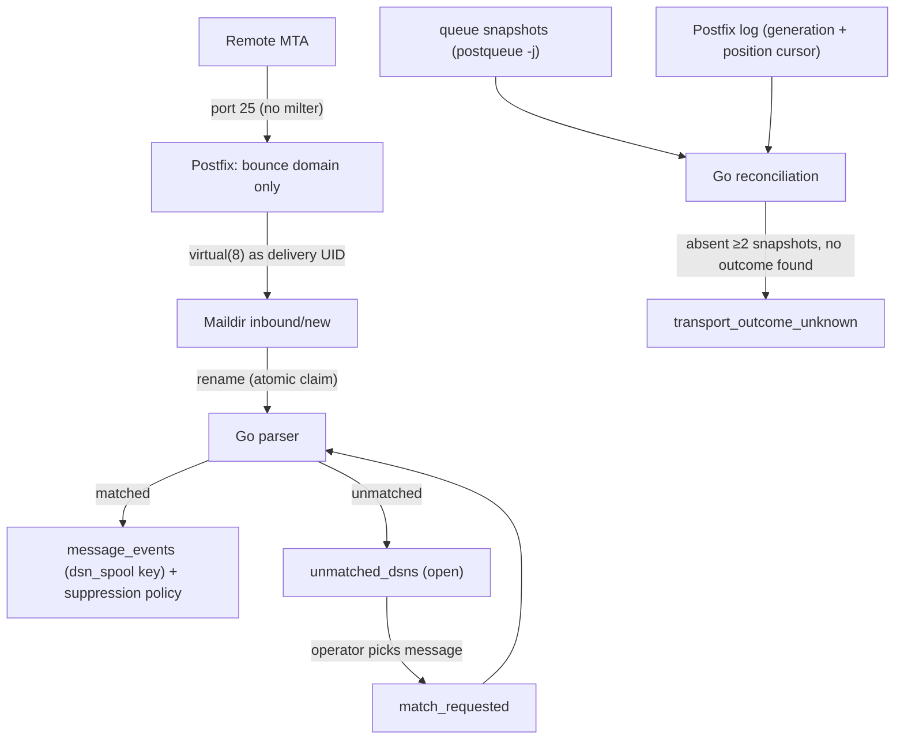
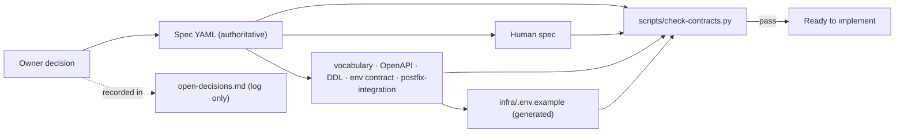
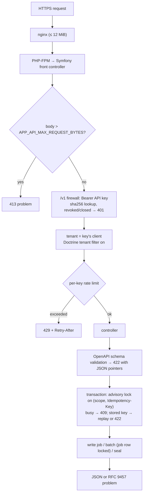
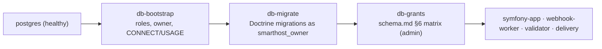

# Project Guide: Structure, Files and Workflows

This guide explains how the repository is organised, what every file does, and how the main
workflows run. Architecture authority is the specification
(`docs/20260908-1644-smarthost-llm-spec.yaml`); this document only describes it.

Generated and secret material is **not** in the repository:
- `infra/.env` holds development secrets.
- `infra/.generated/` holds the rendered env files, rendered units and development TLS keys.

Both are gitignored.

---

## 1. Directory structure

```
.
├── AGENTS.md                      Rules for coding agents (read first)
├── CLAUDE.md                      Claude Code specifics on top of AGENTS.md
├── README.md                      Project overview and quick start
├── CHANGELOG.md                   Version history
├── LICENSE                        MIT licence
├── .gitignore                     Excludes secrets and generated files
├── .containerignore               Build context filter for the app image (repository root)
├── app/                           Symfony 8.1 application (PHP-FPM)
│   ├── Containerfile              Multi-stage: base, tools, test, vendor, runtime
│   ├── README.md
│   ├── composer.json, composer.lock, symfony.lock
│   ├── phpunit.dist.xml
│   ├── bin/console, bin/phpunit
│   ├── public/index.php           The only front controller (nginx → FastCGI)
│   ├── config/                    Framework, Doctrine, security, monolog, routes, services
│   ├── migrations/                5 Doctrine migrations (the schema authority)
│   ├── src/
│   │   ├── Api/                   Problems, OpenAPI validation, idempotency key, cursors, representations
│   │   ├── Audit/                 Audit log writer
│   │   ├── Client/                Client, user and membership administration
│   │   ├── Command/               Console commands (administration and dev bootstrap)
│   │   ├── Config/                Fail-closed configuration, `_FILE` secrets, limits
│   │   ├── Controller/            /v1 API, /healthz, minimal dashboard login
│   │   ├── Crypto/                Encryption keyring (webhook signing secrets)
│   │   ├── Doctrine/Type/         timestamptz and jsonb_map types
│   │   ├── Domain/                Sending domains and DNS TXT verification
│   │   ├── Entity/                24 entities, one per table
│   │   ├── Enum/                  32 vocabulary enums
│   │   ├── Idempotency/           In-flight lock
│   │   ├── Logging/               Contract log format
│   │   ├── Security/              API-key and dashboard authentication, voter
│   │   ├── Sending/               Send-job lifecycle, D-18 normalisation, content fingerprint
│   │   ├── Tenant/                Tenant scope and Doctrine tenant filter
│   │   ├── Validation/            Validation-job creation
│   │   ├── Webhook/               Endpoint/secret model and transactional outbox
│   │   ├── Util/Clock.php
│   │   └── Kernel.php
│   ├── tests/                     PHPUnit: Unit, Contract, Schema, Integration, Support, bin
│   ├── docker/
│   │   ├── fpm-healthcheck.sh
│   │   ├── php.ini
│   │   └── zz-smarthost-fpm.conf
│   └── phase1-probe/
│       ├── db-check.php
│       └── webhook-worker.php
├── validator/                     Python validator image
│   ├── Containerfile
│   ├── README.md
│   ├── phase1_probe.py
│   └── requirements-phase1.txt
├── delivery/                      Go delivery image
│   ├── Containerfile
│   ├── README.md
│   ├── go.mod, go.sum
│   └── cmd/smarthost-delivery-probe/main.go
├── postfix/                       Postfix image
│   ├── Containerfile
│   ├── README.md
│   ├── entrypoint.sh
│   ├── healthcheck.sh
│   ├── queue-snapshot.sh
│   └── logrotate.sh
├── opendkim/                      OpenDKIM milter image
│   ├── Containerfile
│   ├── README.md
│   ├── entrypoint.sh
│   └── dev-key.sh
├── infra/                         Environment, units and tooling
│   ├── .env.example
│   ├── README.md
│   ├── bin/
│   │   ├── smarthostctl
│   │   └── smarthost-machine-helper.sh
│   ├── lib/smarthost_render.py
│   ├── nginx/
│   │   ├── Containerfile
│   │   └── templates/smarthost.conf.template
│   ├── postgres/
│   │   ├── bootstrap.sh           Role bootstrap
│   │   ├── grants.sh              Applies grants.sql after migrations
│   │   └── grants.sql             The schema.md §6 privilege matrix
│   ├── quadlet/*.in               21 Quadlet templates (pod, network, volumes, containers)
│   ├── systemd/*.in               target + timers
│   └── tests/
│       ├── Containerfile          Verification tool image
│       ├── requirements.txt
│       ├── phase1_client.py
│       ├── phase1-verify.sh       Phase 1 verification suite
│       └── phase2-test.sh         Phase 2 test harness (throwaway network-less pod)
├── tests/fake-smtp/               Deterministic SMTP test server
│   ├── Containerfile
│   ├── README.md
│   └── fake_smtp.py
├── scripts/
│   ├── README.md
│   └── check-contracts.py
└── docs/                          Specifications, contracts, architecture
    ├── README.md
    ├── PROJECT.md                 (this file)
    ├── development-environment.md
    ├── 20260908-1644-smarthost-llm-spec.yaml
    ├── 20260908-1644-smarthost-human-specification.md
    ├── api/openapi.v1.yaml
    ├── architecture/
    │   ├── overview.md
    │   ├── conventions.md
    │   ├── postfix-integration.md
    │   └── open-decisions.md
    ├── contracts/
    │   ├── environment.md
    │   └── status-vocabulary.yaml
    └── schema/
        ├── reference-schema.sql
        └── schema.md
```

---

## 2. Files and what they do

### Root

| File | Purpose |
|---|---|
| `AGENTS.md` | Mandatory instructions for any coding agent: read the specs first; Podman only; no commits without instruction; what to report. |
| `CLAUDE.md` | Claude Code notes: authority order, current phase, WSL Podman-machine handling, protection of other projects' containers, required checks. |
| `README.md` | What Smarthost is, an architecture diagram, layout, quick start, status. |
| `CHANGELOG.md` | Version history: 0.1 (Phase 0 complete), 0.1.1 (Phase 1 complete, `smarthost` pod) and 0.1.2 (Phase 2 complete: Symfony foundation, schema, API primitives). |
| `LICENSE` | MIT licence. |
| `.gitignore` | Keeps `infra/.env`, `infra/.generated/`, keys and certificates out of git. |
| `.containerignore` | The app image builds from the repository root so that it can copy the normative OpenAPI and vocabulary contracts; this admits only `app/` (without `vendor/`, `var/`) and those contract files. |

### `docs/`: specifications and contracts

| File | Purpose |
|---|---|
| `20260908-1644-smarthost-llm-spec.yaml` | **Canonical specification 2.1.** It covers architecture, ownership, services, API, sending, tracking, schema, security, compliance and phases. |
| `20260908-1644-smarthost-human-specification.md` | Human-readable companion that mirrors the YAML. |
| `README.md` | Index of the documentation. |
| `PROJECT.md` | This guide. |
| `development-environment.md` | How to run the Podman environment: topology, ports, volumes, mail safety, facts established in Phase 1, the verification suite, and the Phase 2 application (migrations, console, tests). |
| `api/openapi.v1.yaml` | OpenAPI 3.1 contract for `/v1`: validation jobs, batched send jobs (create → recipients → submit), messages, events and webhooks. |
| `contracts/status-vocabulary.yaml` | Every allowed status, event, event source, failure scope and classification value, with transitions and ranks. |
| `contracts/environment.md` | The only list of permitted environment variables, with consumers, secrecy and phase. |
| `schema/reference-schema.sql` | Reference PostgreSQL 16 DDL (24 tables). This is not a migration. |
| `schema/schema.md` | ERD, tenant ownership, required indexes, CHECK rules and the database grant matrix. |
| `architecture/overview.md` | One-page map from the specification to the contracts and flows. |
| `architecture/conventions.md` | Cross-language rules: IDs, time, leases, API, webhooks, logging, wording. |
| `architecture/postfix-integration.md` | Postfix/OpenDKIM/Go channels, cursors, reconciliation and the verified V-1…V-7 results. |
| `architecture/open-decisions.md` | Decision log (D-01…D-30). Not a source of authority. |

### `infra/`: environment, units and tooling

| File | Purpose |
|---|---|
| `.env.example` | Safe template of every contract variable, with secrets empty. Generated from `docs/contracts/environment.md`. |
| `README.md` | What lives in `infra/`. |
| `bin/smarthostctl` | Developer CLI: init-env, render, build, secrets, install, dkim-dev-key, start/stop/restart, status, logs, systemctl pass-through, uninstall, destroy-volumes, verify, test (Phase 2 suite), console (Symfony console in the app container), migrate (re-run migrations and grants). |
| `bin/smarthost-machine-helper.sh` | Runs inside the Podman engine's systemd namespace. It installs and uninstalls units and passes commands through to `systemctl --user` and `journalctl --user`. |
| `lib/smarthost_render.py` | Regenerates `.env.example` and creates `infra/.env` with random development secrets. It renders per-consumer env files and Quadlet/systemd templates, and refuses non-contract variables. |
| `nginx/Containerfile` | nginx 1.28 image without the default site. |
| `nginx/templates/smarthost.conf.template` | HTTPS server. Every request goes to the Symfony front controller over FastCGI, with request-time DNS resolution. Bodies above 12 MiB get a JSON 413 from nginx; the application enforces the 10 MiB API limit itself. Also a loopback-only health server. |
| `postgres/bootstrap.sh` | Idempotent role bootstrap: five least-privilege roles; owner of the database and schema; runtime roles get CONNECT and USAGE only. |
| `postgres/grants.sql` | The table and column privileges of `docs/schema/schema.md` §6, exactly: revoke everything from the runtime roles, then grant the matrix, in one transaction. |
| `postgres/grants.sh` | Runs `grants.sql` with the administrative connection. Idempotent; re-run after every migration run. |
| `quadlet/smarthost.pod.in` | The `smarthost` pod. Every container joins it. It owns the network attachment, the service aliases and the two published loopback ports. |
| `quadlet/smarthost-internal.network.in` | `Internal=true` network `10.89.20.0/24`, with no Internet route. The pod is its only member. |
| `quadlet/smarthost-*.volume.in` (6) | Named volumes: postgres-data, postfix-queue, postfix-observability, dsn-spool, opendkim-keys, opendkim-tables. |
| `quadlet/smarthost-postgres.container.in` | PostgreSQL 16.15, with readiness via `pg_isready`. |
| `quadlet/smarthost-db-bootstrap.container.in` | Oneshot that runs `infra/postgres/bootstrap.sh` after PostgreSQL. |
| `quadlet/smarthost-db-migrate.container.in` | Oneshot after the bootstrap: `doctrine:migrations:migrate` as `smarthost_owner` (app image, `www-data`). |
| `quadlet/smarthost-db-grants.container.in` | Oneshot after the migrations: `infra/postgres/grants.sh` with the administrative connection. The PHP, Python and Go services start after it. |
| `quadlet/smarthost-symfony-app.container.in` | PHP-FPM (alias `symfony-app`) running the Symfony application, with an FPM-ping health check. |
| `quadlet/smarthost-webhook-worker.container.in` | Webhook-worker unit from the same image. Still the placeholder process until Phase 7. |
| `quadlet/smarthost-nginx.container.in` | nginx (pod member). Its HTTPS port is published by the pod as `PROXY_HTTPS_BIND`. TLS comes from Podman secrets. |
| `quadlet/smarthost-validator.container.in` | Python validator probe as uid 10001 (pod member). |
| `quadlet/smarthost-delivery.container.in` | Go probe as `SMARTHOST_DELIVERY_UID`:`SMARTHOST_SPOOL_GID`. Observability is read-only; the spool is read-write. |
| `quadlet/smarthost-postfix.container.in` | Postfix with the queue, observability and spool volumes, and TLS secrets. |
| `quadlet/smarthost-opendkim.container.in` | OpenDKIM, the only container that mounts the key volumes. |
| `quadlet/smarthost-mailpit.container.in` | Mailpit v1.31.0 (pod member). Its UI is published by the pod at `MAILPIT_UI_BIND`. |
| `quadlet/smarthost-fake-smtp.container.in` | Fake SMTP (alias `fake-smtp`), internal only. |
| `systemd/smarthost.target.in` | Groups every unit (`PartOf`/`WantedBy`) so the topology starts and stops together. |
| `systemd/smarthost-postfix-queue-snapshot.{service,timer}.in` | Periodic `podman exec … smarthost-queue-snapshot`. |
| `systemd/smarthost-postfix-logrotate.{service,timer}.in` | Daily `podman exec … smarthost-postfix-logrotate`. |
| `tests/phase1-verify.sh` | Phase 1 verification suite behind `smarthostctl verify [--clean]`. It runs 22 test groups and writes an evidence log to `infra/.generated/verify/`. The groups cover images, units, clean start, readiness, ports, network isolation, the live-mode guard, nginx→FPM, PostgreSQL roles, mail capture, DKIM, the milter-failure policy, V-1…V-7, the DSN spool, fake SMTP, persistence, stop/start and untouched neighbours. |
| `tests/phase2-test.sh` | Phase 2 test harness behind `smarthostctl test`. It builds the app `test` image and starts a throwaway pod **without any network** (`--network none`, label `project=smarthost`) with PostgreSQL 16.15. In it, it runs the real role bootstrap, the Doctrine migrations on the empty database, the grants and the reference schema (into a separate database for comparison), then PHPUnit as the application role. Random credentials; the pod is removed afterwards. |
| `tests/phase1_client.py` | Test client run inside the tool image on the internal network: submission (with queue ID), port-25 DSN injection, Mailpit lookup, cryptographic DKIM verification, fake-SMTP scenarios, PostgreSQL role/privilege probes and inotify watching. |
| `tests/Containerfile`, `tests/requirements.txt` | Verification tool image (`localhost/smarthost-testtools:dev`): Python with dkimpy, psycopg and inotify_simple. Test-only; never a service. |

### Service images

| File | Purpose |
|---|---|
| `postfix/Containerfile` | Debian trixie with Postfix 3.10, Cyrus SASL, OpenSSL and netcat. |
| `postfix/entrypoint.sh` | Enforces the capture/live **safety switch** and builds `main.cf`: relayhost, VERP bounce domain to the Maildir as the delivery UID, logging to the observability volume at 0640. Configures submission on 587 (TLS, SASL, OpenDKIM milter, tempfail) and the sasldb, then starts Postfix in the foreground. |
| `postfix/healthcheck.sh` | Readiness: Postfix master running, and a 220 greeting on 25 and 587. |
| `postfix/queue-snapshot.sh` | Atomic `postqueue -j` JSON-Lines snapshot (tmp file, then rename) with retention. |
| `postfix/logrotate.sh` | `postfix logrotate` plus deletion of rotated files older than the retention period. |
| `opendkim/Containerfile` | Debian trixie with OpenDKIM, opendkim-tools, openssl and busybox. |
| `opendkim/entrypoint.sh` | Writes `opendkim.conf`: sign-only, signs for `MTA ORIGINATING` (Postfix submission) using KeyTable/SigningTable. Logs through busybox syslogd to stdout. |
| `opendkim/dev-key.sh` | Generates a **disposable** development key inside the keys volume, registers it, and prints the public TXT record. Refuses outside development/test. |
| `app/Containerfile` | PHP 8.5-FPM with `pdo_pgsql`, `intl`, `pcntl` and `cgi-fcgi`. Stages: `tools` (Composer), `test` (dev dependencies and test-only contract copies), `runtime` (default; no dev dependencies, no tests). Built from the repository root so that the normative OpenAPI and vocabulary files are copied into `config/contracts/`. No PHP HTTP server. |
| `app/docker/php.ini` | UTC, no `expose_php`, `post_max_size` 12M (the application decides the 10 MiB limit), memory and OPcache settings. |
| `app/docker/zz-smarthost-fpm.conf` | Pool overrides: listen 9000, ping path, `clear_env = no`. |
| `app/docker/fpm-healthcheck.sh` | FastCGI ping readiness check. |
| `app/phase1-probe/db-check.php` | CLI check: connect as the app, webhook or owner role and verify the CREATE privilege boundary (used by the Phase 1 suite). |
| `app/phase1-probe/webhook-worker.php` | Placeholder long-running worker with a heartbeat and database check. Delivers no webhooks (Phase 7). |
| `validator/Containerfile` | Python 3.14 slim, unprivileged uid 10001. |
| `validator/phase1_probe.py` | Heartbeat loop, and `check-db` (the validator role must not be able to create tables). |
| `validator/requirements-phase1.txt` | Pinned `psycopg[binary]` for the probe. |
| `delivery/Containerfile` | Multi-stage Go 1.25 build, then a Debian slim runtime. |
| `delivery/cmd/smarthost-delivery-probe/main.go` | Probe subcommands: `serve`, `identity`, `check-db`, `check-observability` (reads the log and snapshots; proves it cannot write), and `check-spool [--claim]` (atomic rename claim; proves a second claim fails). |
| `delivery/go.mod`, `go.sum` | Module definition; the only dependency is pgx v5. |
| `tests/fake-smtp/fake_smtp.py` | Stdlib asyncio SMTP server whose reply is chosen by the recipient prefix (`reject-550`, `tempfail-450/451`, `unavailable-421`, `timeout`, otherwise accept). DATA is discarded. |
| `tests/fake-smtp/Containerfile` | Python 3.14 slim, uid 10003. |

### `app/`: the Symfony application (Phase 2)

| Path | Purpose |
|---|---|
| `composer.json`, `composer.lock`, `symfony.lock` | Symfony 8.1, Doctrine ORM 3 / DBAL 4 / Migrations, Security, Validator, Serializer, Rate Limiter, Lock, Monolog, Uid, opis/json-schema; PHPUnit 13 and Symfony test tools as dev dependencies. No Dotenv: configuration comes only from the contract variables. |
| `config/packages/framework.yaml` | Secret, trusted proxies, session (dashboard only), rate limiters (per API key, per IP for failed API authentication). |
| `config/packages/doctrine.yaml` | Two lazy connections: `default` as `smarthost_app` (runtime) and `owner` as `smarthost_owner` (migrations only); custom types; the tenant filter. |
| `config/packages/doctrine_migrations.yaml` | Migrations run on the `owner` connection, transactional. |
| `config/packages/security.yaml` | Stateless `/v1` firewall (API keys only) and a separate `/dashboard` form-login firewall (users only). |
| `config/packages/monolog.yaml` | JSON lines to stderr in the contract format; Doctrine only at warning. |
| `config/services.yaml` | Parameters from the environment contract; the test DNS stub. |
| `migrations/Version20261003000100…000500.php` | Tenancy; validation; sending; suppression/reputation; metering, webhooks and audit. Together they reproduce `docs/schema/reference-schema.sql`; each has a `down()`. |
| `src/Kernel.php` | Runs the fail-closed safety guard on every boot. |
| `src/Config/` | `SafetyGuard` (SMARTHOST_ENV values; unverified domains forbidden in production), `SecretEnvVarProcessor` (`X` or `X_FILE`, never both), `Limits` (configuration may lower, never raise, the contract ceilings). |
| `src/Doctrine/Type/` | `timestamptz` (microseconds, UTC) and `jsonb_map` (`{}` stays an object). |
| `src/Entity/` | One entity per table (24). Tables written only by Python or Go are mapped read-only. |
| `src/Enum/` | The 32 vocabularies of `status-vocabulary.yaml` as PHP enums. |
| `src/Security/` | `ApiKeyManager` (raw key `shk_…`, 256 bits, shown once; SHA-256 stored), `ApiKeyAuthenticator` (Bearer; revoked keys and closed clients rejected; last-used tracking; failure rate limit), `ApiClientUser`, dashboard user provider and checker, login listener, `ClientVoter`. |
| `src/Tenant/` | `TenantScope` (the only way API code loads tenant resources; foreign = missing), `TenantFilter` (Doctrine SQL filter, deny-by-default per table), and the listener that enables it for the authenticated client. |
| `src/Api/` | RFC 9457 problems and their renderer, exception mapping for `/v1`, body-size and per-key rate limits, `OpenApiContract` (validates requests against the normative OpenAPI), `JsonRequest`, `RequestHasher` (canonical idempotency hash), `IdempotencyKey`, `Cursor`, `Presenter`. |
| `src/Idempotency/IdempotencyLock.php` | Transaction-scoped advisory lock that turns a concurrent retry into 409. |
| `src/Validation/ValidationJobService.php` | Creates the job and its pending address rows; validates nothing. |
| `src/Sending/` | `SendJobService` (create, batch, submit with row locking), `AddressNormalizer` (D-18), `RecipientContent` (size and SHA-256 fingerprint kept after purge). |
| `src/Domain/` | `SendingDomainService` (registration, TXT verification, re-checks, enable/disable, DKIM status) and the DNS TXT resolver boundary. |
| `src/Crypto/Keyring.php` | `APP_ENCRYPTION_KEYS` keyring (libsodium secretbox, purpose-bound). |
| `src/Webhook/` | `WebhookEndpointService` (encrypted secrets, rotation with overlap) and `WebhookOutbox` (transactional outbox writer). |
| `src/Audit/` | `AuditLogger` and `AuditActor`. |
| `src/Client/AccountAdministration.php` | Clients, users (case-insensitive login), passwords, operator role, memberships. |
| `src/Command/` | `smarthost:client:*`, `smarthost:api-key:*`, `smarthost:user:*`, `smarthost:membership:set`, `smarthost:domain:*`, `smarthost:webhook:*`, `smarthost:dev:bootstrap`. |
| `src/Controller/` | `/v1` controllers (validation jobs, send jobs, messages, `webhooks/test` = 501), `/healthz`, minimal `/dashboard` login. |
| `src/Logging/ContractFormatter.php` | `ts`, `level`, `service`, `msg` plus context. |
| `tests/Unit/` | D-18 normalisation, request hashing, keyring, configuration rules, log format. |
| `tests/Contract/` | `/v1` routes equal the OpenAPI operations; OpenAPI enums equal the PHP enums. |
| `tests/Schema/` | Reference-schema equivalence, migration up/down/up, ORM mapping vs database, vocabulary CHECKs, the grant matrix parsed from `schema.md`, least privilege, critical constraints. |
| `tests/Integration/` | Authentication, tenant isolation, idempotency (including multi-process concurrency), validation jobs, send jobs, sending domains, dashboard users, webhooks, console commands, health and audit. Every response is validated against the OpenAPI contract. |
| `tests/Support/`, `tests/bin/request.php` | Test base class, direct database connections, catalog comparison, DNS stub, and the concurrent-request worker. |

### `scripts/`

| File | Purpose |
|---|---|
| `check-contracts.py` | Read-only consistency check across the specification, human specification, vocabulary, OpenAPI, DDL, schema docs and environment contract/template, plus a stale-term scan. |
| `README.md` | How to run it. |

The per-directory `README.md` files describe each component's role and limits.

---

## 3. Workflow diagrams

### 3.1 Service topology



### 3.2 Send workflow (target behaviour, Phases 2–6)



### 3.3 Validation workflow (target behaviour, Phase 3)



### 3.4 Inbound DSN and reconciliation (target behaviour, Phases 4–5)



### 3.5 Contract governance workflow



### 3.6 API request pipeline (Phase 2)



### 3.7 Schema and grants at start-up



### 3.8 Development environment lifecycle

See `docs/development-environment.md` §2.
