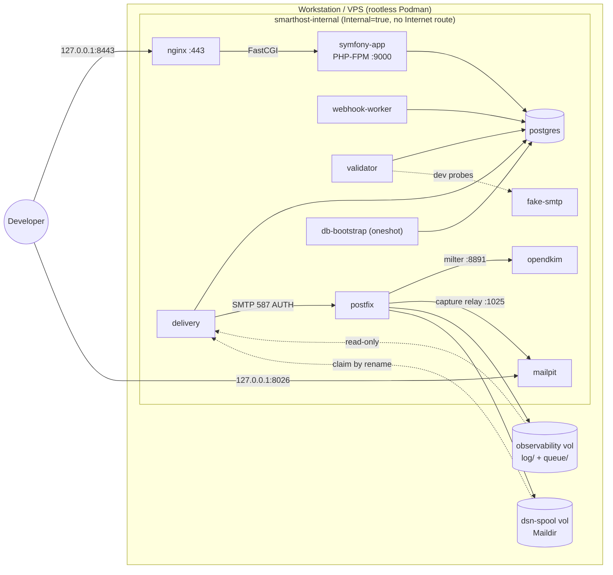
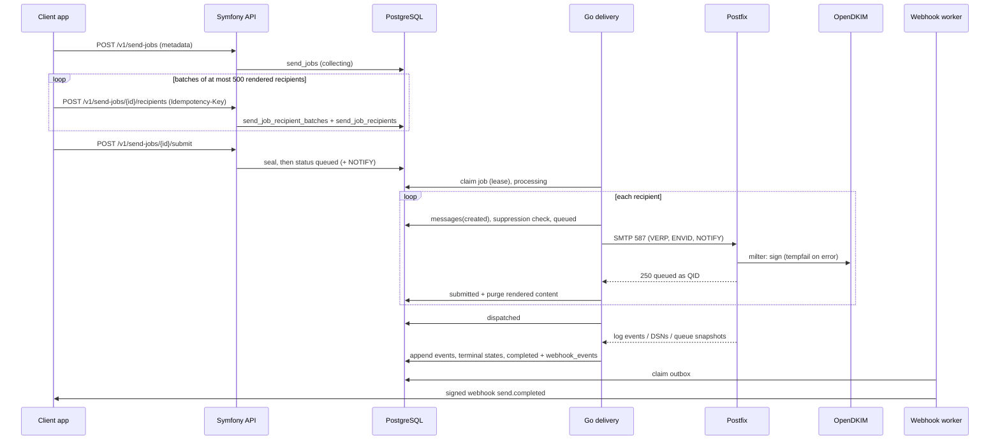
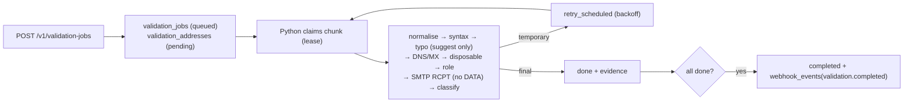
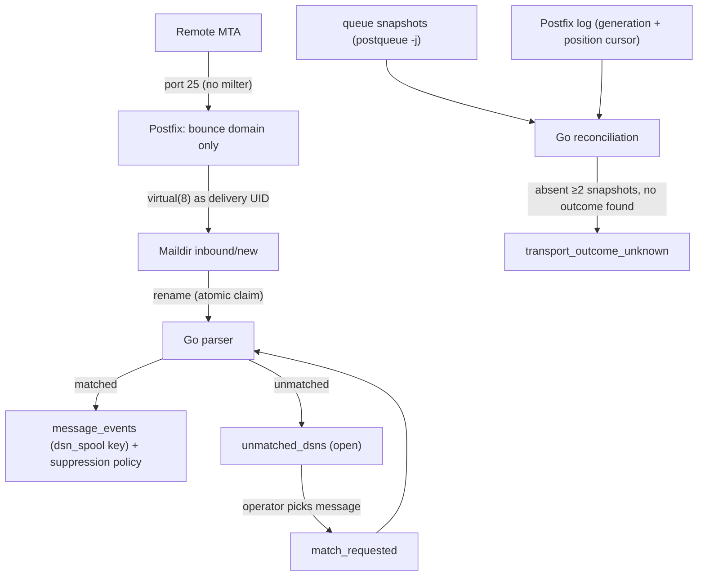
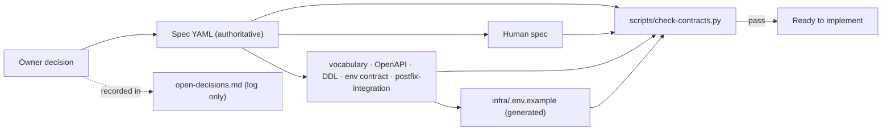

# Project Guide: Structure, Files and Workflows

This guide explains how the repository is organised, what every file does, and how the main
workflows run. Architecture authority is the specification
(`docs/20260908-1644-smarthost-llm-spec.yaml`); this document only describes it.

Generated and secret material is **not** in the repository:
- `infra/.env` holds development secrets.
- `infra/.generated/` holds the rendered env files, rendered units and development TLS keys.

Both are gitignored.

---

## 1. Directory structure

```
.
├── AGENTS.md                      Rules for coding agents (read first)
├── CLAUDE.md                      Claude Code specifics on top of AGENTS.md
├── README.md                      Project overview and quick start
├── CHANGELOG.md                   Version history
├── LICENSE                        MIT licence
├── .gitignore                     Excludes secrets and generated files
├── app/                           Symfony runtime image (PHP-FPM)
│   ├── Containerfile
│   ├── README.md
│   ├── docker/
│   │   ├── fpm-healthcheck.sh
│   │   └── zz-smarthost-fpm.conf
│   └── phase1-probe/
│       ├── healthz.php
│       ├── db-check.php
│       └── webhook-worker.php
├── validator/                     Python validator image
│   ├── Containerfile
│   ├── README.md
│   ├── phase1_probe.py
│   └── requirements-phase1.txt
├── delivery/                      Go delivery image
│   ├── Containerfile
│   ├── README.md
│   ├── go.mod, go.sum
│   └── cmd/smarthost-delivery-probe/main.go
├── postfix/                       Postfix image
│   ├── Containerfile
│   ├── README.md
│   ├── entrypoint.sh
│   ├── healthcheck.sh
│   ├── queue-snapshot.sh
│   └── logrotate.sh
├── opendkim/                      OpenDKIM milter image
│   ├── Containerfile
│   ├── README.md
│   ├── entrypoint.sh
│   └── dev-key.sh
├── infra/                         Environment, units and tooling
│   ├── .env.example
│   ├── README.md
│   ├── bin/
│   │   ├── smarthostctl
│   │   └── smarthost-machine-helper.sh
│   ├── lib/smarthost_render.py
│   ├── nginx/
│   │   ├── Containerfile
│   │   └── templates/smarthost.conf.template
│   ├── postgres/bootstrap.sh
│   ├── quadlet/*.in               18 Quadlet templates
│   ├── systemd/*.in               target + timers
│   └── tests/phase1_client.py
├── tests/fake-smtp/               Deterministic SMTP test server
│   ├── Containerfile
│   ├── README.md
│   └── fake_smtp.py
├── scripts/
│   ├── README.md
│   └── check-contracts.py
└── docs/                          Specifications, contracts, architecture
    ├── README.md
    ├── PROJECT.md                 (this file)
    ├── development-environment.md
    ├── 20260908-1644-smarthost-llm-spec.yaml
    ├── 20260908-1644-smarthost-human-specification.md
    ├── api/openapi.v1.yaml
    ├── architecture/
    │   ├── overview.md
    │   ├── conventions.md
    │   ├── postfix-integration.md
    │   └── open-decisions.md
    ├── contracts/
    │   ├── environment.md
    │   └── status-vocabulary.yaml
    └── schema/
        ├── reference-schema.sql
        └── schema.md
```

---

## 2. Files and what they do

### Root

| File | Purpose |
|---|---|
| `AGENTS.md` | Mandatory instructions for any coding agent: read the specs first; Podman only; no commits without instruction; what to report. |
| `CLAUDE.md` | Claude Code notes: authority order, current phase, WSL Podman-machine handling, protection of other projects' containers, required checks. |
| `README.md` | What Smarthost is, an architecture diagram, layout, quick start, status. |
| `CHANGELOG.md` | Version history (0.1 = Phase 0 complete, Phase 1 in progress). |
| `LICENSE` | MIT licence. |
| `.gitignore` | Keeps `infra/.env`, `infra/.generated/`, keys and certificates out of git. |

### `docs/`: specifications and contracts

| File | Purpose |
|---|---|
| `20260908-1644-smarthost-llm-spec.yaml` | **Canonical specification 2.1.** It covers architecture, ownership, services, API, sending, tracking, schema, security, compliance and phases. |
| `20260908-1644-smarthost-human-specification.md` | Human-readable companion that mirrors the YAML. |
| `README.md` | Index of the documentation. |
| `PROJECT.md` | This guide. |
| `development-environment.md` | How to run the Phase 1 Podman environment, the topology and ports, and what has been observed and what is still pending. |
| `api/openapi.v1.yaml` | OpenAPI 3.1 contract for `/v1`: validation jobs, batched send jobs (create → recipients → submit), messages, events and webhooks. |
| `contracts/status-vocabulary.yaml` | Every allowed status, event, event source, failure scope and classification value, with transitions and ranks. |
| `contracts/environment.md` | The only list of permitted environment variables, with consumers, secrecy and phase. |
| `schema/reference-schema.sql` | Reference PostgreSQL 16 DDL (24 tables). This is not a migration. |
| `schema/schema.md` | ERD, tenant ownership, required indexes, CHECK rules and the database grant matrix. |
| `architecture/overview.md` | One-page map from the specification to the contracts and flows. |
| `architecture/conventions.md` | Cross-language rules: IDs, time, leases, API, webhooks, logging, wording. |
| `architecture/postfix-integration.md` | Postfix/OpenDKIM/Go channels, cursors, reconciliation and the V-1…V-7 verification tasks. |
| `architecture/open-decisions.md` | Decision log (D-01…D-30). Not a source of authority. |

### `infra/`: environment, units and tooling

| File | Purpose |
|---|---|
| `.env.example` | Safe template of every contract variable, with secrets empty. Generated from `docs/contracts/environment.md`. |
| `README.md` | What lives in `infra/`. |
| `bin/smarthostctl` | Developer CLI: init-env, render, build, secrets, install, dkim-dev-key, start/stop/restart, status, logs, uninstall, destroy-volumes. |
| `bin/smarthost-machine-helper.sh` | Runs inside the Podman engine's systemd namespace. It installs and uninstalls units and passes commands through to `systemctl --user` and `journalctl --user`. |
| `lib/smarthost_render.py` | Regenerates `.env.example` and creates `infra/.env` with random development secrets. It renders per-consumer env files and Quadlet/systemd templates, and refuses non-contract variables. |
| `nginx/Containerfile` | nginx 1.28 image without the default site. |
| `nginx/templates/smarthost.conf.template` | HTTPS server. `/healthz` goes to PHP-FPM over FastCGI, with request-time DNS resolution. Also a loopback-only health server. |
| `postgres/bootstrap.sh` | Idempotent role bootstrap: five least-privilege roles; owner of the database and schema; runtime roles get CONNECT and USAGE only. |
| `quadlet/smarthost-internal.network.in` | `Internal=true` network `10.89.20.0/24`, with no Internet route. |
| `quadlet/smarthost-*.volume.in` (6) | Named volumes: postgres-data, postfix-queue, postfix-observability, dsn-spool, opendkim-keys, opendkim-tables. |
| `quadlet/smarthost-postgres.container.in` | PostgreSQL 16.15, with readiness via `pg_isready`. |
| `quadlet/smarthost-db-bootstrap.container.in` | Oneshot that runs `infra/postgres/bootstrap.sh` after PostgreSQL. |
| `quadlet/smarthost-symfony-app.container.in` | PHP-FPM (alias `symfony-app`), with an FPM-ping health check. |
| `quadlet/smarthost-webhook-worker.container.in` | Webhook-worker unit from the same image (a Phase 1 placeholder process). |
| `quadlet/smarthost-nginx.container.in` | nginx. Publishes `PROXY_HTTPS_BIND`; TLS from Podman secrets. |
| `quadlet/smarthost-validator.container.in` | Python validator probe as uid 10001. |
| `quadlet/smarthost-delivery.container.in` | Go probe as `SMARTHOST_DELIVERY_UID`:`SMARTHOST_SPOOL_GID`. Observability is read-only; the spool is read-write. |
| `quadlet/smarthost-postfix.container.in` | Postfix with the queue, observability and spool volumes, and TLS secrets. |
| `quadlet/smarthost-opendkim.container.in` | OpenDKIM, the only container that mounts the key volumes. |
| `quadlet/smarthost-mailpit.container.in` | Mailpit v1.31.0. UI published at `MAILPIT_UI_BIND`. |
| `quadlet/smarthost-fake-smtp.container.in` | Fake SMTP (alias `fake-smtp`), internal only. |
| `systemd/smarthost.target.in` | Groups every unit (`PartOf`/`WantedBy`) so the topology starts and stops together. |
| `systemd/smarthost-postfix-queue-snapshot.{service,timer}.in` | Periodic `podman exec … smarthost-queue-snapshot`. |
| `systemd/smarthost-postfix-logrotate.{service,timer}.in` | Daily `podman exec … smarthost-postfix-logrotate`. |
| `tests/phase1_client.py` | Throwaway test client: authenticated submission on 587, synthetic DSN on port 25, PostgreSQL wrong-password test. |

### Service images

| File | Purpose |
|---|---|
| `postfix/Containerfile` | Debian trixie with Postfix 3.10, Cyrus SASL, OpenSSL and netcat. |
| `postfix/entrypoint.sh` | Enforces the capture/live **safety switch** and builds `main.cf`: relayhost, VERP bounce domain to the Maildir as the delivery UID, logging to the observability volume at 0640. Configures submission on 587 (TLS, SASL, OpenDKIM milter, tempfail) and the sasldb, then starts Postfix in the foreground. |
| `postfix/healthcheck.sh` | Readiness: Postfix master running, and a 220 greeting on 25 and 587. |
| `postfix/queue-snapshot.sh` | Atomic `postqueue -j` JSON-Lines snapshot (tmp file, then rename) with retention. |
| `postfix/logrotate.sh` | `postfix logrotate` plus deletion of rotated files older than the retention period. |
| `opendkim/Containerfile` | Debian trixie with OpenDKIM, opendkim-tools, openssl and busybox. |
| `opendkim/entrypoint.sh` | Writes `opendkim.conf`: sign-only, signs for `MTA ORIGINATING` (Postfix submission) using KeyTable/SigningTable. Logs through busybox syslogd to stdout. |
| `opendkim/dev-key.sh` | Generates a **disposable** development key inside the keys volume, registers it, and prints the public TXT record. Refuses outside development/test. |
| `app/Containerfile` | PHP 8.5-FPM with `pdo_pgsql`, `pcntl` and `cgi-fcgi`. No PHP HTTP server. |
| `app/docker/zz-smarthost-fpm.conf` | Pool overrides: listen 9000, ping path, `clear_env = no`. |
| `app/docker/fpm-healthcheck.sh` | FastCGI ping readiness check. |
| `app/phase1-probe/healthz.php` | JSON probe served through nginx. |
| `app/phase1-probe/db-check.php` | CLI check: connect as the app, webhook or owner role and verify the CREATE privilege boundary. |
| `app/phase1-probe/webhook-worker.php` | Placeholder long-running worker with a heartbeat and database check. Delivers no webhooks. |
| `validator/Containerfile` | Python 3.14 slim, unprivileged uid 10001. |
| `validator/phase1_probe.py` | Heartbeat loop, and `check-db` (the validator role must not be able to create tables). |
| `validator/requirements-phase1.txt` | Pinned `psycopg[binary]` for the probe. |
| `delivery/Containerfile` | Multi-stage Go 1.25 build, then a Debian slim runtime. |
| `delivery/cmd/smarthost-delivery-probe/main.go` | Probe subcommands: `serve`, `identity`, `check-db`, `check-observability` (reads the log and snapshots; proves it cannot write), and `check-spool [--claim]` (atomic rename claim; proves a second claim fails). |
| `delivery/go.mod`, `go.sum` | Module definition; the only dependency is pgx v5. |
| `tests/fake-smtp/fake_smtp.py` | Stdlib asyncio SMTP server whose reply is chosen by the recipient prefix (`reject-550`, `tempfail-450/451`, `unavailable-421`, `timeout`, otherwise accept). DATA is discarded. |
| `tests/fake-smtp/Containerfile` | Python 3.14 slim, uid 10003. |

### `scripts/`

| File | Purpose |
|---|---|
| `check-contracts.py` | Read-only consistency check across the specification, human specification, vocabulary, OpenAPI, DDL, schema docs and environment contract/template, plus a stale-term scan. |
| `README.md` | How to run it. |

The per-directory `README.md` files describe each component's role and limits.

---

## 3. Workflow diagrams

### 3.1 Service topology



### 3.2 Send workflow (target behaviour, Phases 2–6)



### 3.3 Validation workflow (target behaviour, Phase 3)



### 3.4 Inbound DSN and reconciliation (target behaviour, Phases 4–5)



### 3.5 Contract governance workflow



### 3.6 Development environment lifecycle

See `docs/development-environment.md` §2.
