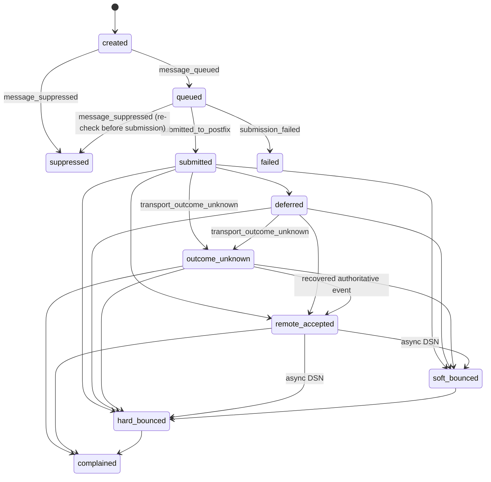
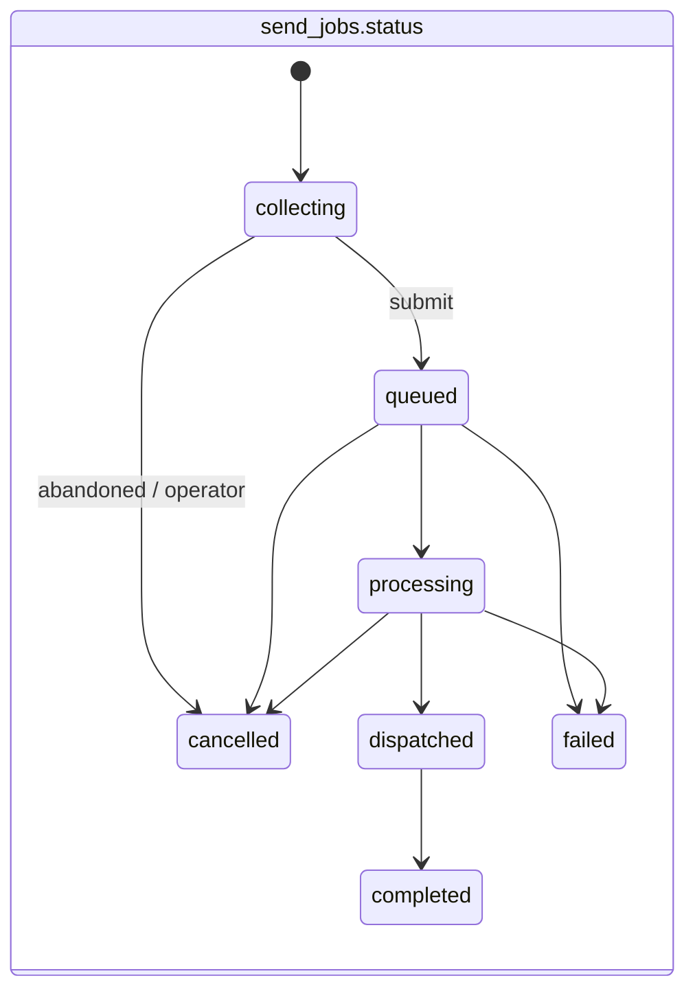
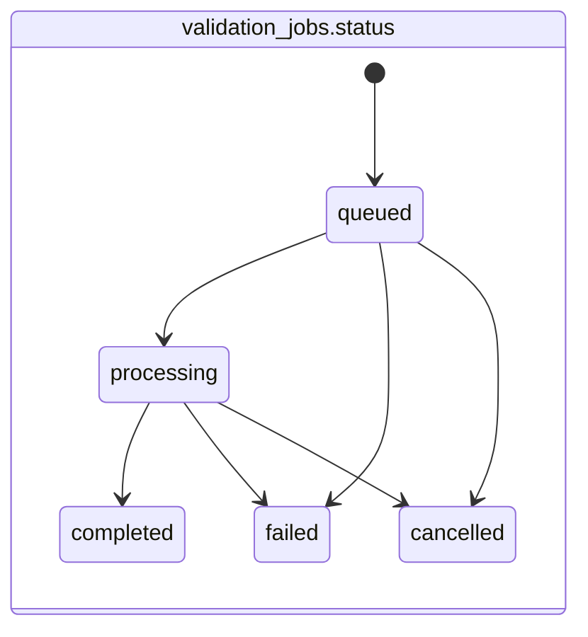

# Smarthost Architecture Overview

**Status:** summary of specification 2.4. The authoritative sources are
`docs/20260908-1644-smarthost-llm-spec.yaml` and its human-readable companion
`docs/20260908-1644-smarthost-human-specification.md`. If this page disagrees with them, they win.
It adds no architecture of its own. It maps the specification onto the contract files and shows
the main flows on one page.

## 1. Contract map

| Concern | Spec section | Contract file |
|---|---|---|
| Statuses, events, sources, failure scopes | `message_tracking`, `sending.send_job_statuses`, `validation.job_statuses` | `docs/contracts/status-vocabulary.yaml` |
| Public API, batched send ingestion, webhooks | `api`, `sending.ingestion` | `docs/api/openapi.v1.yaml` |
| Tables, constraints, indexes, grants | `schema`, `postgres.roles_and_privileges` | `docs/schema/reference-schema.sql`, `docs/schema/schema.md` |
| Configuration | `instruction_for_llm.normative_contracts` | `docs/contracts/environment.md`, `infra/.env.example` |
| Postfix, OpenDKIM, logs, snapshots, DSN spool, reconciliation | `go_delivery.initial_integration_strategy`, `opendkim`, `transport_reconciliation`, `inbound_bounce_handling` | `docs/architecture/postfix-integration.md` |
| Global suppression policy, recipient global opt-out (D-30) | `suppression_and_reputation.global_suppression_policy`, `api.authentication.capabilities` | `docs/contracts/status-vocabulary.yaml`, `docs/api/openapi.v1.yaml`, `docs/schema/schema.md` |
| Cross-language conventions | `instruction_for_llm.implementation_style` | `docs/architecture/conventions.md` |
| Decision history (log only, not authority) | `revision_history` | `docs/architecture/open-decisions.md` |

## 2. Services

```text
Internet ──443──► nginx ──FastCGI──► Symfony PHP-FPM (API, dashboards, tracking)
                                     Symfony webhook worker (same image) ──HTTPS──► client endpoints
PostgreSQL ◄── all Smarthost services (internal network only; per-service roles)
Python validator ──(RCPT probes, never DATA)──► remote MX / fake SMTP
Go delivery ──SMTP 587──► Postfix ──milter──► OpenDKIM
                          Postfix ──► Internet / Mailpit (dev)
Internet ──25──► Postfix ──Maildir──► DSN spool ──► Go (DSN/ARF parsing, correlation,
                                                        global suppression policy, D-30)
Postfix ──► observability volume (log/, queue/ snapshots) ──read-only──► Go
```

## 3. Send flow

```text
The client renders every recipient's subject/HTML/text and generates unsubscribe URLs
POST /v1/send-jobs                → send_jobs(collecting) with job-level metadata only
POST /v1/send-jobs/{id}/recipients (≤500 per request, idempotent, repeated)
                                  → send_job_recipient_batches + send_job_recipients
                                    (running total ≤ limit; duplicate normalised addresses rejected across batches)
POST /v1/send-jobs/{id}/submit    → seal: non-empty, ≤ limit, class metadata valid,
                                    sending domain verified (+ DKIM active in production) → queued
Go (leased): processing
    per recipient: messages(created) → suppression check → queued → MIME build
        (header contract; HTML pixel / HTML link rewriting only if enabled;
         List-Unsubscribe/-Post/List-Id for subscription)
        → SMTP to Postfix → OpenDKIM signs → 250 queued as QID
        → submitted + purge rendered content (same transaction)
    all recipients submitted / suppressed / failed → dispatched
Go: log events, DSNs, reconciliation → terminal knowledge states (incl. outcome_unknown)
    → completed + webhook_events(send.completed)
```

## 4. Validation flow

```text
POST /v1/validation-jobs (addresses with optional external_address_reference)
    → validation_jobs(queued) + validation_addresses(pending)
Python (leased): processing; normalise → syntax → typo (suggestion only) → DNS → disposable → role
    → SMTP probe (no DATA) → classify; retry_scheduled on temporary conditions
    all done → completed + webhook_events(validation.completed)
```

## 5. Webhooks (transactional outbox)

1. The producer (Python, Go or Symfony) inserts a `webhook_events` row in the same transaction as
   the state change.
2. The Symfony webhook worker fans the event out to enabled, subscribed `webhook_endpoints`,
   creating `webhook_deliveries`.
3. The worker claims deliveries with a lease, signs them (current secret, plus the previous secret
   during the rotation overlap), POSTs them, records the outcome, and retries with backoff.

## 6. Message states



The terminal knowledge states are `outcome_unknown`, `remote_accepted`, `soft_bounced`,
`hard_bounced`, `complained`, `failed` and `suppressed`. `outcome_unknown` is never a success
state.

## 7. Job states





## 8. Network exposure

| Service | Production public | Development published |
|---|---|---|
| nginx (published by the `smarthost` pod) | 443 | `127.0.0.1:8443` |
| Postfix | 25 (bounce domain only), 587 (authenticated) | none, or loopback for tests |
| PHP-FPM, webhook worker, OpenDKIM, Python, Go, PostgreSQL | **none** | **none** |
| Mailpit | n/a | `127.0.0.1:8026` |
