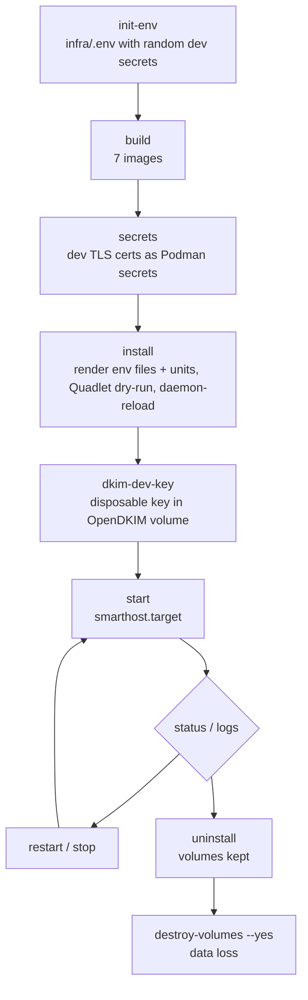

# Development Environment (Phase 1)

**Status:** in progress (version 0.1). The topology builds, installs and starts with every
service healthy. The automated verification suite and several V-1…V-7 verifications are still
pending (§6).

## 1. Requirements

- Rootless Podman 5.1 or later with Quadlet (needed for `Notify=healthy`). Verified with engine
  6.0.2 in a WSL Podman machine (Fedora 44) and client `podman-remote` 6.1.1.
- A systemd user manager on the engine host, with lingering enabled.
- Python 3.10 or later on the workstation (for `infra/lib/smarthost_render.py` and the contract
  checker).

### WSL Podman machine notes

The Podman engine runs inside the `podman-machine-default` WSL distribution. That distribution's
PID 1 is WSL's `/init`; systemd runs in a nested namespace.

- `smarthostctl` sends systemd/Quadlet operations through `wsl.exe` and the machine's own
  `/usr/local/bin/enterns`, which is the same mechanism `podman machine ssh` uses.
- Quadlet files are installed to `~/.config/containers/systemd/`.
- The target and timers are installed to `~/.local/share/systemd/user/`. In the machine image,
  `~/.config/systemd/user` is root-owned.
- The repository must be on a path visible to the machine. `/mnt/wsl/...` is shared between WSL
  distributions.

## 2. Lifecycle

| Command | Effect |
|---|---|
| `smarthostctl init-env` | Creates `infra/.env` (mode 0600, gitignored) from `infra/.env.example` and fills the secrets with random development values. Never overwrites. |
| `smarthostctl render` | Writes one env file per consumer (least privilege, following the contract's *Consumers* column) and renders the Quadlet and systemd templates into `infra/.generated/`. Rejects any variable that is not in the contract. |
| `smarthostctl build` | Builds the seven Smarthost images (`localhost/smarthost-*:dev`). |
| `smarthostctl secrets` | Creates disposable self-signed TLS certificates for Postfix and nginx as Podman secrets. |
| `smarthostctl install` | Renders the files, installs them, runs the Quadlet dry-run and reloads systemd. |
| `smarthostctl dkim-dev-key [domain selector]` | Generates a dev DKIM key inside the OpenDKIM volume. The default is `smarthost-dev.test` / `phase1`. |
| `smarthostctl start`, `stop`, `restart` | Operate `smarthost.target`. |
| `smarthostctl status [unit]`, `logs <unit> [n]` | Show unit status and the unit's journal. |
| `smarthostctl uninstall` | Stops the services and removes the units. Volumes are kept. |
| `smarthostctl destroy-volumes --yes` | Deletes every volume labelled `project=smarthost`. |
| `smarthostctl verify` | Reserved for the Phase 1 verification suite. It is **not written yet**, so the command currently fails. |

## 3. Topology

All containers are attached to **`smarthost-internal`**: `Internal=true`, subnet
`10.89.20.0/24`, aardvark DNS aliases.

| Unit (`smarthost-…`) | Image | Alias | Identity | Readiness check |
|---|---|---|---|---|
| postgres | postgres:16.15-trixie | `postgres` | image default | `pg_isready` |
| db-bootstrap (oneshot) | postgres:16.15-trixie | — | admin connection | exit status |
| symfony-app | smarthost-app | `symfony-app` | FPM master root, workers www-data | FastCGI `/fpm-ping` |
| webhook-worker | smarthost-app | — | www-data | heartbeat file |
| nginx | smarthost-nginx | — | image default | loopback `/nginx-health` |
| validator | smarthost-validator | — | uid 10001 | database probe |
| delivery | smarthost-delivery | — | `SMARTHOST_DELIVERY_UID`:`SMARTHOST_SPOOL_GID` (5001:5000) | database probe |
| postfix | smarthost-postfix | `postfix` | root (Postfix drops privileges) | 220 greeting on ports 25 and 587 |
| opendkim | smarthost-opendkim | `opendkim` | opendkim | port 8891 listening |
| mailpit | mailpit:v1.31.0 | `mailpit` | image default | `mailpit readyz` |
| fake-smtp | smarthost-fake-smtp | `fake-smtp` | uid 10003 | 220 greeting |

The timers are `smarthost-postfix-queue-snapshot.timer` (every
`POSTFIX_QUEUE_SNAPSHOT_INTERVAL_SECONDS`) and `smarthost-postfix-logrotate.timer` (daily).

### Published host ports

| Bind | Service | Why |
|---|---|---|
| `127.0.0.1:8443` → 443 | nginx | The only HTTP entry (`PROXY_HTTPS_BIND`) |
| `127.0.0.1:8026` → 8025 | Mailpit UI | Development inspection (`MAILPIT_UI_BIND`). 8025 is often taken by other local Mailpit instances. |

PostgreSQL, PHP-FPM, OpenDKIM, Postfix, the Python and Go workers, and fake SMTP publish no
ports.

### Persistent volumes

| Volume | Mounted by |
|---|---|
| `smarthost-postgres-data` | postgres |
| `smarthost-postfix-queue` | postfix (`/var/spool/postfix`) |
| `smarthost-postfix-observability` | postfix (rw), delivery (**ro**) |
| `smarthost-dsn-spool` | postfix (rw), delivery (rw, for claim by rename) |
| `smarthost-opendkim-keys` | opendkim only |
| `smarthost-opendkim-tables` | opendkim only |

## 4. Mail safety

Three independent layers keep development mail off the Internet:

1. **Capture mode.** With `SMARTHOST_LIVE_DELIVERY_ENABLED=false`, Postfix relays all outbound
   mail to `POSTFIX_RELAYHOST` (`[mailpit]:1025`) and refuses to start without one.
2. **Live-mode guard.** `SMARTHOST_LIVE_DELIVERY_ENABLED=true` is rejected unless
   `SMARTHOST_ENV=production` and the relayhost is empty.
3. **Network isolation.** `smarthost-internal` has no route out. An experiment on an equivalent
   internal network returned "Network is unreachable" for TCP to 1.1.1.1, and external DNS had no
   answer. Published loopback ports and container aliases still worked.

## 5. Facts observed so far (Phase 1)

| Topic | Observation |
|---|---|
| Postfix version | 3.10.13 (Debian trixie). `postqueue -j` is available. |
| `maillog_file_prefixes` | Default `/var, /dev/stdout`, so the observability directory must be under `/var`. |
| `maillog_file_permissions` | Exists, default `0600`. Set to `0640`. Observed log file: `-rw-r----- root:5000` in a setgid `2750 root:5000` directory. |
| `milter_default_action` | The default in 3.10 is **`shutdown`**, so `tempfail` is set explicitly (globally and on the submission service). |
| Health check | Sending `QUIT` before the greeting triggers Postfix's pipelining protection (`554 5.5.0 SMTP protocol synchronization`), so the check waits for the 220 banner. |
| OpenDKIM | 2.11.0. `opendkim-genkey` needs the `openssl` CLI. Dev keys are `0600 opendkim:opendkim` in the keys volume. |
| PostgreSQL bootstrap | The runtime roles connect and get `permission denied for schema public` on `CREATE TABLE`, as intended. |
| First start | During the first start, the network and volume units failed once with no error output. A manual run, and every later start, succeeded. This is still under investigation as part of the clean-state test. |

## 6. Pending (Phase 1 not yet complete)

- The automated verification suite (`infra/tests/phase1-verify.sh`). The test client
  `infra/tests/phase1_client.py` exists.
- An end-to-end test: submission on 587, then Mailpit, with no Internet delivery attempt.
- Verifying the DKIM signature on a Mailpit message.
- Milter-unavailable behaviour (expected: 4xx tempfail on submission; port 25 unaffected).
- Format of a non-empty `postqueue -j` snapshot, and log rotation and compression (V-2, V-3).
- DSN spool file ownership and mode (expected `0600` as UID 5001), plus the claim-by-rename test
  from the delivery identity (V-5).
- Shared-GID read access from the delivery container (V-4).
- Restart persistence of PostgreSQL and the Postfix queue.
- A clean-state start from destroyed volumes.
