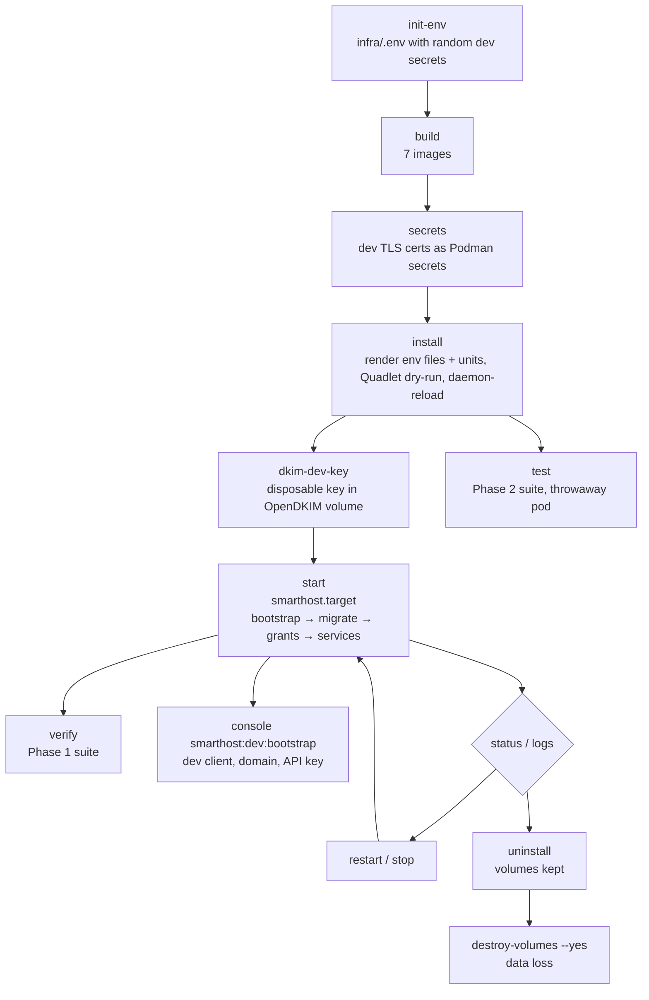

# Development Environment

**Status:** Phases 1 and 2 (database and Symfony foundation) complete.
`smarthostctl verify --clean` passes all 166 checks starting from destroyed volumes (§6), and
`smarthostctl test` passes the Phase 2 suite (§7).

## 1. Requirements

- Rootless Podman 5.1 or later with Quadlet (needed for `Notify=healthy`). Verified with engine
  6.0.2 in a WSL Podman machine (Fedora 44) and client `podman-remote` 6.1.1.
- A systemd user manager on the engine host, with lingering enabled.
- Python 3.10 or later on the workstation (for `infra/lib/smarthost_render.py` and the contract
  checker). `curl` is needed by the verification suite.

### WSL Podman machine notes

The Podman engine runs inside the `podman-machine-default` WSL distribution. That distribution's
PID 1 is WSL's `/init`; systemd runs in a nested namespace.

- `smarthostctl` sends systemd/Quadlet operations through `wsl.exe` and the machine's own
  `/usr/local/bin/enterns`, which is the same mechanism `podman machine ssh` uses.
- Quadlet files are installed to `~/.config/containers/systemd/`.
- The target and timers are installed to `~/.local/share/systemd/user/`. In the machine image,
  `~/.config/systemd/user` is root-owned.
- The repository must be on a path visible to the machine. `/mnt/wsl/...` is shared between WSL
  distributions.

## 2. Lifecycle



| Command | Effect |
|---|---|
| `smarthostctl init-env` | Creates `infra/.env` (mode 0600, gitignored) from `infra/.env.example` and fills the secrets with random development values. Never overwrites. |
| `smarthostctl render` | Writes one env file per consumer (least privilege, following the contract's *Consumers* column) and renders the Quadlet and systemd templates into `infra/.generated/`. Rejects any variable that is not in the contract. |
| `smarthostctl build` | Builds the seven Smarthost images (`localhost/smarthost-*:dev`). |
| `smarthostctl secrets` | Creates disposable self-signed TLS certificates for Postfix and nginx as Podman secrets. |
| `smarthostctl install` | Renders the files, installs them, runs the Quadlet dry-run and reloads systemd. |
| `smarthostctl dkim-dev-key [domain selector]` | Generates a dev DKIM key inside the OpenDKIM volume, creating the volume with its project label if needed. The default is `smarthost-dev.test` / `phase1`. |
| `smarthostctl start` | Starts `smarthost.target`. It returns once every service reports healthy (`Notify=healthy`). |
| `smarthostctl stop`, `restart` | Stop the target, its timers, every member service and the pod by name. `systemctl stop smarthost.target` alone returns before PartOf-propagated stops finish, so naming the members makes stop deterministic. `restart` is a stop followed by a start. |
| `smarthostctl status [unit]`, `logs <unit> [n]` | Show unit status and the unit's journal. |
| `smarthostctl systemctl <args>` | Pass-through to `systemctl --user` on the engine host. |
| `smarthostctl uninstall` | Stops the services and removes the units. Volumes are kept. |
| `smarthostctl destroy-volumes --yes` | Deletes the six Smarthost volumes by name. Nothing else is touched. |
| `smarthostctl verify [--clean]` | Runs the Phase 1 verification suite (§6). `--clean` first destroys the Smarthost volumes and network to prove a clean-state start. |
| `smarthostctl test [phpunit args]` | Runs the Phase 2 test suite in a throwaway, network-less pod (§7). Does not touch the running environment. |
| `smarthostctl console <command>` | Runs a Symfony console command in the running `smarthost-symfony-app` container as `www-data` (application database role). |
| `smarthostctl migrate` | Re-runs the migration oneshot and then the grants oneshot (after pulling new migrations into a rebuilt image). |

## 3. Topology

All Smarthost containers run in one Podman **pod**, `smarthost`, defined in
`infra/quadlet/smarthost.pod.in`.

- **Networking is owned by the pod.** The pod (its infra container `smarthost-infra`) is the only
  thing attached to **`smarthost-internal`** (`Internal=true`, subnet `10.89.20.0/24`).
  - It carries the aardvark DNS aliases `postgres`, `symfony-app`, `postfix`, `opendkim`,
    `mailpit` and `fake-smtp`, so the environment contract's host names are unchanged.
  - It publishes the only host ports.
- **Members share the pod's network namespace.** Ports cannot collide, and loopback is shared.
  For that reason Postfix port 25 no longer has `permit_mynetworks`: it relays for no client
  address, including `127.0.0.1`.
- **Throwaway test clients** from the verification suite run outside the pod on
  `smarthost-internal` and reach the services through the same aliases.

| Unit (`smarthost-…`) | Image | Pod alias | Identity | Readiness check |
|---|---|---|---|---|
| pod (`smarthost-pod.service`) | infra (`smarthost-infra`) | — | — | — |
| postgres | postgres:16.15-trixie | `postgres` | image default | `pg_isready -U … -d …` |
| db-bootstrap (oneshot) | postgres:16.15-trixie | — | admin connection | exit status |
| db-migrate (oneshot) | smarthost-app | — | www-data; database role `smarthost_owner` | exit status |
| db-grants (oneshot) | postgres:16.15-trixie | — | admin connection | exit status |
| symfony-app | smarthost-app | `symfony-app` | FPM master root, workers www-data; database role `smarthost_app` | FastCGI `/fpm-ping` |
| webhook-worker | smarthost-app | — | www-data | heartbeat file |
| nginx | smarthost-nginx | — | image default | loopback `/nginx-health` |
| validator | smarthost-validator | — | uid 10001 | database probe |
| delivery | smarthost-delivery | — | `SMARTHOST_DELIVERY_UID`:`SMARTHOST_SPOOL_GID` (5001:5000) | database probe |
| postfix | smarthost-postfix | `postfix` | root (Postfix drops privileges) | 220 greeting on ports 25 and 587 |
| opendkim | smarthost-opendkim | `opendkim` | opendkim | port 8891 listening |
| mailpit | mailpit:v1.31.0 | `mailpit` | image default | `mailpit readyz` |
| fake-smtp | smarthost-fake-smtp | `fake-smtp` | uid 10003 | 220 greeting |

The timers are `smarthost-postfix-queue-snapshot.timer` (every
`POSTFIX_QUEUE_SNAPSHOT_INTERVAL_SECONDS`) and `smarthost-postfix-logrotate.timer` (daily).

### Published host ports (published by the pod; verified with `podman port smarthost-infra`, T05)

| Bind | Service | Why |
|---|---|---|
| `127.0.0.1:8443` → 443 | nginx | The only HTTP entry (`PROXY_HTTPS_BIND`) |
| `127.0.0.1:8026` → 8025 | Mailpit UI | Development inspection (`MAILPIT_UI_BIND`). 8025 is often taken by other local Mailpit instances. |

PostgreSQL, PHP-FPM, OpenDKIM, Postfix, the Python and Go workers, and fake SMTP publish no
ports. PostgreSQL is unreachable even from other Podman networks.

### Persistent volumes (verified across full container recreation, T19)

| Volume | Mounted by |
|---|---|
| `smarthost-postgres-data` | postgres |
| `smarthost-postfix-queue` | postfix (`/var/spool/postfix`) |
| `smarthost-postfix-observability` | postfix (rw), delivery (**ro**) |
| `smarthost-dsn-spool` | postfix (rw), delivery (rw, for claim by rename) |
| `smarthost-opendkim-keys` | opendkim only |
| `smarthost-opendkim-tables` | opendkim only |

## 4. Mail safety (verified, T06/T07/T10/T14)

Three independent layers keep development mail off the Internet:

1. **Capture mode.** With `SMARTHOST_LIVE_DELIVERY_ENABLED=false`, Postfix relays all outbound mail
   to `POSTFIX_RELAYHOST` (`[mailpit]:1025`).
   - A message submitted to `someone@example.com` arrived in Mailpit, and Postfix's log shows
     `relay=mailpit[…]:1025 status=sent` and no other relay attempt.
   - With Mailpit stopped, the message stayed **deferred** ("Host not found") instead of falling
     back to an MX lookup, and it was delivered to Mailpit when Mailpit returned.
2. **Live-mode guard.** The Postfix image refuses to start (exit 64) in each of these cases:
   - live mode in `development` or `test`;
   - live mode in `production` while a relayhost is still set;
   - capture mode without a relayhost;
   - any value of the switch other than `true` or `false`.
3. **Network isolation.** Containers on `smarthost-internal` have no default route.
   - TCP to `1.1.1.1:25` fails with "Network is unreachable", and public MX hosts do not resolve.
   - Published loopback ports and container aliases still work.

## 5. Facts established in Phase 1

| Topic | Observation |
|---|---|
| Postfix version | 3.10.13 (Debian trixie). `postqueue -j` is available. |
| `maillog_file_prefixes` | Default `/var, /dev/stdout`, so the observability directory must be under `/var`. |
| `maillog_file_permissions` | Default `0600`; set to `0640`. The log file is `0640 root:5000` in a setgid `2750 root:5000` directory. |
| `milter_default_action` | The 3.10 default is **`shutdown`**, so `tempfail` is set explicitly (globally and on the submission service). |
| Health check | Sending `QUIT` before the greeting triggers Postfix's pipelining protection (`554 5.5.0`), so the check waits for the 220 banner. |
| Cyrus SASL | Debian's Cyrus SASL does not look in `/etc/postfix/sasl` unless `cyrus_sasl_config_path` is set, and `smtpd.conf` must be readable by the `postfix` user. |
| Config file modes | `virtual(8)` runs as the delivery UID and must read the bounce-recipient table, so the entrypoint writes configuration with umask `022`. Only the shared-volume layout uses `027`. The sasldb is explicitly `0640 root:postfix`. |
| OpenDKIM | 2.11.0. `opendkim-genkey` needs the `openssl` CLI. Dev keys are `0600 opendkim:opendkim` in the keys volume. It signs only mail tagged `ORIGINATING` by the submission service. |
| PostgreSQL roles | `smarthost_owner` can create tables. `smarthost_app`, `smarthost_webhook`, `smarthost_validator` and `smarthost_delivery` cannot (`permission denied for schema public`). None is superuser, createdb or createrole, and a wrong password is refused. |
| nginx → PHP-FPM | `/healthz` is served with `sapi=fpm-fcgi`. After a PHP-FPM restart (new container and IP), nginx reaches it again without being restarted, because it resolves the upstream at request time. |
| `smarthost.target` stop | `systemctl stop smarthost.target` returns before PartOf-propagated stops complete. `smarthostctl stop` names every member, so stop is deterministic. |
| First-start failure | The one-off network/volume unit failure seen during the very first installation was not reproduced in two clean-state runs that destroyed all volumes and the network. |
| Postfix V-1…V-7 | See `docs/architecture/postfix-integration.md` §8. |

## 6. Verification suite

```sh
infra/bin/smarthostctl verify          # against the running environment
infra/bin/smarthostctl verify --clean  # destroy Smarthost volumes/network first (disposable data)
```

The suite is `infra/tests/phase1-verify.sh`. It runs throwaway clients from
`localhost/smarthost-testtools:dev` on the internal network and writes an evidence log to
`infra/.generated/verify/` (gitignored). It exits non-zero if any check fails.

| Group | Proves |
|---|---|
| T01–T02 | All images build; render/install passes the Quadlet dry-run; every unit loads |
| T03–T04 | Clean-state start; all 10 services healthy; bootstrap, migration and grant oneshots succeeded; timers active |
| T05–T06 | Every service is a pod member sharing the pod network namespace; only the pod publishes ports (nginx HTTPS and the Mailpit UI, both on loopback); the pod sits only on the `Internal=true` network; no Internet egress |
| T07 | The live-mode guard refuses every unsafe combination; a pod member cannot relay through port 25 via `127.0.0.1` |
| T08 | nginx → FastCGI → PHP-FPM (`/healthz`, now served by the Symfony front controller), including after a PHP-FPM restart |
| T09 | PostgreSQL 16 version, role privileges and isolation from other networks |
| T10–T11 | Submission on 587 → Mailpit only, with a cryptographically valid DKIM signature |
| T12 | The DKIM private key is visible only to OpenDKIM |
| T13 | OpenDKIM down → 4xx tempfail and no unsigned mail; port 25 unaffected; recovery |
| T14–T17 | V-1…V-7: snapshots, rotation, DSN spool claim, inotify, shared identity |
| T18 | Fake SMTP reproduces 250/421/450/451/550, DATA discard and timeout |
| T19 | Persistence of PostgreSQL, the Postfix queue (held message), the observability log, the DSN spool and the DKIM key across a restart that recreates every container |
| T20 | Stop leaves nothing running; start returns to healthy |
| T21 | Contract checks pass |
| T22 | Containers of other Podman projects are unchanged |

The latest clean-state run (after Phase 2) passed all 166 checks.

## 7. Phase 2: the Symfony application

### Start-up order

`db-bootstrap` (roles) → `db-migrate` (Doctrine migrations as `smarthost_owner`) → `db-grants`
(`infra/postgres/grants.sh`, the `schema.md` §6 matrix) → `symfony-app`, `webhook-worker`,
`validator`, `delivery`. Migrations are idempotent, so every start re-checks them; the grants are
re-applied every time.

### Development data

```sh
infra/bin/smarthostctl console smarthost:dev:bootstrap [--operator-email you@smarthost-dev.test]
```

This creates (or reuses) an active development client and the sending domain
`smarthost-dev.test` and **marks it verified without DNS**, with DKIM active and selector
`phase1`, matching the disposable key from `smarthostctl dkim-dev-key`. It refuses to run unless
`SMARTHOST_ENV` is `development` or `test`. A new API key (and, optionally, an operator with a
random password) is printed **once**; only its SHA-256 hash is stored.

```sh
K=shk_...   # the printed key
curl -sk https://127.0.0.1:8443/v1/send-jobs -H "Authorization: Bearer $K" \
  -H 'Content-Type: application/json' -H "Idempotency-Key: $(uuidgen)" \
  -d '{"external_reference":"demo","message_class":"transactional","sender_identity":{"email":"dev@smarthost-dev.test"}}'
```

Other administration (clients, keys, users, memberships, sending domains, webhook endpoints) is
done with the `smarthost:*` console commands (`console list smarthost`), never through undocumented
API endpoints. Submitted jobs stay `queued` until the Go delivery daemon exists (Phase 4); Phase 2
never creates messages or talks to Postfix.

### Test suite

```sh
infra/bin/smarthostctl test                        # everything
infra/bin/smarthostctl test --testsuite schema     # one suite (unit, contract, schema, integration)
```

`infra/tests/phase2-test.sh` builds the `test` stage of the app image and starts a throwaway pod
with **no network at all** (members share only loopback): PostgreSQL 16.15, the real role
bootstrap, the Doctrine migrations on an **empty** database, the grants, and the reference schema
loaded into a separate `<db>_reference` database used only for comparison. PHPUnit then runs as the
least-privilege application role; DNS is stubbed and nothing reaches the Internet. The pod is
labelled `project=smarthost` and removed afterwards.

| Suite | Proves |
|---|---|
| unit | D-18 normalisation (including IDNA), canonical request hashing, the keyring, fail-closed configuration, log format |
| contract | `/v1` routes are exactly the OpenAPI operations; OpenAPI enums equal the PHP enums |
| schema | The migrated catalog equals `reference-schema.sql` (tables, columns, defaults, constraints, indexes); migrations up/down/up and per-migration rollback; ORM mapping equals the database; CHECKs equal the vocabulary; grants equal `schema.md` §6; least-privilege behaviour; critical CHECK/UNIQUE/FK behaviour |
| integration | Authentication, tenant isolation, idempotency (including concurrent retries from separate processes), validation jobs, send jobs, sending domains, dashboard users, webhooks, console commands, health and audit; every response is validated against the OpenAPI contract |

Latest run: 156 tests and 1,471 assertions, all passing (unit 36, contract 2, schema 33, integration 85).
