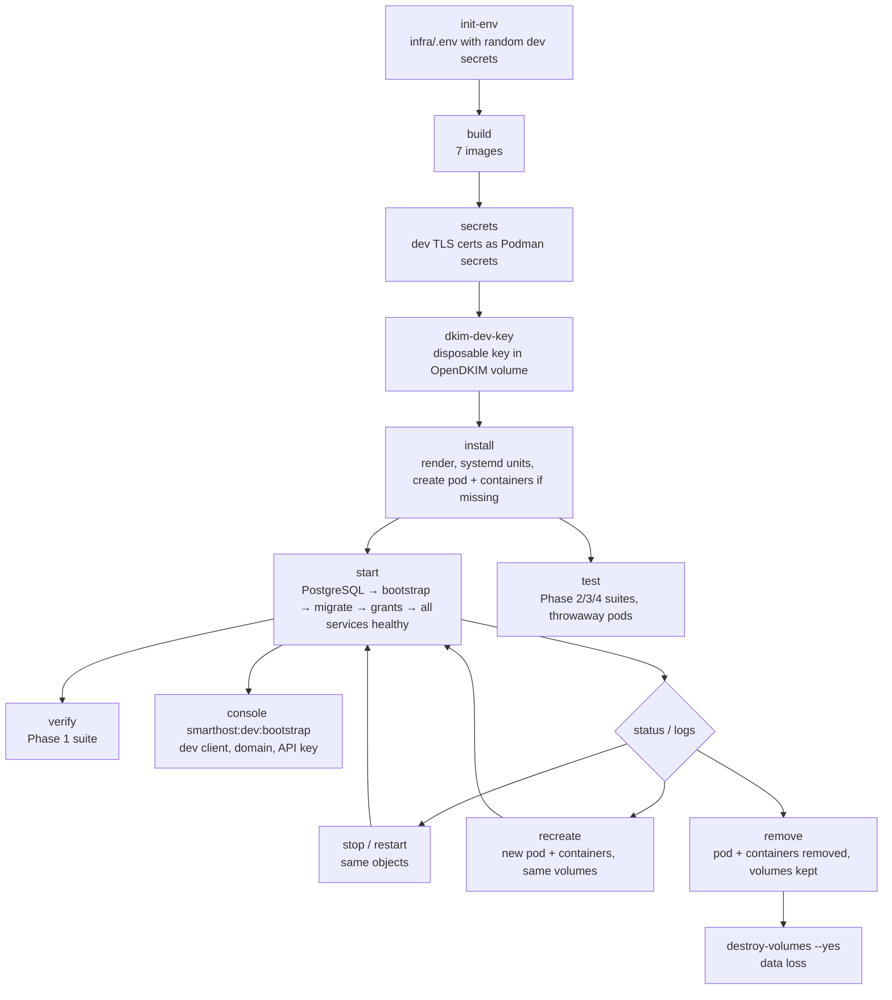

# Development Environment

**Status:** Phases 1–7 complete (Phase 5: inbound DSN, complaint and global suppression
processing, D-30, v0.1.5; Phase 6: tracking and dashboards with passwordless sign-in, roles and
ACL, v0.1.6; Phase 7 Smarthost side: the webhook worker, specification 2.8, v0.1.7); Phases 8 and
9 repository side (production tooling and rehearsal, public SaaS hardening, specification 2.10,
v0.1.8); Phase 10 operator self-service (installer, host agent, setup wizard, diagnostics, help,
address batches, re-permission, specification 2.11, v0.1.9). Since v0.2.0 the environment also
runs on a local Linux engine with Podman 4.9 (§1). `smarthostctl verify` passes all 176 checks
(§6; `--clean` additionally starts from destroyed volumes; on Podman 4.9 two DNS checks fail, see
§1), and `smarthostctl test` passes the Phase 2, 3 and 4/5 suites, and
`smarthostctl test phase4-e2e`, `test phase5-e2e`, `test phase6-e2e` and `test phase7-e2e` the
end-to-end runs (§7).

## 1. Requirements

- Rootless Podman 4.9 or later (the specification's minimum), either as a **local engine** on a
  Linux host or in a **WSL Podman machine**. Verified with:
  - Podman 4.9.3 as a local engine (the Ubuntu 24.04 packages: netavark, aardvark-dns 1.4.0,
    cgroup v2 with systemd 255); see *Podman 4.9 notes* below;
  - engine 6.0.2 in a WSL Podman machine (Fedora 44) with client `podman-remote` 6.1.1.
- A systemd user manager on the engine host, with lingering enabled
  (`loginctl enable-linger "$USER"`) and the user's `podman.socket` enabled
  (`systemctl --user enable --now podman.socket`; the boot service talks to it).
- Python 3.10 or later with PyYAML on the workstation (for `infra/lib/smarthost_render.py` and the
  contract checker). `curl` is needed by the verification suite.
- The two external images, pulled once per engine. The pod creates every container with
  `--pull never`, so `install` or `start` fails with "image not known" without them:

  ```sh
  podman pull docker.io/library/postgres:16.15-trixie docker.io/axllent/mailpit:v1.31.0
  ```

**Start at boot.** `smarthostctl install` links `smarthost.service` into
`~/.local/share/systemd/user/default.target.wants/`, on either kind of engine. With lingering,
the user manager starts at boot (on WSL: when the machine starts, for example from Podman
Desktop), and the service starts the existing `smarthost` pod.

### Local Linux engine notes

`smarthostctl` detects a local engine (`podman info` reports no remote service) and runs the
systemd steps directly with `systemctl --user`. The units are installed to
`~/.local/share/systemd/user/` as on WSL. Podman Desktop connected to the same rootless engine
lists the `smarthost` pod and its containers; its Start and Stop buttons are the
`podman pod start`/`stop` of §2.

### Podman 4.9 notes

- **Stop and remove errors.** Podman 4.9 may print
  `removing pod … cgroup: Unit user-libpod_pod_<id>.slice not loaded` after stopping or removing
  the pod, and always does when the pod is already stopped. The operation itself has worked.
  `smarthostctl stop`, `restart`, `recreate` and `remove` therefore judge the result (nothing
  running, or no pod) rather than Podman's exit status. Podman Desktop may show the same message
  when you stop the pod there.
- **DNS on the internal network.** aardvark-dns 1.4 answers the pod's aliases but also forwards
  queries for public names from the `Internal=true` network, so public MX hosts resolve (verify
  T06 fails). The network still has no route out: connections to the Internet fail, and Postfix
  in capture mode only relays to Mailpit. While containers join or leave the network, alias
  lookups (for example `opendkim`) can fail for several seconds; verify T13's "signing after
  restore" check, which runs while test containers come and go, can then time out. Steady-state
  use is not affected. Expect `verify` to report T06, and usually T13, as failed on such an
  engine. (The production topology does not depend on aardvark-dns for service names: it uses
  fixed addresses and `/etc/hosts`.)

### WSL Podman machine notes

The Podman engine runs inside the `podman-machine-default` WSL distribution. That distribution's
PID 1 is WSL's `/init`; systemd runs in a nested namespace.

- `smarthostctl` sends systemd operations through `wsl.exe` and the machine's own
  `/usr/local/bin/enterns`, which is the same mechanism `podman machine ssh` uses. Container
  operations use the normal `podman` (remote) CLI.
- The systemd units are installed to `~/.local/share/systemd/user/`. In the machine image,
  `~/.config/systemd/user` is root-owned.
- The repository must be on a path visible to the machine. `/mnt/wsl/...` is shared between WSL
  distributions.
- The boot link is written directly because `systemctl --user enable` would write to the
  root-owned directory; `is-enabled` therefore reports `disabled`.

## 2. Lifecycle

The `smarthost` pod and its ten service containers are **persistent Podman objects** (D-35). They
are created once and then only started and stopped, exactly like a pod you manage in Podman
Desktop:

| Operation | Command | Pod and containers | Volumes and data |
|---|---|---|---|
| create | `smarthostctl install` (if missing) or `create` | created from the current images and configuration | created if missing, never replaced |
| start | `smarthostctl start`, `podman pod start smarthost`, Podman Desktop *Start* | the same objects start | kept |
| stop | `smarthostctl stop`, `podman pod stop smarthost`, Podman Desktop *Stop* | stopped and **kept** (`podman pod ps`, `podman ps -a` show them exited) | kept |
| restart | `smarthostctl restart` | the same objects are stopped and started | kept |
| recreate | `smarthostctl recreate` | **replaced** (new IDs) from the current images and configuration | kept |
| remove | `smarthostctl remove` | stopped and removed | kept |
| destroy volumes | `smarthostctl destroy-volumes --yes` (only after `remove`) | — | **deleted** |

* **Deploying a change.** After `smarthostctl build` (new images) or a change to a container
  definition (`infra/podman/smarthost-pod.sh.in`, env files), run `smarthostctl recreate`. A plain
  `restart` deliberately keeps the existing containers and therefore their old image and
  configuration.
* **Start order.** `smarthostctl start` (and the boot service) starts PostgreSQL, waits until it is
  healthy, runs the one-off tasks `db-bootstrap` (roles), `db-migrate` (Doctrine migrations as
  `smarthost_owner`) and `db-grants` (the `schema.md` §6 matrix) in that order, then starts the
  whole pod and waits until all ten services are healthy. The tasks are short-lived containers in
  the pod (`podman run --rm`), not pod members.
* **Starting from Podman Desktop** (`podman pod start`) starts all members at once and does not run
  the tasks; that is safe because the database is already initialised and every service retries
  until PostgreSQL is ready. Run `smarthostctl start` or `migrate` after changing migrations.
* **Boot and shutdown.** `smarthost.service` (wanted by `default.target`) runs the ordered start at
  machine boot and `podman pod stop` at shutdown. It never creates or removes objects and has no
  `ExecStopPost`. It talks to the user's Podman API socket, so containers belong to
  `podman.service` exactly as when Podman Desktop starts them, and stopping or starting the pod
  outside systemd does not make the unit interfere.
* **Restart on failure** is Podman's `--restart on-failure` policy; a deliberate stop is never
  restarted.



| Command | Effect |
|---|---|
| `smarthostctl init-env` | Creates `infra/.env` (mode 0600, gitignored) from `infra/.env.example` and fills the secrets with random development values. Never overwrites. The file holds only the settings you set, grouped under headings; every other variable is built in (`docs/contracts/environment.md`, *The .env file*). |
| `smarthostctl env-migrate` | Rewrites an older `infra/.env` in the current grouped layout, keeping every value; the old file stays as `infra/.env.v<version>-<timestamp>` (gitignored). |
| `smarthostctl settings-apply` | Applies the settings changed in the dashboard (System › Settings): renders with them and recreates the pod (volumes kept). Every render reads them from the running database. |
| `smarthostctl render` | Writes one env file per consumer (least privilege, following the contract's *Consumers* column) and renders the pod script (`infra/podman/`) and the systemd units (`infra/systemd/`) into `infra/.generated/`. Rejects any variable that is not in the contract. |
| `smarthostctl build` | Builds the seven Smarthost images (`localhost/smarthost-*:dev`). The PostgreSQL and Mailpit images are not built; pull them once (§1). |
| `smarthostctl secrets` | Creates disposable self-signed TLS certificates for Postfix and nginx as Podman secrets. |
| `smarthostctl install` | Renders the files, installs the systemd units and the boot link (removing the pre-D-35 Quadlet units once), and creates the pod and its containers if they do not exist. It never replaces an existing pod. |
| `smarthostctl create` | Creates the network and volumes if missing, then the pod and its containers. Fails if the pod exists. |
| `smarthostctl dkim-dev-key [domain selector]` | Generates a dev DKIM key inside the OpenDKIM volume, creating the volume with its project label if needed. The default is `smarthost-dev.test` / `phase1`. |
| `smarthostctl start` | Ordered start of the existing pod (see above); returns once all ten services are healthy. |
| `smarthostctl stop` | Stops the pod (`podman pod stop`). The pod and containers are kept. Succeeds when nothing is left running, even if Podman 4.9 reports a cgroup error (§1). |
| `smarthostctl restart` | `stop` + `start` of the same objects. |
| `smarthostctl recreate` | Stops, removes the pod and its containers, creates them again from the current images and configuration, starts them and shows their status. Volumes are never touched. |
| `smarthostctl remove` | Stops and removes the pod and its containers. Volumes are kept. |
| `smarthostctl status` | The boot service state, the pod and every container with its ID and status. |
| `smarthostctl logs <name> [n]` | A container's log (`logs postfix`), or the journal of a unit (`logs smarthost.service`). |
| `smarthostctl systemctl <args>` | Pass-through to `systemctl --user` on the engine host. |
| `smarthostctl uninstall` | Removes the systemd units and the boot link. The pod, containers and volumes are untouched. |
| `smarthostctl destroy-volumes --yes` | Deletes the six Smarthost volumes by name (data loss). Refuses while the pod exists. |
| `smarthostctl verify [--clean]` | Runs the Phase 1 verification suite (§6). `--clean` first removes the pod and destroys the Smarthost volumes and network to prove a clean-state create and start. |
| `smarthostctl test [phase2\|phase3\|phase4\|phase5] [args]` | Runs the Phase 2 (PHPUnit), Phase 3 (pytest + end to end) or Phase 4/5 (Go unit + PostgreSQL integration, one suite) suite in throwaway, network-less pods (§7); without a phase, all of them. Does not touch the running environment. |
| `smarthostctl test phase4-e2e [A B C D E]` | Phase 4 end to end against the **running** pod's Postfix, OpenDKIM and Mailpit (§7). It stops and restarts Smarthost containers only (OpenDKIM, Mailpit, delivery). |
| `smarthostctl test phase5-e2e [A B C D E F G]` | Phase 5 end to end against the **running** pod: DSNs and ARF reports through Postfix port 25 and the real DSN spool (§7). It creates a second test client and stops/starts only the delivery container. |
| `smarthostctl test phase6-e2e` | Phase 6 end to end against the **running** pod through nginx: tracking from a delivered message, open-redirect attempts, the dashboards as two client users and an operator, token-free logs (§7). It creates test clients and users and stops nothing. |
| `smarthostctl test phase8` | Phase 8 production tooling without network (§8): configuration rules, the rendered production topology, the preflight logic with DNS/host/TLS fixtures, Postfix held/live/pause modes and sender ownership, the DKIM key tool, shellcheck. Throwaway containers only. |
| `smarthostctl test phase8-rehearsal` | Deploys the **production** topology on this engine as the separate instance `smarthost-rehearsal` (no Internet egress, loopback ports 18443 and 12525) through `smarthostctl prod`, exercises it (§8) and removes it. It never touches the development pod. |
| `smarthostctl test installer [--keep] [--with-upgrade]` | Runs `install-catto-mail` in a stand-in for a clean **Ubuntu Server 26.04 LTS** VPS (a systemd container `smarthost-installer-test` with rootless Podman inside), from this working tree committed as a test release tag. About half an hour. See below. |
| `smarthostctl prod <command>` | **Production only** (refuses this development `.env`): see `docs/production/runbook.md`. |
| `smarthostctl test phase7-e2e` | Phase 7 end to end against the **running** pod: an external client using only the API and the signed webhooks verified by a local receiver container (`smarthost-test-webhook-receiver`, alias `webhook-receiver`, removed afterwards). It creates a test client, SIGKILLs and restarts the webhook-worker container once, and stops nothing else (§7). |
| `smarthostctl console <command>` | Runs a Symfony console command in the running `smarthost-symfony-app` container as `www-data` (application database role). |
| `smarthostctl migrate` | Runs the `db-migrate` and `db-grants` tasks in the running pod (after `recreate` with a rebuilt app image that brings new migrations, `start` also runs them). |

## 3. Topology

All Smarthost containers run in one Podman **pod**, `smarthost`, defined together with its
containers in `infra/podman/smarthost-pod.sh.in`.

- **Networking is owned by the pod.** The pod (its infra container `smarthost-infra`) is the only
  thing attached to **`smarthost-internal`** (`Internal=true`, subnet `10.89.20.0/24`).
  - It carries the aardvark DNS aliases `postgres`, `symfony-app`, `postfix`, `opendkim`,
    `mailpit` and `fake-smtp`, so the environment contract's host names are unchanged.
  - It publishes the only host ports.
- **Members share the pod's network namespace.** Ports cannot collide, and loopback is shared.
  For that reason Postfix port 25 no longer has `permit_mynetworks`: it relays for no client
  address, including `127.0.0.1`.
- **Throwaway test clients** from the verification suite run outside the pod on
  `smarthost-internal` and reach the services through the same aliases.

| Container (`smarthost-…`) | Image | Pod alias | Identity | Readiness check |
|---|---|---|---|---|
| pod infra (`smarthost-infra`) | infra | — | — | — |
| postgres | postgres:16.15-trixie | `postgres` | image default | `pg_isready -U … -d …` |
| db-bootstrap (task, not a member) | postgres:16.15-trixie | — | admin connection | exit status |
| db-migrate (task, not a member) | smarthost-app | — | www-data; database role `smarthost_owner` | exit status |
| db-grants (task, not a member) | postgres:16.15-trixie | — | admin connection | exit status |
| symfony-app | smarthost-app | `symfony-app` | FPM master root, workers www-data; database role `smarthost_app` | FastCGI `/fpm-ping` |
| webhook-worker | smarthost-app (`smarthost:webhook:work`) | — | www-data; database role `smarthost_webhook` | liveness file newer than 120 s |
| nginx | smarthost-nginx | — | image default | loopback `/nginx-health` |
| validator | smarthost-validator | — | uid 10001 | database probe |
| delivery | smarthost-delivery | — | `SMARTHOST_DELIVERY_UID`:`SMARTHOST_SPOOL_GID` (5001:5000) | heartbeat (database reachable) |
| postfix | smarthost-postfix | `postfix` | root (Postfix drops privileges) | 220 greeting on ports 25 and 587 |
| opendkim | smarthost-opendkim | `opendkim` | opendkim | port 8891 listening |
| mailpit | mailpit:v1.31.0 | `mailpit` | image default | `mailpit readyz` |
| fake-smtp | smarthost-fake-smtp | `fake-smtp` | uid 10003 | 220 greeting |

The timers are `smarthost-postfix-queue-snapshot.timer` (every
`POSTFIX_QUEUE_SNAPSHOT_INTERVAL_SECONDS`) and `smarthost-postfix-logrotate.timer` (daily). They
run with `smarthost.service` and do nothing while Postfix is not running.

### Published host ports (published by the pod; verified with `podman port smarthost-infra`, T05)

| Bind | Service | Why |
|---|---|---|
| `127.0.0.1:8443` → 443 | nginx | The only HTTP entry (`PROXY_HTTPS_BIND`) |
| `127.0.0.1:8026` → 8025 | Mailpit UI | Development inspection (`MAILPIT_UI_BIND`). 8025 is often taken by other local Mailpit instances. |

PostgreSQL, PHP-FPM, OpenDKIM, Postfix, the Python and Go workers, and fake SMTP publish no
ports. PostgreSQL is unreachable even from other Podman networks.

### Persistent volumes (verified across stop/start, restart, Podman-level stop/start and recreate, T19–T23)

| Volume | Mounted by |
|---|---|
| `smarthost-postgres-data` | postgres |
| `smarthost-postfix-queue` | postfix (`/var/spool/postfix`) |
| `smarthost-postfix-observability` | postfix (rw), delivery (**ro**) |
| `smarthost-dsn-spool` | postfix (rw), delivery (rw, for claim by rename) |
| `smarthost-opendkim-keys` | opendkim only |
| `smarthost-opendkim-tables` | opendkim only |

## 4. Mail safety (verified, T06/T07/T10/T14)

Three independent layers keep development mail off the Internet:

1. **Capture mode.** With `SMARTHOST_LIVE_DELIVERY_ENABLED=false`, Postfix relays all outbound mail
   to `POSTFIX_RELAYHOST` (`[mailpit]:1025`).
   - A message submitted to `someone@example.com` arrived in Mailpit, and Postfix's log shows
     `relay=mailpit[…]:1025 status=sent` and no other relay attempt.
   - With Mailpit stopped, the message stayed **deferred** ("Host not found") instead of falling
     back to an MX lookup, and it was delivered to Mailpit when Mailpit returned.
2. **Live-mode guard.** The Postfix image refuses to start (exit 64) in each of these cases:
   - live mode in `development` or `test`;
   - live mode in `production` while a relayhost is still set;
   - capture mode without a relayhost;
   - any value of the switch other than `true` or `false`.
3. **Network isolation.** Containers on `smarthost-internal` have no default route.
   - TCP to `1.1.1.1:25` fails with "Network is unreachable", and public MX hosts do not resolve
     (with aardvark-dns 1.4 they do resolve, but are still unreachable; §1).
   - Published loopback ports and container aliases still work.

## 5. Facts established in Phase 1

| Topic | Observation |
|---|---|
| Postfix version | 3.10.13 (Debian trixie). `postqueue -j` is available. |
| `maillog_file_prefixes` | Default `/var, /dev/stdout`, so the observability directory must be under `/var`. |
| `maillog_file_permissions` | Default `0600`; set to `0640`. The log file is `0640 root:5000` in a setgid `2750 root:5000` directory. |
| `milter_default_action` | The 3.10 default is **`shutdown`**, so `tempfail` is set explicitly (globally and on the submission service). |
| Health check | Sending `QUIT` before the greeting triggers Postfix's pipelining protection (`554 5.5.0`), so the check waits for the 220 banner. |
| Cyrus SASL | Debian's Cyrus SASL does not look in `/etc/postfix/sasl` unless `cyrus_sasl_config_path` is set, and `smtpd.conf` must be readable by the `postfix` user. |
| Config file modes | `virtual(8)` runs as the delivery UID and must read the bounce-recipient table, so the entrypoint writes configuration with umask `022`. Only the shared-volume layout uses `027`. The sasldb is explicitly `0640 root:postfix`. |
| OpenDKIM | 2.11.0. `opendkim-genkey` needs the `openssl` CLI. Dev keys are `0600 opendkim:opendkim` in the keys volume. It signs only mail tagged `ORIGINATING` by the submission service. |
| PostgreSQL roles | `smarthost_owner` can create tables. `smarthost_app`, `smarthost_webhook`, `smarthost_validator` and `smarthost_delivery` cannot (`permission denied for schema public`). None is superuser, createdb or createrole, and a wrong password is refused. |
| nginx → PHP-FPM | `/healthz` is served with `sapi=fpm-fcgi`. After a PHP-FPM restart, nginx reaches it again without being restarted, because it resolves the upstream at request time. |
| Quadlet lifecycle (before D-35) | Quadlet's generated units run containers with `--rm` and remove the pod in `ExecStopPost`, so every stop (including a machine shutdown) deleted the pod and its containers. The persistent pod replaced them. |
| Stop signals | The php-fpm base image sets `STOPSIGNAL SIGQUIT`, which the PHP webhook worker running as PID 1 ignores; its container uses `--stop-signal SIGTERM`, on which `smarthost:webhook:work` stops claiming, finishes or abandons its in-flight requests (their lease expires) and exits within `--stop-timeout 30`. The fake SMTP server (Python, PID 1, no SIGTERM handler) runs with `--init`. Without these, every pod stop waited 30 s for SIGKILL. |
| Containers started by the boot service | A unit that runs the local `podman` CLI leaves each container's `conmon` in the unit's cgroup (its journal fills with container output, and a failed unit would kill them). `smarthost.service` therefore uses the user's Podman API socket (`CONTAINER_HOST`), like Podman Desktop, plus `KillMode=process`. |
| Postfix V-1…V-7 | See `docs/architecture/postfix-integration.md` §8. |

## 6. Verification suite

```sh
infra/bin/smarthostctl verify          # against the running environment
infra/bin/smarthostctl verify --clean  # remove the pod, destroy Smarthost volumes/network first (disposable data)
```

The suite is `infra/tests/phase1-verify.sh`. It runs throwaway clients from
`localhost/smarthost-testtools:dev` on the internal network and writes an evidence log to
`infra/.generated/verify/` (gitignored). It exits non-zero if any check fails.

| Group | Proves |
|---|---|
| T01–T02 | All images build; install loads the boot service and both timers; `default.target` wants `smarthost.service`; no legacy Quadlet unit remains; the service has no `ExecStopPost` and stops with a pod stop; the pod and all 11 containers exist |
| T03–T04 | Clean-state create and start (with `--clean`); all 10 services healthy; the bootstrap, migration and grant tasks ran in order; timers active |
| T05–T06 | Every service is a pod member sharing the pod network namespace; only the pod publishes ports (nginx HTTPS and the Mailpit UI, both on loopback); the pod sits only on the `Internal=true` network; no Internet egress |
| T07 | The live-mode guard refuses every unsafe combination; a pod member cannot relay through port 25 via `127.0.0.1` |
| T08 | nginx → FastCGI → PHP-FPM (`/healthz`, now served by the Symfony front controller), including after a PHP-FPM restart |
| T09 | PostgreSQL 16 version, role privileges and isolation from other networks |
| T10–T11 | Submission on 587 → Mailpit only, with a cryptographically valid DKIM signature |
| T12 | The DKIM private key is visible only to OpenDKIM |
| T13 | OpenDKIM down → 4xx tempfail and no unsigned mail; port 25 unaffected; recovery |
| T14–T17 | V-1…V-7: snapshots, rotation, DSN spool claim (with the delivery daemon stopped, since it consumes the spool), inotify, shared identity; the running daemon then ingests a new DSN |
| T18 | Fake SMTP reproduces 250/421/450/451/550, DATA discard and timeout |
| T19 | `smarthostctl restart` keeps the same pod ID and all 11 container IDs; PostgreSQL data, a held Postfix message, the DSN spool, the log generation and the DKIM key survive |
| T20 | `smarthostctl stop` leaves the pod listed by `podman pod ps` and all 11 containers listed by `podman ps -a` as exited; the boot service becomes inactive; `start` reuses the same IDs; data survives |
| T21 | `podman pod stop`/`start` (what Podman Desktop does): after 20 s stopped, nothing was restarted, removed or recreated; start reuses the same IDs; data survives |
| T22 | The boot path (`systemctl --user start smarthost.service`) starts the existing pod with the same IDs; the timers run with it |
| T23 | `smarthostctl recreate` creates a new pod and replaces all 11 containers (no ID survives) while the six volumes stay the same volumes and all data survives |
| T24 | Contract checks pass |
| T25 | Containers of other Podman projects are unchanged |

The latest clean-state run (`--clean`, after Phase 4) passed all 180 checks. The latest run after
Phase 5 (without `--clean`, so without the five T03 checks, and with the new T16 daemon check)
passed all 176 checks. On a local Podman 4.9.3 engine (v0.2.0) 174 of 176 passed; T06 (public MX
resolution) and T13 (signing after restore) failed for the aardvark-dns reasons in §1.

The suite reads the systemd unit state by property name (systemd 255 orders `--value` output
differently) and counts a container as healthy only while it runs (a stopped container keeps its
last health status).

## 7. The Symfony application and the test suites

### Start-up order

`db-bootstrap` (roles) → `db-migrate` (Doctrine migrations as `smarthost_owner`) → `db-grants`
(`infra/postgres/grants.sh`, the `schema.md` §6 matrix) → `symfony-app`, `webhook-worker`,
`validator`, `delivery`. Migrations are idempotent, so every start re-checks them; the grants are
re-applied every time.

### Development data

```sh
infra/bin/smarthostctl console smarthost:dev:bootstrap [--operator-email you@smarthost-dev.test]
```

This creates (or reuses) an active development client and the sending domain
`smarthost-dev.test` and **marks it verified without DNS**, with DKIM active and selector
`phase1`, matching the disposable key from `smarthostctl dkim-dev-key`. It refuses to run unless
`SMARTHOST_ENV` is `development` or `test`. A new API key is printed **once**; only its SHA-256
hash is stored. `--operator-email` also creates a user with the OPERATOR role, who signs in with an
emailed link like everyone else.

```sh
K=shk_...   # the printed key
curl -sk https://127.0.0.1:8443/v1/send-jobs -H "Authorization: Bearer $K" \
  -H 'Content-Type: application/json' -H "Idempotency-Key: $(uuidgen)" \
  -d '{"external_reference":"demo","message_class":"transactional","sender_identity":{"email":"dev@smarthost-dev.test"}}'
```

Other administration (clients, keys, users, memberships, sending domains) is done with the
`smarthost:*` console commands (`console list smarthost`), never through undocumented API endpoints.
Webhook endpoints can also be managed by client admins in the dashboard (*Webhooks*). In
development only the receiver fixture host `webhook-receiver` may be a private destination
(`APP_WEBHOOK_ALLOWED_PRIVATE_HOSTS`); every other endpoint must resolve to a public address, and
the worker refuses everything else.

### Dashboard sign-in (passwordless)

1. Open **https://localhost:8443/dashboard** (from Windows too; the development certificate is
   self-signed, so accept the browser warning once).
2. Enter the administrator address, `APP_ADMIN_EMAIL` in `infra/.env` (development default
   `admin@smarthost-dev.test`), and choose *Email me a sign-in link*.
3. Open Mailpit at **http://localhost:8026**: the sign-in email is there (all development mail is
   captured; nothing reaches the Internet). Click *Sign in*. The link works once and expires after
   `APP_LOGIN_LINK_TTL_SECONDS` (15 minutes).
4. The administrator account is created on first sign-in and holds the **ADMIN** role (every
   permission). Under *Operator* you can add users (*Users*: roles, client memberships, *Email a
   sign-in link*) and define roles (*Roles & permissions*). There are no passwords anywhere.

To use your own address, set `APP_ADMIN_EMAIL` in `infra/.env`, then `smarthostctl install` and
`smarthostctl recreate`. Client users see only their clients (`/dashboard/c/<client-id>`); users with
platform permissions also get `/dashboard/operator`. The tracking endpoints `/t/o/<token>.gif` and
`/t/c/<token>/<n>` are public; tracking and sign-in links in Mailpit point at
`SMARTHOST_PUBLIC_BASE_URL` (`https://localhost:8443` in development), so they open in the browser.
Images are rebuilt with `smarthostctl build` (not `install`), then `smarthostctl recreate`.

The development pod has no Internet route, so real domains classify as `undeliverable` (NXDOMAIN)
there; meaningful validation results come from the fake DNS/SMTP scenarios of
`smarthostctl test phase3`.

### Test suites

```sh
infra/bin/smarthostctl test                                 # Phase 2, 3 and 4/5 suites
infra/bin/smarthostctl test phase2                          # PHPUnit only
infra/bin/smarthostctl test phase2 --testsuite schema       # one suite (unit, contract, schema, integration)
infra/bin/smarthostctl test phase3                          # pytest + end to end
infra/bin/smarthostctl test phase3 -k leases                # pytest arguments
```

Both harnesses use the throwaway test pod of `infra/tests/testpod.sh`, which has **no network at
all** (members share only loopback): PostgreSQL 16.15, the real role bootstrap, the Doctrine
migrations on an **empty** database and the grants. The pod is labelled `project=smarthost` and
removed afterwards; credentials are random per run.

**Phase 2** (`infra/tests/phase2-test.sh`) also loads the reference schema into a separate
`<db>_reference` database used only for comparison. PHPUnit then runs as the least-privilege
application role; DNS is stubbed and nothing reaches the Internet.

| Suite | Proves |
|---|---|
| unit | D-18 normalisation (including IDNA), canonical request hashing, the keyring, fail-closed configuration, log format |
| contract | `/v1` routes are exactly the OpenAPI operations; OpenAPI enums equal the PHP enums |
| schema | The migrated catalog equals `reference-schema.sql` (tables, columns, defaults, constraints, indexes); migrations up/down/up and per-migration rollback; ORM mapping equals the database; CHECKs equal the vocabulary; grants equal `schema.md` §6; least-privilege behaviour; critical CHECK/UNIQUE/FK behaviour |
| integration | Authentication, tenant isolation, idempotency (including concurrent retries from separate processes), validation jobs, send jobs, sending domains, dashboard users, webhooks, console commands, health and audit, the global opt-out API and the Phase 5 operator commands; every API response is validated against the OpenAPI contract. Phase 6: tracking endpoints (opens, clicks, open-redirect attacks, expiry, privacy, logs), tracking statistics, client and operator dashboards (pages, filters, keyset pagination, CSV export, CSRF, terminology, headers), two-client isolation, operator-only access, and the 10,000-row load test (query counts, memory, EXPLAIN ANALYZE of every page query, written to `infra/.generated/test-output/phase6-dashboard-observations.txt`). Phase 7: the webhook worker (contract body and signature, fan-out, retry policy, leases and fencing, DNS rebinding and SSRF, limits, rotation), dashboard webhook management, the web process without the worker's credentials, and the webhook query plans at 180,000 deliveries (`phase7-webhook-query-plans.txt`) |

Latest run (v0.1.8): 272 tests and 4,410 assertions, all passing (v0.1.7: 244; v0.1.6: 225; v0.1.5: 177). Phase 9 adds
the lifecycle, quota (including an 8-process race), usage and billing, reputation, dashboard,
two-client tenant-isolation and query-plan tests (`phase9-query-plans.txt` in
`infra/.generated/test-output/`, 1,000,000 usage records). Unit includes the shared D-32
vectors; integration includes the D-31 client-status rules, the D-30 global opt-out API
(`GlobalSuppressionApiTest`, including multi-process concurrency) and the Phase 5 operator commands
(`Phase5OperatorCommandTest`); schema includes the D-30 constraints and the six-migration rollback.

**Phase 3** (`infra/tests/phase3-test.sh`) builds the validator `test` and `runtime` images, then:

1. **pytest** as the `smarthost_validator` role: unit tests (D-32 vectors, syntax, typos, roles,
   configuration, DNS, SMTP, limits, classification, pipeline), database tests (claiming, D-31
   suspension, renewal, expiry and reclaim, fencing, atomic finalisation, D-33 metering under
   crash/retry/reclaim, outbox, whole-job failure) and worker tests against fake DNS and fake SMTP;
2. **end to end:** a fake DNS server (`validator/tests/fakes/fake_dns.py`, zone
   `validator/tests/e2e/zone.json`) and the fake SMTP service join the pod; Symfony creates jobs
   through `/v1` (a mixed-scenario job, a 10,000-address job and a suspended client's job); the
   real worker runs, is killed with SIGKILL mid-job and restarted, and Symfony verifies results,
   counters, usage and the outbox through `/v1` and the database. The harness fails if the fake SMTP
   server's command log contains `DATA` or `BDAT`. The report is written to
   `infra/.generated/phase3-e2e-report.json`.

Latest run (v0.1.8): 295 pytest tests passed; end to end PASS (details in `CHANGELOG.md`).

**Phase 4** (`infra/tests/phase4-test.sh`) builds the delivery `test` image (gofmt and go vet run
during the build), runs the Go unit tests with no network (D-32 vectors, identifiers and VERP,
MIME and header injection, tracking, SMTP submission outcomes, Postfix log parsing and generations,
snapshots, pacing, projection, configuration) and then the integration tests in the test pod as
`smarthost_delivery`, with an in-process submission server and fixture Postfix logs and snapshots.

**Phase 4 end to end** (`infra/tests/phase4-e2e.sh`, `smarthostctl test phase4-e2e`) uses the
running pod: jobs are created through `/v1`; scenarios A–C run on the pod's own delivery daemon,
D and E on throwaway worker containers in the pod (20 s lease, test pacing) while the pod's daemon
is stopped:

| Scenario | Proves |
|---|---|
| A | Subscription (tracking, Reply-To) and transactional jobs reach Mailpit with the VERP Return-Path, Message-ID, List-Unsubscribe/-Post/List-Id (subscription only), tracking pixel and rewritten links, an untouched text part, a DKIM signature verified with dkimpy; events, purge, one usage unit per message, summary counts, `send.completed` |
| B | OpenDKIM stopped: the message stays queued with its content and no usage, nothing reaches Mailpit, the daemon retries; once OpenDKIM is back the message is delivered signed |
| C | Mailpit stopped: `connection_failure` → deferred, job dispatched not completed; then `delivery_attempt`, `remote_accepted`, completed |
| D | A worker is killed with SIGKILL mid-job; after its lease expires another worker reclaims it, recovers in-flight submissions from the Postfix log, and finishes; every message reached Postfix exactly once (checked in the log), usage and purge exactly once |
| E | 10,000 recipients over 50 domains, a log rotation mid-run: exactly-once submission, usage and purge, completion via the log, pacing limits and bounded memory |

Latest runs: Go unit tests (10 packages) and 14 integration tests pass; end to end A–E pass (the
10,000-recipient job completed in about two minutes with a peak RSS of 25 MiB). After Phase 5 (v0.1.5): Go
unit tests in 13 packages and 28 integration tests pass; A–E pass again (10,000 recipients in
185 s, peak RSS 26.6 MiB, with the per-message pre-submission suppression check). v0.1.8: the Go
unit tests and 33 integration tests pass; `test phase4-e2e` 21/21.

**Phase 5** uses the same Go harness (`smarthostctl test phase5`): DSN and ARF fixtures
(`delivery/internal/dsn/testdata`), the failure-scope classifier, the spool processor, and
PostgreSQL integration tests for correlation, the global suppression policy (cross-client,
excluded scopes, repeated soft bounces and their reset, concurrency), complaints, the unmatched-DSN
resolution, every suppression reason, suppressions created after staging, crash/reclaim/duplicate
idempotency and retention.

**Phase 5 end to end** (`infra/tests/phase5-e2e.sh`, `smarthostctl test phase5-e2e`) sends real
messages to Mailpit and then injects synthetic DSNs and ARF reports over SMTP to Postfix port 25:

| Scenario | Proves |
|---|---|
| A | Client A's recipient-specific 5.1.1 DSN (VERP) supersedes `remote_accepted` with `hard_bounced`, writes `message.hard_bounced` once and a global suppression with source message and event; client B's later message to the same address is suppressed and never reaches Postfix; the file is kept in `done/` |
| B | Opt-out API: 403 without the capability; 201 for the trusted client, idempotent replay, 200 for an existing opt-out; global row with `source_client_id`; client B suppressed; only the reporter can lift; audited; sending works after the lift; a key that found the opt-out active replays its result after the lift and creates nothing (D-38); a suspended trusted client creates but cannot lift (D-37) |
| C | Correlation through the real spool by ENVID, returned Message-ID and Postfix queue id; recipient + sender evidence alone stays an open unmatched DSN with an operator candidate (D-36) |
| D | ARF complaint to the feedback-loop address: `complained`, `message.complained`, global suppression; an uncorrelated complaint stays an unmatched DSN |
| E | Provider-policy, domain and DELAY DSNs never suppress; three recipient soft bounces across two clients give a 30-day `repeated_soft_bounce` |
| F | Unmatched DSN → `smarthost:dsn:show` → `smarthost:dsn:match` → Go resolution (event, operator, suppression); dismissal requires a reason |
| G | 15 DSNs while the daemon is down, 3 left as crashed claims, a worker SIGKILLed mid-pass: all recorded exactly once, stale claims reclaimed, old processed files deleted by retention while their events remain |

Latest run (v0.1.8): 50/50 checks pass.

**Phase 6 end to end** (`infra/tests/phase6-e2e.sh`, `smarthostctl test phase6-e2e`) runs
everything through nginx → PHP-FPM, as a mail client or browser would:

| Part | Proves |
|---|---|
| T | A tracked subscription message is delivered to Mailpit; its HTML has the pixel and one rewritten link (the unsubscribe link is untouched, no address in any tracking URL). The pixel is a 43-byte GIF, `no-store`, no cookie; one `open_recorded` (an immediate repeat is not recorded); an unknown token gets the identical pixel. The click redirects exactly to the stored target and records `click_recorded` with the link index; a query string or `Referer` cannot change the target; other indexes, unknown tokens and URL-shaped paths are 404 without redirect |
| D | Anonymous → login; passwordless sign-in (link emailed through Postfix to Mailpit, DKIM-signed, single use; an unknown address gets the same answer and no email; `APP_ADMIN_EMAIL` gets ADMIN; an OPERATOR cannot open roles); client pages, timeline with the recorded events and no token or delivery/read claims, clicks per link, CSV export (formula cell neutralised); 403 for the operator area and 404 for another client; client B's user gets 404 for every client A page; operator pages and worker health; unmatched-DSN dismissal (audited, no event created); operator block and lift with a note (row kept, audited); GET sign-out does nothing, POST with CSRF ends the session |
| L | Neither the nginx access log (tracking URLs shown as `/t/o/[token].gif`, `/t/c/[token]/1`) nor the application log contains the token |

Latest run (v0.1.8): 75/75 checks pass.

**Phase 7 end to end** (`infra/tests/phase7-e2e.sh`, `smarthostctl test phase7-e2e`) plays the
first client application. Its driver (`phase7_e2e.py`) holds only an API key and reads only the
API and the webhooks its receiver accepted. The receiver (`tests/webhook-receiver/`) verifies
signatures independently and de-duplicates by event id.

| Part | Proves |
|---|---|
| V | Validation job through the API → `validation.completed` webhook → results paged and mapped back by `external_address_reference` |
| S | A 501-recipient rendered subscription send in two batches (one replayed with the same Idempotency-Key) → Go → Postfix → OpenDKIM → Mailpit → `send.completed` webhook; messages mapped by `external_recipient_reference` |
| T | Pixel and click from the delivered mail are visible as recorded events through the API; the unsubscribe link is not tracked; no tracking webhook |
| B/C | A hard-bounce DSN and an ARF complaint through Postfix port 25 → `message.hard_bounced` / `message.complained` webhooks and API events |
| O | A recipient global opt-out (D-30) produces no webhook |
| W | `POST /v1/webhooks/test` without `webhook_endpoint_id` is 422 and nothing is delivered (a test always names one endpoint) |
| F | Receiver offline → retry → delivered; worker SIGKILLed while the receiver is processing → re-sent after the lease, one client-side effect; HTTP 400 → failed without retry, client reconciles by polling |
| X | Endpoints at 127.0.0.1 and 169.254.169.254 are refused before any request |

It also checks that every request was validly signed, the User-Agent, the worker command and its
heartbeat.

Each run registers its endpoint at its own receiver path (`/hooks/client-<timestamp>`), waits until
no earlier send work is queued or processing, and disables its endpoints on exit.

Latest run (v0.1.8): 38/38 checks pass.

## 8. Production tooling and the rehearsal (Phase 8)

The development environment is unchanged: the pod, Mailpit capture, the internal network without
an Internet route, and D-35. Production is a separate topology and command family
(`docs/production/README.md`, `docs/production/runbook.md`). Two suites test it locally.

**`smarthostctl test phase8`** runs only throwaway containers with `--network none`:
- the unit tests in `infra/tests/phase8/`: the production configuration rules and template,
  init-env, the rendered production topology, the DNS wire client, SPF/DKIM/DMARC/TLS logic, the
  grant matrix, and every preflight section with DNS and host fixtures (including the low-port
  host check and the ingress section against a preserving and a collapsing fake ingress);
- shellcheck;
- the Postfix modes: held, live, capture, relayhost refusal, pause at start and at runtime, sender
  ownership, port-25 hardening, and the production PROXY-protocol listener (the header's address
  is the logged peer; development keeps the plain listener);
- the nginx templates: production listens on the ingress binds and passes SMTP with the PROXY
  protocol; development renders unchanged;
- the production DKIM key tool.

**`smarthostctl test phase8-rehearsal`** deploys the production topology as `smarthost-rehearsal`:
- `SMARTHOST_ENV=production`, live delivery off, `SMARTHOST_EGRESS_ENABLED=false` (every network
  internal), and the ingress socket on `127.0.0.1:18443` and `127.0.0.1:12525`. Its systemd units
  `smarthost-rehearsal-ingress.socket/.service` are installed in the engine host's user manager.
  With a WSL engine that is the Podman machine's, which `smarthostctl prod` reaches through
  `SMARTHOST_HOSTCTL`, a tool location it sets itself; the unprivileged ports need no sysctl.
- configuration under `infra/.generated/rehearsal/`;
- images tagged `:rehearsal` and `:rehearsal2`.

It uses only `smarthostctl prod` (with `SMARTHOST_DOTENV`/`SMARTHOST_GENERATED` pointing at the
rehearsal configuration). It checks:
- the configuration rules, build, TLS, install (with the ingress units) and healthy start;
- the topology: networks, membership, no published ports, the ingress socket and nginx under it;
- client addresses:
  - a rootlessport control container shows two clients collapsed to one address;
  - through the ingress, the same two loopback sources stay distinct in nginx and Postfix
    (`prod ingress-check`);
  - Symfony keeps them apart (the sign-in limiter's per-address hash), and ignores a forged
    `X-Forwarded-For`;
  - after an nginx crash, systemd restarts it with the sockets;
- held mode: an API send job is not claimed, Postfix refuses campaign mail with 450, the sign-in
  mail is queued;
- sender ownership, and the queue-depth heartbeat;
- the preflight, and the refused live activation;
- the audited pause and resume (also setting the database emergency stop), and the refusal for
  an OPERATOR;
- operator self-service (specification 2.11):
  - the bootstrap sign-in link, redeemed once through nginx and never logged;
  - the host agent and the backup, certificate and reputation timers running with the instance;
  - a dashboard request carried out by the agent, the agent's host checks and the application
    diagnostics;
  - a scheduled encrypted backup copied to an off-host directory, the backup status and the
    restore rehearsal;
  - the log shortcuts and the certificate status;
  - the re-permission page through nginx (no cookie, unknown tokens 404 and never logged);
- backup and restore, D-35 stop/start (stop releases the ingress socket), and an upgrade to a new
  tag (client addresses still preserved).

**`smarthostctl test installer`** (specification 2.11) tests the installer on Ubuntu Server 26.04 LTS.
- The VPS stand-in is the Ubuntu 26.04 image with systemd as PID 1
  (`infra/tests/installer/Containerfile`). The installer installs everything else, including
  Podman, the service user and lingering.
- The release is the working tree, committed as tag `v0.0.1` into a throwaway repository under
  `infra/.generated/installer-test/`. As the guide says, the test clones that tag into
  `/root/catto-mail-installer` and runs the installer from there without `--version`, so it
  starts in a directory the service user cannot enter.
- The stand-in must map the service user's subordinate IDs (from 165,536 up, after the image's
  own `ubuntu` user), so the engine host needs more than the common 65,536 subordinate IDs
  (`/etc/subuid` and `/etc/subgid`); otherwise step 8 fails with
  `newuidmap: write to uid_map failed`. It installs with the installer's test option
  `--no-egress` (`SMARTHOST_EGRESS_ENABLED=false`: no container has an Internet route, and the
  production rules then accept the `.test` host names it uses), so nothing resolves and nothing
  is sent. The installer refuses private and documentation addresses as the public IPv4, so the
  test passes `1.2.3.4`; nothing connects to it.
- It checks:
  - the 21 steps (PASS or WARN), HELD mode, the private `infra/.env`, the sign-in link (not
    logged), and the firewall generated but not applied;
  - a second run that skips the finished steps;
  - the units, the sign-in link redeemed through the ingress socket on port 443, and the host
    agent's checks;
  - the web emergency stop: the delivery daemon pauses and the agent holds Postfix; resuming
    needs RESUME SENDING;
  - a container restart standing in for a reboot.
- `--with-upgrade` also runs `prod upgrade` to a second tag and `prod rollback` to its backup.
- `--keep` leaves the VPS container for inspection
  (`podman exec -it smarthost-installer-test bash`).

It also checks that no development container changed, and then removes every rehearsal container,
volume, network, secret and image.

Latest runs (v0.1.8): `test phase8` 25/25 (49 unit tests); `test phase8-rehearsal` 52/52,
including the Phase 9 section (reputation timer, approval with a reason, a quota refusal through
nginx, the public API documentation, the evaluation through the timer's command path; rehearsal
preflight: 53 PASS, 0 WARN, 0 FAIL, 1 SKIP; `prod ingress-check` 7/7 PASS).

Latest runs (v0.1.9, Phase 10, specification 2.11): `verify` 176/176; `test phase2` 289
tests; `test phase3` 295 pytest tests and the 10,000-address run; `test phase4` Go units and 34
integration tests (including the web emergency stop); `phase4-e2e` 21/21; `phase5-e2e` 50/50;
`phase6-e2e` 75/75; `phase7-e2e` 38/38; `test phase8` 25/25 (64 unit tests); `test
phase8-rehearsal` 68/68 (rehearsal preflight 52 PASS, 1 WARN, 0 FAIL, 1 SKIP); `test installer
--with-upgrade` 17/17.

Latest runs (v0.2.0, on a local Podman 4.9.3 engine): `verify` 174/176 (T06 and T13, §1);
`test phase2` 289 tests and 4,817 assertions; `test phase3` ruff, mypy, 295 pytest tests and the
10,000-address run; `test phase4` the Go units and 34 integration tests; `test phase8` 25/25 (64
unit tests). The end-to-end suites, the rehearsal and the installer test were not re-run for
0.2.0, which changes no application behaviour.

Latest runs (v0.2.1, installer fix): `test phase2` 289; `test phase3` 295 and the 10,000-address
run; `test phase4` 34 integration tests; `test phase8` 25/25. Installer steps 1–8 run from a clone
in `/root` in the Ubuntu 26.04 stand-in: the v0.2.0 installer fails step 8 (`cannot chdir`), the
v0.2.1 installer passes it; the full installer test was not run (the engine host had only 65,536
subordinate IDs).

Latest runs (v0.2.2, dashboard redesign, on the local Podman 4.9.3 engine): `test phase2` 295 tests
and 4,900 assertions; `test phase3` 295 and the 10,000-address run; `test phase4` the Go units and
34 integration tests; `test phase8` 25/25; `check-contracts` 2,548. End to end against the pod:
`phase6-e2e` 75/75; `phase4-e2e` B–E passed and A passed on its re-run; `phase5-e2e` and
`phase7-e2e` had failures in every run, each matching a logged name-resolution timeout
(aardvark-dns 1.4, §1: Postfix "Name service error for name=mailpit", nginx "symfony-app could not
be resolved", the application "could not translate host name postgres"), so different checks failed
on each run. Screenshots of every page were taken with headless Chromium at 1,440 and 390 pixels
(`docs/screenshots/`) without script errors, CSP violations or horizontal overflow. The rehearsal
and the installer test were not run.

Latest runs (v0.2.3, installation time zone, grouped `.env`, System › Settings, on the local
Podman 4.9.3 engine): `test phase2` 303 tests and 4,986 assertions; `test phase3` 298 pytest tests
and the 10,000-address run; `test phase4` the Go units and 34 integration tests; `test phase8`
25/25 (74 unit tests); `check-contracts` 2,823; `verify` 175/176 (T06, §1; the run before lost T14
and T16 as well, to a logged "Temporary failure in name resolution" for `opendkim` and a slow DSN
delivery); `test phase8-rehearsal` 68/68 (its first run found that pruning and the restore
rehearsal did not recognise backup names with the zone's offset, fixed before the release). End
to end against the pod during the work: `phase6-e2e` 75/75; `phase4-e2e`, `phase5-e2e` and
`phase7-e2e` failed only checks with a logged name-resolution timeout (§1), and `phase4-e2e`
scenario A passed 4/4 on its re-run. Every
screenshot was retaken at 0.2.3. The installer test was not run (the engine host has only 65,536
subordinate IDs).

**Phase 1 verification note (specification 2.9).** Each submission account may use only its own
envelope senders. The verification client therefore submits with the VERP envelope sender
`bounce@<bounce domain>`, while the header From stays `editor@smarthost-dev.test`, so the DKIM
check is unchanged.

