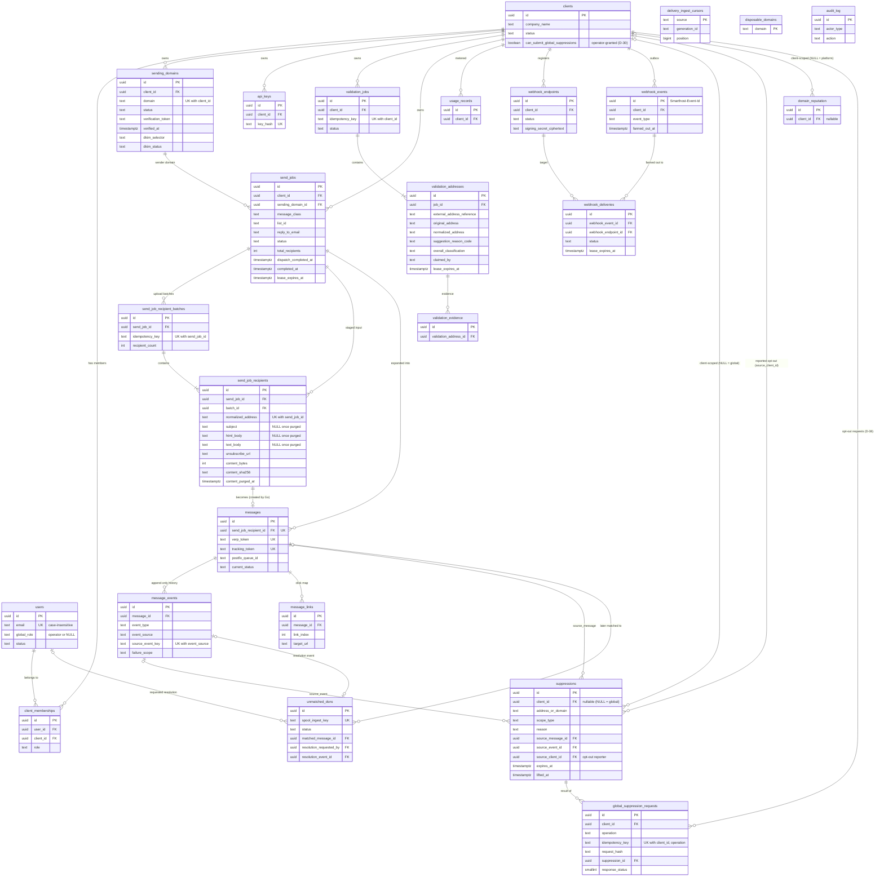

# Smarthost Database Schema

**Status:** normative contract for specification 2.5 · **Target:** PostgreSQL 16.x

[`reference-schema.sql`](reference-schema.sql) holds the exact column types, constraints and
indexes. It is a **reference, not a migration**:
* Doctrine migrations (Phase 2) are the only authority for schema objects and must reproduce it.
* Roles and grants are infrastructure (§6), so they are not in the DDL.

Enum values come from [`../contracts/status-vocabulary.yaml`](../contracts/status-vocabulary.yaml).

## 1. Rules

| Rule | Spec |
|---|---|
| Only Doctrine migrations create or alter tables, indexes, FKs and constraints, running as `smarthost_owner`. | `schema.owner`, `postgres.roles_and_privileges` |
| Roles and grants are created by infrastructure bootstrap tooling under `infra/`. Python and Go never hold schema-altering privileges. | `postgres.roles_and_privileges` |
| IDs are UUIDv7 generated by the writer. Timestamps are `timestamptz` in UTC. Enums are `text` with `CHECK`. | `schema` |
| Raw API keys are never stored. VERP tokens are unique. Tracking tokens are unique opaque random values of ≥ 192 bits. | `schema.integrity_rules` |
| `message_events` and `validation_evidence` are append-only. | `schema.integrity_rules` |
| `send_job_recipients` is immutable once its job leaves `collecting`, except for purging rendered content. | `schema.integrity_rules` |
| Webhook signing secrets are encrypted at rest. | `api.webhooks` |
| Address normalisation (D-18): trim whitespace, preserve the local part, lower-case the domain. It is used for duplicate detection and suppression matching. | `suppression_and_reputation.address_matching` |
| Automatic suppressions and recipient global opt-outs are global (`suppressions.client_id` NULL, D-30). `client_id` only scopes a row; the client that reported an opt-out is `source_client_id`. Suppressions are lifted (`lifted_at`), never deleted, except by configured retention. | `suppression_and_reputation.global_suppression_policy` |
| `users.email` is unique case-insensitively. This is a login rule only. | `schema.integrity_rules` |
| Leased work uses `claimed_by`, `lease_expires_at`, `attempt_count`, `next_attempt_at` and `last_error`. | `architecture.work_claiming` |
| Rendered content is transient and is purged on Postfix acceptance. Other retention periods are configurable. | `compliance.retention` |
| Foreign keys never cascade deletes. | convention |

## 2. Entity-relationship diagram

## 3. Tenant ownership

| Table | Ownership | Scoping path |
|---|---|---|
| `clients` | tenant root | `id` |
| `global_suppression_requests` | tenant | `client_id` (the reporting client; D-38) |
| `client_memberships`, `sending_domains`, `api_keys`, `validation_jobs`, `send_jobs`, `usage_records`, `webhook_endpoints`, `webhook_events`, `webhook_deliveries` | tenant | `client_id` |
| `validation_addresses`, `validation_evidence` | tenant | via `validation_jobs.client_id` |
| `send_job_recipient_batches`, `send_job_recipients`, `messages` | tenant | via `send_jobs.client_id` |
| `message_links`, `message_events` | tenant | via `messages → send_jobs.client_id` |
| `users` | global identity | client data is reached only through `client_memberships`, or as an operator |
| `suppressions` | tenant or global | `client_id`, where NULL = global. A tenant sees its own client-scoped rows and the global opt-outs it reported (`source_client_id`); other global rows are not tenant data (D-30). |
| `domain_reputation` | tenant or platform | `client_id`, where NULL = platform |
| `disposable_domains` | global reference data | none |
| `unmatched_dsns` | operator only | none until matched |
| `delivery_ingest_cursors` | internal (Go) | none |
| `audit_log` | operator | none |

Another client's resource returns **404**. Dashboard access is checked by Symfony voters over
memberships, and operators act through `global_role`.

## 4. Indexes required by the spec

| Spec requirement | Reference index |
|---|---|
| `validation_addresses.job_id` | `validation_addresses_job_id_idx (job_id, id)` |
| `validation_addresses.normalized_address` | `validation_addresses_normalized_address_idx` |
| `messages.send_job_id` | `messages_send_job_id_idx (send_job_id, id)` |
| `messages.verp_token_unique` | `messages_verp_token_uq` |
| `messages.postfix_queue_id` | `messages_postfix_queue_id_idx` (partial, non-unique) |
| `message_events.message_id_occurred_at` | `message_events_message_occurred_idx` |
| `suppressions.address_or_domain_scope` | `suppressions_address_or_domain_scope_idx`. Active-suppression lookup at message creation and before submission. |
| `suppressions.global_address_reason_active_unique` | `suppressions_global_address_reason_active_uq` (partial: global, address, not lifted, hard_bounce/complaint). One active row per address and reason under concurrent evidence (D-30). |
| `global_suppression_requests.client_id_operation_idempotency_key_unique` | `global_suppression_requests_client_operation_key_uq`. Durable opt-out request idempotency per reporting client (D-38). |
| `suppressions.source_client_id_address_active_opt_out_unique` | `suppressions_source_client_address_active_uq` (partial: active opt-outs). One active opt-out per reporting client and address. |
| `messages.recipient_address` | `messages_recipient_address_idx`. Global repeated-soft-bounce evaluation and recipient-based DSN correlation (D-30). |
| `api_keys.key_hash_unique` | `api_keys_key_hash_uq` |
| `send_jobs.client_id_status` | `send_jobs_client_status_idx` |
| `validation_jobs.client_id_status` | `validation_jobs_client_status_idx` |
| `send_job_recipients.send_job_id` | `send_job_recipients_send_job_idx` |
| `send_job_recipients.send_job_id_normalized_address_unique` | `send_job_recipients_job_address_uq`. Duplicate detection across batches. |
| `send_job_recipient_batches.send_job_id_idempotency_key_unique` | `send_job_recipient_batches_job_key_uq` |
| `messages.send_job_recipient_id_unique` | `messages_send_job_recipient_uq` |
| `messages.tracking_token_unique` | `messages_tracking_token_uq` |
| `message_links.message_id_link_index_unique` | `message_links_message_link_uq` |
| `message_events.event_source_source_event_key_unique` | `message_events_source_key_uq` (partial: key not null) |
| `unmatched_dsns.status_received_at` | `unmatched_dsns_status_received_idx` |
| `unmatched_dsns.spool_ingest_key_unique` | `unmatched_dsns_spool_key_uq` |
| `sending_domains.client_id_domain_unique` | `sending_domains_client_domain_uq` |
| `users.email_unique` | `users_email_uq` on `lower(email)` |
| `client_memberships.user_id_client_id_unique` | `client_memberships_user_client_uq` |
| `webhook_endpoints.client_id` | `webhook_endpoints_client_idx` |
| `webhook_deliveries.status_next_attempt_at` | `webhook_deliveries_due_idx` |

Other indexes:
* claimable-work indexes;
* reconciliation candidates (`messages_unresolved_idx`);
* soft-bounce rule evaluation (`message_events_soft_bounce_idx`, used with `messages_recipient_address_idx`);
* suppressions by source message (`suppressions_source_message_idx`, partial), which also serves the foreign key;
* opt-out requests by suppression (`global_suppression_requests_suppression_idx`), which serves the foreign key;
* unpurged content;
* abandoned collecting jobs;
* the webhook outbox (pending fan-out, once-only).

## 5. Key table-level rules (enforced by CHECK)

| Table | Rules |
|---|---|
| `send_jobs` | `list_id` is present **iff** `message_class = subscription`. Every status other than `collecting`/`cancelled` requires `queued_at` and `total_recipients ≥ 1` (the seal rule). `dispatched`/`completed` require their timestamps. `total_recipients ≤ 10000`. |
| `send_job_recipient_batches` | `recipient_count` is 1–500. |
| `send_job_recipients` | Content is either present and unpurged (subject plus at least one body), or fully purged (all NULL with `content_purged_at`). `unsubscribe_url` must be HTTPS. |
| `messages` | `tracking_token` is ≥ 32 base64url characters (192 bits) when present. |
| `message_events` | Transport sources always carry `source_event_key`. `tracking_endpoint` events never do, because repeated opens are legitimate. `failure_scope` is allowed only on deferral and bounce events. |
| `unmatched_dsns` | `match_requested`/`matched` require the matched message and the requesting operator. `matched` requires the resolution event and time. `dismissed` requires the time and a written reason (`resolution_note`). |
| `suppressions` | D-18 normalisation (local part never case-folded). A `recipient_global_opt_out` row, and only it, carries `source_client_id` (and may carry `external_reference`), and is global and address-scoped; its requests and their idempotency keys are in `global_suppression_requests`. `hard_bounce`, `complaint` and `recipient_global_opt_out` never expire; `repeated_soft_bounce` is the temporary reason. `source_event_id` requires `source_message_id`. |
| `global_suppression_requests` | One row per (`client_id`, `operation`, `idempotency_key`); `operation` from the vocabulary (`create_global_opt_out`); `response_status` is 201 (created) or 200 (already active). |
| `validation_addresses` | A suggestion has both a reason code and a confidence. A claimed row has a lease. |
| `sending_domains` | `verified` requires `verified_at`. A DKIM status other than `not_configured` requires a selector. |

## 6. Database roles and table access (D-15)

Roles are created by an infrastructure bootstrap under `infra/`, using the administrative
connection (`POSTGRES_USER`). After each migration run, the same tooling idempotently applies the
grants below. No runtime role has DDL rights.

**S** = SELECT, **I** = INSERT, **U** = UPDATE, **D** = DELETE.

| Table | `smarthost_app` (web + scheduled) | `smarthost_webhook` (worker) | `smarthost_validator` | `smarthost_delivery` |
|---|---|---|---|---|
| clients | S I U | S | S | S |
| users, client_memberships | S I U | – | – | – |
| sending_domains | S I U | – | – | S |
| api_keys | S I U | – | – | – |
| validation_jobs | S I U | S | S U | – |
| validation_addresses | S I D¹ | – | S U | – |
| validation_evidence | S D¹ | – | S I | – |
| disposable_domains | S I U D | – | S | – |
| send_jobs | S I U | S | – | S U |
| send_job_recipient_batches | S I | – | – | – |
| send_job_recipients | S I U² D¹ | – | – | S U² |
| messages | S D¹ | S | – | S I U |
| message_links | S D¹ | – | – | S I |
| message_events | S I³ D¹ | S | – | S I |
| unmatched_dsns | S U D¹ | – | – | S I U |
| delivery_ingest_cursors | – | – | – | S I U |
| suppressions | S I U D¹ | – | – | S I |
| global_suppression_requests | S I D¹ | – | – | – |
| domain_reputation | S | – | – | S I U |
| usage_records | S I D¹ | – | I | I |
| webhook_endpoints | S I U | S | – | – |
| webhook_events | S I | S U | I | I |
| webhook_deliveries | S | S I U | – | – |
| audit_log | S I D¹ | I | I | I |

¹ `DELETE` is used only by the configured retention commands, and only when a retention period
is set.

² `UPDATE` is column-restricted to `subject`, `html_body`, `text_body` and `content_purged_at`
(the purge).

³ Open/click events from the tracking endpoints only.

Suppressions (D-30): Symfony creates only client-reported `recipient_global_opt_out` rows (API)
and operator blocks (console), and lifts by setting `lifted_at`. Go creates the system
suppressions (`hard_bounce`, `complaint`, `repeated_soft_bounce`) and never updates or deletes a
suppression: repeated or concurrent evidence finds the active row and inserts nothing.
`global_suppression_requests` (D-38) is written only by Symfony and never updated: an accepted
opt-out request is history.

Neither Python nor Go can read webhook endpoints or secrets, or write deliveries. Only the
Symfony webhook worker performs HTTP webhook delivery.
